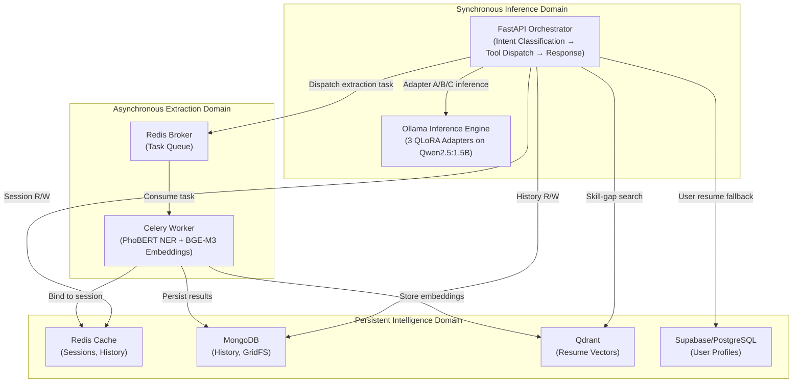
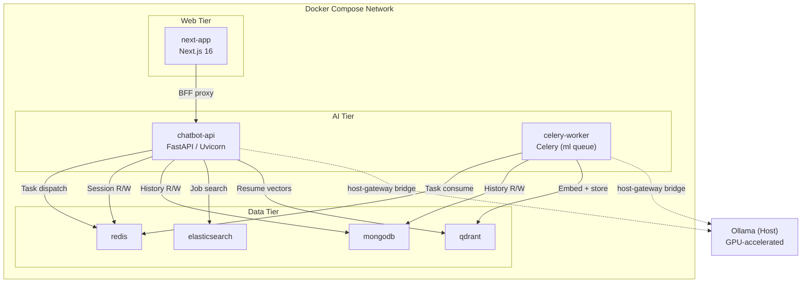
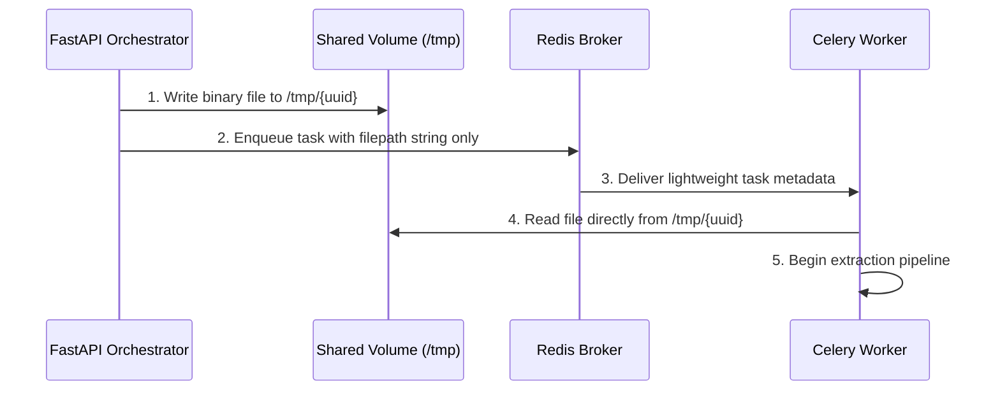
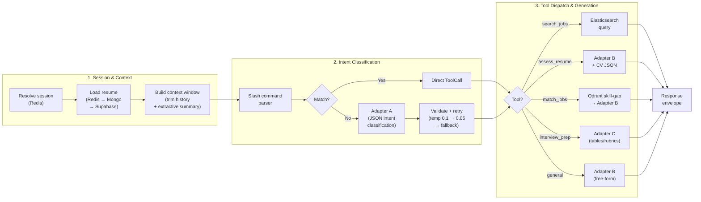

# Chapter 1: AI Orchestration & ML Pipeline Architecture

## 1.1 Overview

The CareerIntel platform is built around a central architectural premise: a small language model (SLM) with only 1.5 billion parameters can match or exceed the task-specific performance of models ten times its size — provided that its responsibilities are decomposed into discrete, fine-tuned sub-tasks rather than handled by a single general-purpose prompt. This premise drives every layer of the system, from the three-adapter inference engine that serves users in real time, to the six-phase training pipeline that produces those adapters, to the polyglot persistence layer that maintains conversational state across sessions.

This chapter presents the high-level architecture of the AI components: the computational domains that organize the system, the container topology that isolates them, the key design tradeoffs that shape their interaction, and the end-to-end data flows that connect a user's request to an AI-generated response. Subsequent chapters elaborate each domain in depth — Chapter 3 details the persistence layer, Chapter 7 describes the multi-adapter inference engine, and Chapter 8 documents the training pipeline.

## 1.2 Three-Domain Architecture

The AI subsystem is organized into three computational domains, each with distinct latency requirements, resource profiles, and failure characteristics. This separation ensures that heavy tensor computations do not block real-time user interactions, and that persistent state remains durable independently of the compute layer's lifecycle.

### 1.2.1 Synchronous Inference Domain

The synchronous inference domain handles the real-time chat loop: receiving a user message, classifying intent, routing to the appropriate adapter, generating a response, and returning it — all within the latency budget of a single HTTP request-response cycle. Two components collaborate in this domain:

- **FastAPI Orchestrator** — the central coordinator that exposes chat and upload endpoints, manages session state, and implements the tool dispatch decision tree. It determines *which* adapter should handle each request and *how* the response should be framed, but delegates the actual text generation to the inference engine.
- **Ollama Inference Engine** — hosts three QLoRA-finetuned adapters on the same Qwen2.5:1.5B base model, each specialized for a different output modality: structured JSON for intent classification (Adapter A), empathetic Vietnamese prose for career coaching (Adapter B), and formatted markdown tables for interview preparation (Adapter C). All three adapters share the base model's weights in memory, with only lightweight LoRA delta matrices differentiating them.

The critical design decision in this domain is that Ollama runs natively on the host machine rather than inside a container. This hybrid approach allows the inference engine to access host GPU hardware directly, avoiding the configuration complexity of Docker GPU passthrough while keeping all application logic fully containerized.

### 1.2.2 Asynchronous Extraction Domain

CV processing — parsing PDFs, running Named Entity Recognition, computing vector embeddings — routinely takes 30 to 180 seconds, far exceeding acceptable synchronous response times. The asynchronous domain isolates these heavy workloads behind a task queue:

- **Celery Worker** — a background processor that consumes extraction tasks from a Redis-backed message queue. It executes the same three-stage extraction cascade used in the training pipeline (semantic chunking → regex extraction → PhoBERT NER), followed by quality scoring and BGE-M3 embedding generation. Machine learning models are pre-warmed at worker startup, eliminating the approximately 50-second cold-start penalty on the first upload.
- **Redis Broker** — mediates between the FastAPI orchestrator (which dispatches tasks) and the Celery worker (which executes them), decoupling request acceptance from processing completion.

The frontend observes extraction progress through a long-polling pattern: the backend returns a job identifier immediately upon upload, and the client polls a status endpoint every two seconds until the worker reports completion.

### 1.2.3 Persistent Intelligence Domain

The persistence layer spans four specialized databases, each chosen for a distinct access pattern that no single database could serve optimally:

- **Redis** — in-memory cache for active session data (resume bindings, recent conversation turns) with 24-hour TTL-based eviction. Serves as the first-read tier in a three-level fallback chain.
- **MongoDB** — durable store for conversation history, session metadata, and raw uploaded files (via GridFS). Provides the source-of-truth for session restoration after Redis eviction.
- **Qdrant** — vector database storing 1024-dimensional BGE-M3 embeddings across four named vectors per resume (full_profile, skills, experience, education), enabling aspect-specific semantic search and skill-gap analysis.
- **Supabase (PostgreSQL)** — persistent, user-scoped resume storage that survives across chatbot sessions. A three-tier fallback chain (Redis → MongoDB → Supabase) ensures returning users can access their resume data without re-uploading.

This polyglot strategy reflects a deliberate architectural trade: operational complexity in managing four databases is accepted in exchange for each database serving its optimal access pattern — sub-millisecond reads from Redis, flexible document queries from MongoDB, high-dimensional similarity search from Qdrant, and relational integrity with Row Level Security from PostgreSQL.

## 1.3 Container Topology

The system is deployed as a Docker Compose cluster comprising seven containers organized into three functional tiers, plus the Ollama inference engine running natively on the host. The containerization boundary is drawn precisely at the point where GPU access is required: all application logic, databases, and background workers run inside containers, while the inference engine that requires direct hardware access runs outside.

The Next.js frontend communicates with the FastAPI orchestrator exclusively through a Backend-For-Frontend (BFF) proxy layer, which normalizes upstream errors and ensures the backend is never directly exposed to the public network. The dashed lines to the Ollama node represent the host-gateway DNS bridge described in §1.4.1.

Docker Compose orchestrates the startup sequence through a health-gated dependency graph: data-tier services (Redis, MongoDB, Elasticsearch) must pass their health probes before AI-tier services are permitted to start, preventing connection failures during initialization. Qdrant uses a weaker `service_started` condition because the Celery worker lazily initializes its Qdrant client only upon the first CV upload, tolerating a brief startup window.

## 1.4 Design Tradeoffs

### 1.4.1 CPU Containers with Host GPU Bridge

Running fine-tuned language models requires GPU hardware, yet configuring Docker GPU passthrough (via the Nvidia Container Toolkit) introduces significant operational complexity — driver version dependencies, runtime configuration, and potential conflicts with host processes. The architecture resolves this tension through a hybrid deployment: the Ollama inference engine runs natively on the host machine with direct GPU access, while the application logic remains fully containerized with CPU-only images.

Communication between containerized services and the host inference engine is established via Docker's DNS resolution mechanism (`host.docker.internal`), which resolves to the host machine's gateway address. This allows both the FastAPI orchestrator and the Celery worker to invoke Ollama's API without leaving the Docker network's logical boundary.

The container images are built from `python:3.11-slim` and explicitly target CPU-only PyTorch wheels, omitting the approximately 2 GB of CUDA runtime libraries that would otherwise bloat each image. System-level OCR dependencies (Tesseract with Vietnamese language support) are installed at build time, ensuring that scanned-document processing is available without additional host configuration.

This tradeoff yields a clean separation of concerns: containers encapsulate application dependencies and can be reproduced identically across development machines, while the host retains exclusive control over GPU resource allocation and model loading.

### 1.4.2 Zero-Copy File Exchange

A fundamental bottleneck in distributed ML pipelines involving large file payloads is the serialization overhead of pushing binary data through a message broker. A 10 MB PDF encoded as Base64 expands to approximately 13.3 MB and must be serialized into a Redis message, transmitted, deserialized, and decoded — consuming broker memory and adding latency proportional to file size.

CareerIntel eliminates this overhead through a zero-copy exchange pattern using a shared Docker volume (`shared_tmp`):

The orchestrator writes the uploaded file to the shared volume and enqueues only the filepath string (tens of bytes) through Redis, rather than the file content (megabytes). The worker reads the file directly from the same volume mount, achieving zero serialization overhead regardless of file size. This pattern reduces broker memory pressure and eliminates the Base64 encoding/decoding latency entirely.

## 1.5 Request Lifecycle Flows

### 1.5.1 Chat Request Pipeline

Every chat interaction traverses a nine-step pipeline that transforms a natural-language user message into an adapter-generated response. The pipeline demonstrates how the three computational domains collaborate at runtime:

The pipeline begins in the Persistent Intelligence Domain (session resolution, history retrieval, context window management), transitions through Adapter A's intent classification in the Synchronous Inference Domain, and branches into five execution paths — one of which (job search) queries Elasticsearch directly without invoking a language model, while the remaining four route through Adapters B or C for text generation.

A critical architectural feature is the **retry-with-temperature-drop strategy** for intent classification: if Adapter A's initial response fails JSON validation, the system retries at near-greedy temperature (0.05) before gracefully degrading to a general conversational response. This three-tier resilience ensures users always receive a meaningful reply, even when intent classification is uncertain.

### 1.5.2 CV Upload Pipeline

The CV upload flow demonstrates the data transformation chain that converts an unstructured document into a structured, searchable, AI-ready representation:

```mermaid
flowchart LR
    subgraph "Stage 1: Ingestion"
        direction TB
        A["Binary file<br>(PDF / DOCX / Image)"] --> B["File validation<br>(type, size ≤ 20MB)"]
        B --> C["Write to shared volume<br>+ GridFS archival"]
    end

    subgraph "Stage 2: Text Extraction"
        direction TB
        D["PyMuPDF text layer"] --> E{Text empty?}
        E -->|Yes| F["OCR fallback<br>(Tesseract vie+eng<br>200 DPI rendering)"]
        E -->|No| G["Raw text"]
        F --> G
    end

    subgraph "Stage 4: Validation & Vectorization"
        direction TB
        M["CanonicalResume<br>(typed JSON schema)"] --> N["Quality scorer<br>(4 dimensions,<br>0–100 score)"]
        N --> O["BGE-M3 embedder<br>(4 × 1024-dim<br>named vectors)"]
        O --> P["Qdrant upsert<br>(vectors + payload)"]
    end

    subgraph "Stage 3: Semantic Structuring"
        direction TB
        H["Heuristic section<br>splitter<br>(11 regex patterns)"] --> I["Semantic chunker<br>(1 chunk per<br>logical unit)"]
        I --> J["Regex extractor<br>(email, phone, date,<br>GPA, URLs, skills)"]
        I --> K["PhoBERT NER<br>(PER, ORG, LOC)"]
        J --> L["Entity merge<br>(regex priority<br>for structured fields)"]
        K --> L
    end

    C -->|"Celery async"| D
    G --> H
    L --> M
    P --> Q["Session binding<br>(Redis + MongoDB<br>dual-write)"]
    
    C ~~~ M
    A ~~~ H
```

The pipeline transforms data through four increasingly structured representations:

| Stage | Input | Output | Transformation |
|-------|-------|--------|----------------|
| **Ingestion** | Binary file (PDF/DOCX/Image) | Raw bytes on shared volume | Format validation, zero-copy exchange |
| **Text Extraction** | Raw bytes | Unstructured text string | PyMuPDF parsing or Tesseract OCR fallback |
| **Semantic Structuring** | Flat text | `CanonicalResume` typed JSON | Section splitting → chunking → entity extraction → merge |
| **Validation & Vectorization** | Typed JSON | Quality-scored vectors in Qdrant | Multi-criteria scoring + BGE-M3 dense embeddings |

Each stage progressively adds structure and semantic meaning to the data. The unstructured binary input gains textual form through parsing, textual form gains semantic labels through entity extraction, and labeled entities gain mathematical representations through vectorization — culminating in a rich, searchable resume representation that downstream tools (CV assessment, job matching, interview preparation) can consume directly.

This same four-stage pipeline serves dual purposes: at training time (Chapter 8, Phases 2–3), it processes synthetic CVs to build the training dataset; at inference time (Chapter 7, §7.6), it processes real user uploads to populate the vector database. The architectural reuse ensures consistency between the data representations the model was trained on and those it encounters at runtime.
