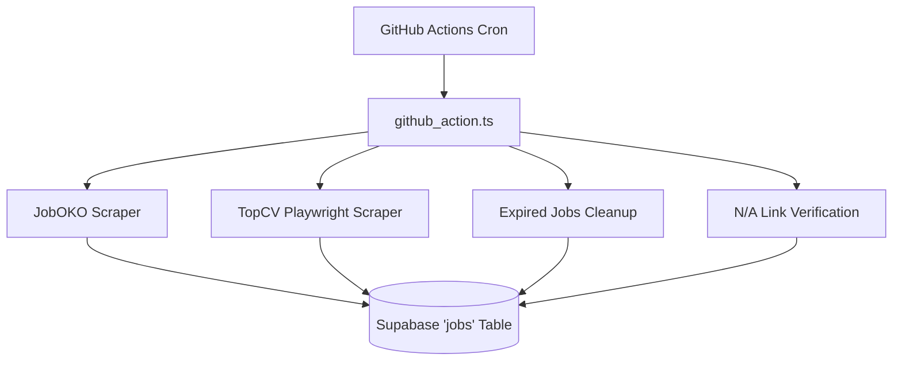

# Chapter 2: Data Acquisition Pipeline (Web Scraping)

## 2.1 Overview
The Job Market Analytics Platform employs a robust, automated data acquisition pipeline designed to harvest, normalize, and persist job postings from major Vietnamese recruitment portals. The pipeline primarily targets TopCV and JobOKO, utilizing Playwright (headless Chromium) to handle JavaScript-heavy DOM rendering. This architecture is orchestrated via a daily GitHub Actions cron job, ensuring a continuous influx of fresh job data directly into the Supabase (PostgreSQL) data layer.

## 2.2 Scraping Architecture and CI/CD Integration
The entry point for the data acquisition pipeline is `backend/jobs/github_action.ts`, which is triggered by a daily GitHub Actions cron schedule. This automation ensures the platform's dataset remains current without requiring manual intervention.

### Technical Flow
1. **Initialization**: The process begins by validating Supabase Service Role Keys, establishing a secure connection that bypasses Row Level Security (RLS) policies for administrative ingestion.
2. **Scraping Sources**:
   - **JobOKO** (`scrapeJoboko`): Configured dynamically via environment variables (e.g., `SCRAPER_MAX_PAGES=5`, delay `7000ms`), this scraper systematically traverses both listing and detail pages.
   - **TopCV** (`scrapeTopCV`): Employs a more sophisticated, two-pass scraping pattern using Playwright to handle dynamic content.
3. **Direct Upsert**: Data extracted by the scrapers is immediately persisted into the Supabase `jobs` table using an `upsert` operation, keyed on the unique job `url`. To optimize CI runtimes, data normalization is intentionally bypassed during the scraping phase and deferred to an offline worker (`fix_khac_offline.py` or the Python ML Service).

## 2.3 Playwright vs Traditional Scrapers
Modern recruitment portals like TopCV rely heavily on client-side JavaScript for rendering job listings dynamically. Traditional scraping tools (such as BeautifulSoup or Scrapy) operate on raw HTML and frequently fail to parse these dynamic Document Object Models (DOM). To overcome this, the platform utilizes Playwright's headless Chromium browser (`--no-sandbox`, `--disable-setuid-sandbox`), which executes the JavaScript and evaluates the DOM only after it has been fully rendered.

### Anti-Scraping Countermeasures
To ensure reliable extraction and avoid IP bans, the `scrap_topcv.ts` implementation incorporates several evasion strategies:
- **User-Agent Spoofing**: The scraper simulates a legitimate user by mimicking a Chrome 120 browser operating on Windows 10.
- **Delay Injection**: Aggressive rate limiting is applied. The system introduces an 8-second delay before querying listing pages, and a 2.5 to 10-second delay between individual detail page crawls.
- **Two-Pass Scraping**:
  - *Pass 1 (Listing)*: Extracts high-level metadata (title, URL, company name, salary, location, and logo) from search result pages, filtering out duplicate URLs in-memory using a JavaScript `Set`.
  - *Pass 2 (Detail)*: Iterates over the deduplicated URLs, opens individual pages, waits for DOM readiness, and extracts deep content (full description, requirements, benefits, and expiration date) using heuristic DOM traversal techniques.

## 2.4 Concurrency Control and Data Freshness
Managing thousands of network requests requires strict concurrency limits to prevent connection timeouts and avoid overwhelming target servers.

- **Worker Pool Pattern (`runWithConcurrency`)**: The pipeline utilizes a robust concurrency limit pattern, capping active workers (e.g., 10 concurrent workers for link checking). Workers independently request the next task from the pool upon completion, which is more efficient than batching with `Promise.all` and prevents isolated timeouts from stalling the entire queue.
- **Expired Jobs Cleanup**: To maintain data relevance, a maintenance script periodically fetches URLs with specific expiration dates (parsed from `DD/MM/YYYY` strings). These dates are compared against the current date, and expired records are purged in batches of 50 to minimize load on the Supabase Postgres instance.
- **N/A Links Verification**: For job postings without an explicit expiration date (marked as 'N/A'), the system verifies the survival of the listing by dispatching HTTP requests to the URL. Dead links are subsequently batch-deleted from the database.

## 2.5 Architecture Flow Diagram
The following diagram illustrates the flow of data from the initial cron trigger through scraping, persistence, and offline maintenance:



## 2.6 Data Normalization Pipeline

While the primary scraping mechanism persists raw data directly to the database to optimize ingestion speed, the platform implements a robust, secondary offline processing pipeline to standardize and enrich this data. This normalization process is executed by a dedicated Python Machine Learning Service via a FastAPI backend, designed as a four-phase Extract, Transform, Load (ETL) pipeline.

### 2.6.1 Phase 1: Pattern-Based Cleansing
The initial phase addresses common structural anomalies inherent in scraped text. Utilizing targeted regular expressions, the system cleanses mandatory fields such as company names and geographical locations, stripping out irrelevant characters, errant whitespace, and inconsistent formatting to establish a baseline of clean string data.

### 2.6.2 Phase 2: Semantic Normalization and Feature Extraction
The core of the data enrichment process leverages a hybrid approach combining artificial intelligence with rule-based heuristics.
- **Job Title Standardization**: Regular expressions are applied to isolate the core professional title by removing promotional prefixes (e.g., "Urgent," "Seeking") and descriptive suffixes detailing salary or urgency.
- **Categorization**: The pipeline maps diverse job listings into 66 predefined industry domains. It primarily utilizes the Gemini AI model to semantically categorize the job based on its description and context. To ensure reliability against API rate limits or service unavailability, a fallback rule-based system is implemented, which traverses the title and description against a comprehensive keyword map.
- **Skill Extraction**: The system parses unstructured job descriptions to identify and extract up to ten specific professional skills. This is achieved using Gemini AI configured for constrained JSON output generation. Similar to categorization, a keyword-matching heuristic against a predefined skill dictionary serves as a secondary fallback.

### 2.6.3 Phase 3: Deterministic Content Hashing
To facilitate absolute deduplication beyond simple URL collisions, the pipeline generates a deterministic hash identifier for each job. This hash is computed based on the normalized company name, the cleaned job title, and the standardized location, ensuring that identical postings from different source URLs are accurately identified and consolidated.

### 2.6.4 Phase 4: Persistence
In the final phase, the pipeline assembles the finalized payload, integrating the original fields with the newly computed normalized data and extracted skills. This enriched dataset is then persisted to the PostgreSQL data layer using an upsert operation, updating existing records and inserting new ones seamlessly.

### 2.6.5 Normalization Flow Diagram
The following diagram visualizes the flow of data through the four phases of the normalization pipeline:

```mermaid
flowchart LR
    R[Raw Job Record] --> P1[Phase 1: Regex Cleansing]
    P1 --> P2[Phase 2: Semantic Normalization]
    
    subgraph Phase 2 Extraction
        P2A[Title Standardization]
        P2B[AI / Heuristic Categorization]
        P2C[AI / Heuristic Skill Extraction]
    end
    
    P2 --> Phase 2 Extraction
    Phase 2 Extraction --> P3[Phase 3: Content Hashing]
    P3 --> P4[Phase 4: Database Upsert]
```
