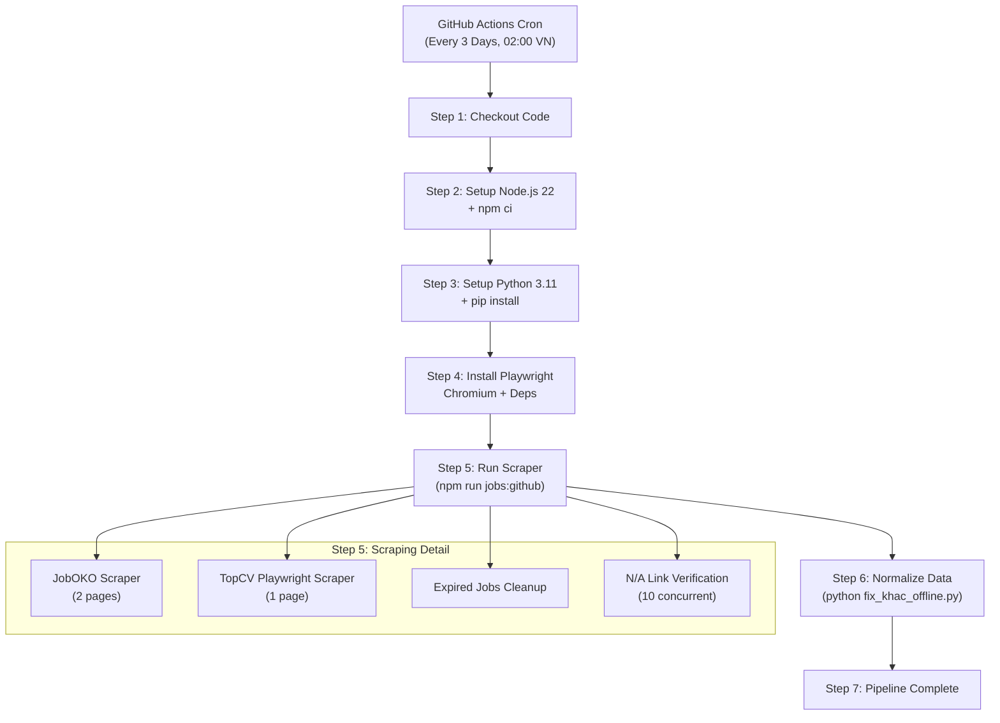
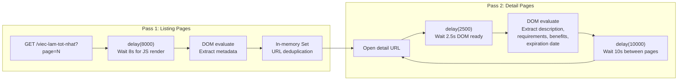
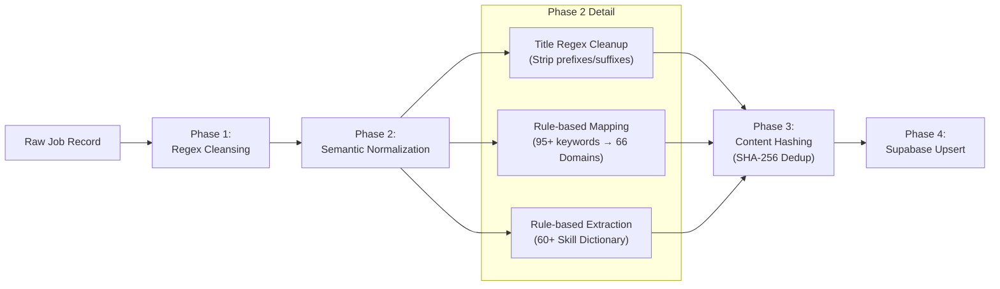

# Chapter 2: Data Acquisition Pipeline (Web Scraping)

## 2.1 Overview
The Job Market Analytics Platform employs a robust, automated data acquisition pipeline designed to harvest, normalize, and persist job postings from major Vietnamese recruitment portals. The pipeline primarily targets TopCV and JobOKO, utilizing Playwright (headless Chromium) to handle JavaScript-heavy DOM rendering. This architecture is orchestrated via a GitHub Actions cron job running every three days (cron: `0 19 */3 * *`, corresponding to 02:00 AM Vietnam time), ensuring a continuous influx of fresh job data directly into the Supabase (PostgreSQL) data layer. The workflow also supports manual triggering via `workflow_dispatch` for on-demand data refresh.

## 2.2 Scraping Architecture and CI/CD Integration
The entry point for the data acquisition pipeline is `backend/jobs/github_action.ts`, which is triggered by the GitHub Actions cron schedule every three days. This automation ensures the platform's dataset remains current without requiring manual intervention.

### CI/CD Dual-Runtime Pipeline
The GitHub Actions workflow orchestrates a multi-language pipeline, installing both **Node.js 22** (for the Playwright scrapers) and **Python 3.11** (for the offline normalization service) within a single CI run. The pipeline timeout is set to **150 minutes** to accommodate the sequential scraping of multiple sources with rate-limiting delays.

### Technical Flow
1. **Initialization**: The process begins by validating Supabase Service Role Keys, establishing a secure connection that bypasses Row Level Security (RLS) policies for administrative ingestion.
2. **Scraping Sources**:
   - **JobOKO** (`scrapeJoboko`): Configured dynamically via environment variables. The scraper delay is set to `3000ms` in the CI environment (via `SCRAPER_DELAY_MS`), though local development defaults to `7000ms` for more conservative rate limiting.
   - **TopCV** (`scrapeTopCV`): Employs a more sophisticated, two-pass scraping pattern using Playwright to handle dynamic content (323 lines of scraper logic).
3. **Direct Upsert**: Data extracted by the scrapers is immediately persisted into the Supabase `jobs` table using an `upsert` operation, keyed on the unique job `url`. To optimize CI runtimes, data normalization is intentionally bypassed during the scraping phase and deferred to an offline Python script (`fix_khac_offline.py`). This script runs within the same CI job but as a separate step, because the FastAPI ML Service is not started in the CI environment — it is intended for local development or future production deployment.

## 2.3 Playwright vs Traditional Scrapers
Modern recruitment portals like TopCV rely heavily on client-side JavaScript for rendering job listings dynamically. Traditional scraping tools (such as BeautifulSoup or Scrapy) operate on raw HTML and frequently fail to parse these dynamic Document Object Models (DOM). To overcome this, the platform utilizes Playwright's headless Chromium browser (`--no-sandbox`, `--disable-setuid-sandbox`), which executes the JavaScript and evaluates the DOM only after it has been fully rendered.

### Technology Choice: Playwright vs Alternatives

| Criteria | Playwright | Puppeteer | Selenium | Scrapy / BeautifulSoup |
|----------|-----------|-----------|---------|----------------------|
| **JS rendering** | Full Chromium engine | Full Chromium engine | Full browser engines | None (static HTML only) |
| **Language support** | Node.js, Python, Java, C# | Node.js only | All major languages | Python only |
| **Multi-browser** | Chromium, Firefox, WebKit | Chromium only | Chrome, Firefox, Edge, Safari | N/A |
| **CI/CD support** | Native (`npx playwright install`) | Requires manual binary setup | Requires WebDriver binary management | Built-in (no browser needed) |
| **Auto-wait** | Built-in smart waits | Manual `waitForSelector` | Explicit WebDriverWait | N/A |
| **Headless performance** | ~200 MB per browser context | ~200 MB per browser context | ~300 MB per browser instance | ~20 MB (no browser) |

Playwright was selected over Puppeteer for its superior multi-language support (enabling potential migration to Python scrapers in the future), native CI/CD integration, and built-in auto-wait mechanisms that simplify scraping JavaScript-rendered pages.

### Anti-Scraping Countermeasures
To ensure reliable extraction and avoid IP bans, the `scrap_topcv.ts` implementation incorporates several evasion strategies:
- **User-Agent Spoofing**: The scraper simulates a legitimate user by mimicking a Chrome 120 browser operating on Windows 10 via the `User-Agent` header.
- **Accept-Language Header**: The scraper sets `Accept-Language: vi-VN,vi;q=0.9,en-US;q=0.8,en;q=0.7`, signaling to the target server that the request originates from a Vietnamese-language browser. This reduces the likelihood of being flagged by geographic anomaly detection systems.
- **Delay Injection**: Aggressive rate limiting is applied. The system introduces an 8-second delay before querying listing pages to allow dynamic content to fully render. Between individual detail page crawls, a fixed 10-second delay is enforced to prevent triggering rate-limit thresholds on the target server.
- **Two-Pass Scraping**:
  - *Pass 1 (Listing)*: Extracts high-level metadata (title, URL, company name, salary, location, and logo) from search result pages, filtering out duplicate URLs in-memory using a JavaScript `Set`.
  - *Pass 2 (Detail)*: Iterates over the deduplicated URLs, opens individual pages, waits for DOM readiness (2.5 seconds), and extracts deep content (full description, requirements, benefits, and expiration date) using heuristic DOM traversal techniques.

## 2.4 Concurrency Control and Data Freshness
Managing thousands of network requests requires strict concurrency limits to prevent connection timeouts and avoid overwhelming target servers.

- **Worker Pool Pattern (`runWithConcurrency`)**: The pipeline utilizes a robust concurrency limit pattern, capping active workers at 10 concurrent requests for link checking. Workers independently request the next task from the pool upon completion, which is more efficient than batching with `Promise.all` and prevents isolated timeouts from stalling the entire queue. Each worker independently captures its own result (fulfilled or rejected), ensuring fault isolation.
- **Expired Jobs Cleanup**: To maintain data relevance, a maintenance job periodically fetches all records with explicit expiration dates (parsed from `DD/MM/YYYY` strings). These dates are compared against the current date, and expired records are purged in batches of 50 to minimize load on the Supabase Postgres instance. The batch size of 50 is chosen to comply with Supabase's `.in()` filter constraint, which limits the number of elements in a single filter predicate.
- **N/A Links Verification**: For job postings without an explicit expiration date (marked as 'N/A'), the system verifies the survival of the listing by dispatching HTTP requests to the URL via the `checkJobExists` function. Dead links are subsequently batch-deleted from the database in groups of 50.

## 2.5 Data Normalization Pipeline

While the primary scraping mechanism persists raw data directly to the database to optimize ingestion speed, the platform implements a robust, secondary offline processing pipeline to standardize and enrich this data. This normalization process is executed by a dedicated Python Machine Learning Service (334 lines), designed as a four-phase Extract, Transform, Load (ETL) pipeline.

### 2.5.1 Phase 1: Pattern-Based Cleansing
The initial phase addresses common structural anomalies inherent in scraped text. Utilizing targeted regular expressions, the system cleanses mandatory fields such as company names and geographical locations, stripping out irrelevant characters, errant whitespace, and inconsistent formatting to establish a baseline of clean string data.

### 2.5.2 Phase 2: Semantic Normalization and Feature Extraction
The core of the data enrichment process leverages rule-based heuristics.
- **Job Title Standardization**: Regular expressions are applied to isolate the core professional title by removing promotional prefixes (e.g., "Tuyển gấp," "Cần tuyển") and descriptive suffixes detailing salary or urgency.
- **Categorization**: The pipeline maps diverse job listings into **66 predefined industry domains** (defined in the `CORE_DOMAINS` dictionary, spanning from "An toàn lao động" to "Sinh viên / Thực tập sinh"). It utilizes a rule-based heuristic system which traverses the job title and description against a comprehensive keyword map of **95+ keyword-to-domain mappings**.
- **Skill Extraction**: The system parses unstructured job descriptions to identify and extract up to ten specific professional skills. This is achieved using a rule-based dictionary of **60+ professional skills** spanning office tools, programming languages, soft skills, and industry-specific competencies.

### 2.5.3 Phase 3: Deterministic Content Hashing
To facilitate absolute deduplication beyond simple URL collisions, the pipeline generates a deterministic hash identifier for each job. This hash is computed based on the normalized company name, the cleaned job title, and the standardized location, ensuring that identical postings from different source URLs are accurately identified and consolidated.

### 2.5.4 Phase 4: Persistence
In the final phase, the pipeline assembles the finalized payload, integrating the original fields with the newly computed normalized data and extracted skills. This enriched dataset is then persisted to the PostgreSQL data layer using an upsert operation, updating existing records and inserting new ones seamlessly.

### 2.5.5 Normalization Flow Diagram
The following diagram visualizes the flow of data through the four phases of the normalization pipeline:

## 2.6 Key Quantitative Metrics

| Metric | Value |
|--------|-------|
| Scraper source files | 8 files, ~77 KB total |
| TopCV scraper complexity | 323 lines |
| JobOKO scraper complexity | 516 lines |
| Industry domains (Phase 2) | 66 categories |
| Keyword-to-domain mappings | 95+ entries |
| Skill extraction dictionary | 60+ professional skills |
| CI/CD pipeline timeout | 150 minutes |
| Cron schedule | Every 3 days at 02:00 VN |
| Concurrency limit (link checking) | 10 workers |
| Batch delete size | 50 records |
| Listing page delay | 8,000 ms |
| Detail page inter-crawl delay | 10,000 ms |
