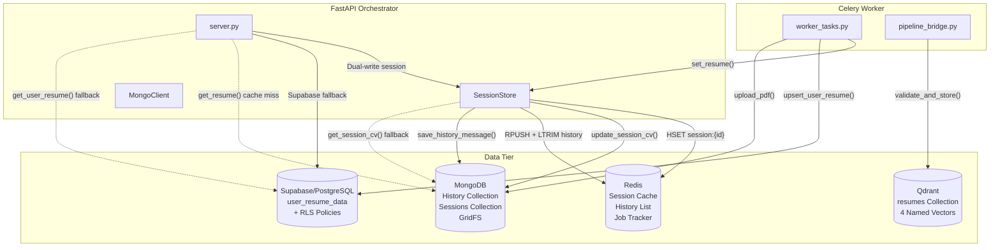
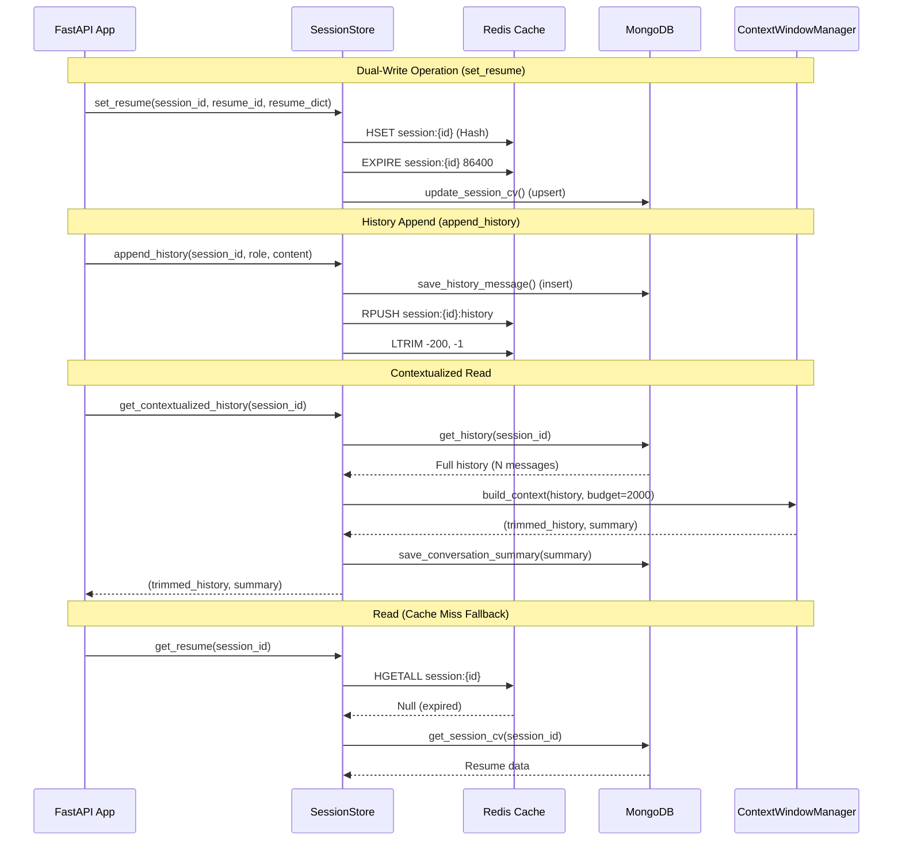
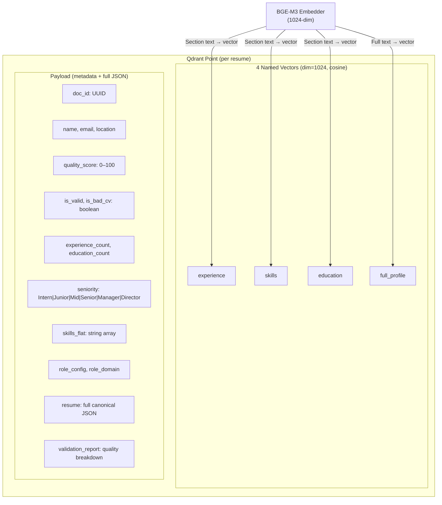

# Chapter 3: Data Persistence and Session Management for AI Chatbot

This chapter details the data layer architecture designed specifically for the AI chatbot component of the CareerIntel platform. The system leverages a polyglot persistence approach, utilizing MongoDB, Redis, Supabase, and Qdrant to manage conversational state, cache frequent queries, store persistent user profiles, and perform semantic vector searches. The following diagram illustrates the complete data flow across all four database systems:

## 3.1 MongoDB for Unstructured Conversation History

The chatbot handles highly unstructured and dynamic data, making a NoSQL document database like MongoDB the ideal choice for storing conversation history. The `MongoClient` wrapper class provides all database operations through the asynchronous Motor driver.

### 3.1.1 Async I/O with Motor

To ensure high performance and non-blocking operations within the FastAPI backend, the system utilizes `AsyncIOMotorClient`. This allows the application to handle multiple concurrent database requests efficiently, which is critical for real-time chat interactions. The client is instantiated as a module-level singleton (`mongo_client = MongoClient()`) and lazily connects on first use, preventing connection pool exhaustion during import-time initialization.

### 3.1.2 History Collection Schema

Each turn in the chat conversation is stored as an individual document in the `history` collection. The schema includes the session identifier, the role (user or assistant), the message content, and a Unix timestamp:

| Field | Type | Description |
|-------|------|-------------|
| `session_id` | String | Links message to a chatbot session (8-char UUID) |
| `role` | String | Message author: `"user"` or `"assistant"` |
| `content` | String | Full message text (Markdown format for assistant) |
| `timestamp` | Float | Unix timestamp for chronological ordering |

To optimize retrieval speed when loading a user's chat history, a compound index is implemented on the session identifier and timestamp fields `(session_id, 1), (timestamp, 1)`. This index enables MongoDB to perform a covered query: given a session ID, it retrieves all messages in chronological order using a single index scan without requiring a sort operation. The index is created idempotently during the `connect()` method, ensuring it exists regardless of whether the collection was freshly created or already populated.

### 3.1.3 Sessions Collection Schema

Session metadata — including parsed resume data and conversation summaries — is stored in a separate `sessions` collection with a unique index on `session_id`:

| Field | Type | Description |
|-------|------|-------------|
| `session_id` | String (unique) | Primary identifier, matches Redis session key |
| `resume_id` | String | Qdrant point ID of the stored resume vector |
| `resume_dict` | Object | Full canonical resume JSON (from Phase 2 extraction) |
| `resume_name` | String | Original uploaded filename |
| `conversation_summary` | String | Extractive summary of dropped conversation history |

The `conversation_summary` field is particularly important for long-running conversations. When the Context Window Manager (§7.5 in Chapter 7) trims older messages to fit within the SLM's token budget, it generates an extractive summary of the dropped messages. This summary is persisted to MongoDB via `save_conversation_summary()` and retrieved on subsequent requests via `get_conversation_summary()`, ensuring that the chatbot retains awareness of earlier conversational context even after individual messages have been evicted from the active window.

### 3.1.4 GridFS for Raw File Storage

Users frequently upload PDF resumes for analysis. MongoDB's GridFS, accessed via `AsyncIOMotorGridFSBucket`, provides a robust mechanism for storing these raw, potentially large binary files. The `upload_pdf()` method streams the file content into GridFS chunks with metadata linking it to the originating session:

| GridFS Metadata Field | Value |
|----------------------|-------|
| `session_id` | The chatbot session that triggered the upload |
| `content_type` | `"application/pdf"` (fixed for CV uploads) |

This metadata enables future retrieval of the original binary file for re-extraction or audit purposes, independent of the parsed JSON representation stored in the session.

## 3.2 Dual-Write Session Management (Redis + MongoDB)

Session management requires both extreme speed for real-time interaction and durability to prevent data loss. This is achieved through a dual-write strategy using Redis and MongoDB, implemented in the `SessionStore` class.

### 3.2.1 Redis Cache Layer

Redis serves as the primary, low-latency datastore for active sessions. Session data is stored using Redis Hashes, keyed by the session identifier (e.g., `session:{id}`). A Time-To-Live (TTL) is configured for 24 hours (`SESSION_TTL = 86400`), ensuring that inactive sessions are automatically purged to conserve memory. The session hash contains three fields:

| Redis Hash Field | Content |
|-----------------|---------|
| `resume_id` | Qdrant point ID (empty string if no CV uploaded) |
| `resume_dict` | JSON-serialized canonical resume |
| `resume_name` | Original filename of the uploaded CV |

### 3.2.2 Session Data Dual-Write

When a session is updated via `set_resume()`, the data is written to both datastores in sequence:

1. **Redis write**: `HSET session:{id}` with the serialized resume data, followed by `EXPIRE` to refresh the 24-hour TTL.
2. **MongoDB write**: `update_session_cv()` performs an `upsert` operation on the `sessions` collection, creating the document if it doesn't exist or updating it if it does.

If a session is requested but not found in Redis (a cache miss due to TTL expiration or Redis restart), the `get_resume()` method seamlessly falls back to MongoDB via `get_session_cv()` to retrieve and serve the data.

### 3.2.3 Conversation History Dual-Write

Conversation history follows a separate dual-write pattern through the `append_history()` method:

1. **MongoDB write** (primary): Each message is inserted as an individual document in the `history` collection via `save_history_message()`.
2. **Redis write** (cache): The message is serialized to JSON and appended to a Redis List at key `session:{id}:history` using `RPUSH`. The list is then trimmed with `LTRIM` to retain only the most recent messages (`MAX_HISTORY_TURNS × 2 = 200` messages), preventing unbounded memory growth.

This dual-write ensures that the full conversation history is always available in MongoDB for session restoration, while the most recent turns are cached in Redis for fast retrieval during active conversations.

### 3.2.4 Context Window Integration

The `SessionStore` integrates directly with the Context Window Manager through the `get_contextualized_history()` method, creating a bridge between the persistence layer and the SLM's token budget constraints:

1. Retrieve full history from MongoDB via `get_history()`.
2. Pass the full history to `ContextWindowManager.build_context()`, which trims messages to fit within the 2,000-token budget.
3. If messages were trimmed, save the generated extractive summary to MongoDB via `save_conversation_summary()`.
4. If no trimming was needed, attempt to retrieve an existing summary from MongoDB.
5. Return the tuple `(trimmed_history, summary_or_none)` to the chat endpoint.

This integration ensures that the session layer is aware of token budget constraints and transparently manages summary persistence without requiring the API endpoint to coordinate between multiple subsystems.

## 3.3 Supabase for Persistent User Profiles

While MongoDB handles ephemeral session-scoped chat data, Supabase (PostgreSQL) is utilized for persistent, user-scoped data that survives across multiple chatbot sessions.

### 3.3.1 Table Schema

The platform stores analyzed resume data in a structured `user_resume_data` table with the following schema:

| Column | Type | Constraints | Description |
|--------|------|-------------|-------------|
| `user_id` | UUID | PRIMARY KEY, REFERENCES `auth.users(id)` ON DELETE CASCADE | Links to Supabase Auth user |
| `resume_json` | JSONB | NOT NULL | Full canonical resume JSON from Phase 2 extraction |
| `quality_score` | INTEGER | DEFAULT 0 | Overall CV quality score (0–100) from Phase 3 validation |
| `num_experience` | INTEGER | DEFAULT 0 | Count of work experience entries |
| `num_skills` | INTEGER | DEFAULT 0 | Count of extracted skill items |
| `source_file_name` | TEXT | — | Original uploaded filename |
| `extracted_at` | TIMESTAMPTZ | DEFAULT NOW() | Timestamp of first extraction |
| `updated_at` | TIMESTAMPTZ | DEFAULT NOW() | Timestamp of most recent update |

The `ON DELETE CASCADE` constraint ensures that when a user account is deleted from Supabase Auth, their resume data is automatically purged, maintaining referential integrity without requiring application-level cleanup logic.

### 3.3.2 Row Level Security (RLS)

To ensure strict data privacy, four Row Level Security policies are enforced at the database level, guaranteeing tenant isolation without relying on application-level authorization checks:

| Policy | Operation | Rule | Purpose |
|--------|-----------|------|---------|
| Users can view own resume data | SELECT | `auth.uid() = user_id` | Read isolation |
| Users can insert own resume data | INSERT | `auth.uid() = user_id` (WITH CHECK) | Write isolation |
| Users can update own resume data | UPDATE | `auth.uid() = user_id` (USING + WITH CHECK) | Modification isolation |
| Users can delete own resume data | DELETE | `auth.uid() = user_id` | Deletion isolation |

Each policy uses Supabase's `auth.uid()` function, which extracts the authenticated user's UUID from the JWT token, ensuring that even direct database queries through the Supabase client SDK are automatically filtered to the requesting user's data.

The backend chatbot service bypasses these RLS policies by connecting with the `SUPABASE_SERVICE_ROLE_KEY` rather than the user's JWT. This elevated-privilege access is required because the Celery worker performs server-side writes (via `upsert_user_resume()`) on behalf of users during asynchronous CV extraction, where no user JWT is available in the processing context.

### 3.3.3 Cross-Database Fallback Pattern

The system implements a three-tier fallback chain to locate a user's resume data, prioritizing speed over durability:

1. **Redis** (fastest): Check `session:{id}` hash for `resume_id` and `resume_dict`.
2. **MongoDB** (durable): If Redis returns null, query `sessions` collection via `get_session_cv()`.
3. **Supabase** (persistent): If both Redis and MongoDB lack data for the session, and the request includes a `user_id`, query `user_resume_data` via `get_user_resume()`.

This fallback is implemented in the chat endpoint: when a `user_id` is present in the request but the current session has no resume, the server queries Supabase for the user's persistent resume and injects it into the session context. This enables returning users to continue receiving CV-aware responses without re-uploading their resume, even when starting a new chatbot session.

## 3.4 Qdrant for Semantic Vector Search

To enable the chatbot to understand the semantic meaning of resumes and job descriptions, the system integrates Qdrant, a high-performance vector database optimized for approximate nearest-neighbor search using HNSW indexing.

### 3.4.1 Collection Architecture

The Qdrant collection named `resumes` employs a multi-vector architecture where each resume is stored as a single Qdrant point containing four named vectors. Each vector is a 1,024-dimensional dense embedding generated by the BGE-M3 model, using cosine similarity as the distance metric:

| Vector Name | Content Embedded | Downstream Usage |
|-------------|-----------------|-----------------|
| `experience` | Concatenated work experience entries | Experience-based resume matching |
| `skills` | Flattened skill categories and individual skills | Skill-gap analysis via `compare_skills()` |
| `education` | Education entries with institutions and degrees | Education-level filtering |
| `full_profile` | Concatenation of all resume sections | Overall resume similarity search |

The collection is created with explicit `VectorParams` for each named vector:

This multi-vector design enables aspect-specific searches. For example, the `match_jobs` tool queries only the `skills` vector to find resumes with similar skill profiles, while a general resume search uses the `full_profile` vector for holistic similarity.

### 3.4.2 Payload Structure

Each Qdrant point carries a rich payload alongside its vectors, enabling filtered retrieval without requiring a secondary database query:

| Payload Field | Type | Source |
|--------------|------|--------|
| `doc_id` | String | UUID generated during Phase 3 or from metadata |
| `name` | String | `personal_info.name` from canonical resume |
| `email` | String | `personal_info.email` from canonical resume |
| `location` | String | `personal_info.location` from canonical resume |
| `quality_score` | Integer | Overall quality score from Phase 3 validation |
| `is_valid` | Boolean | Whether the resume passed validation checks |
| `is_bad_cv` | Boolean | Quality score below threshold |
| `experience_count` | Integer | Number of work experience entries |
| `education_count` | Integer | Number of education entries |
| `seniority` | String | Highest inferred seniority level across all experience |
| `skills_flat` | Array[String] | All skills flattened from nested category structure |
| `role_config` | String | Synthetic role configuration (if generated CV) |
| `role_domain` | String | Industry domain classification |
| `resume` | Object | Complete canonical resume JSON |
| `validation_report` | Object | Full quality score breakdown with per-section scores |

The `skills_flat` field deserves special attention. It transforms the nested skill category structure (`[{category: "Programming", skills: ["Python", "Java"]}, ...]`) into a flat array (`["Python", "Java", ...]`), enabling the `compare_skills()` method in the chatbot's data client to perform efficient token-overlap comparisons between a user's skills and a job description text.

### 3.4.3 Skill-Gap Analysis

The chatbot's `match_jobs` tool leverages the Qdrant payload (not the vector search) for skill-gap analysis. The `compare_skills()` method in the `ResumeQdrantClient` retrieves the `skills_flat` array from the stored resume point and performs a naive but effective token-overlap comparison against the job description text:

1. Retrieve the user's skill set from Qdrant payload.
2. For each skill, check if the skill name appears as a substring in the lowercased JD text.
3. Partition skills into `present_in_jd` (matched) and `missing` (not found).
4. Pass the structured gap analysis to Adapter B (HR Coach) for natural-language interpretation.

This approach prioritizes precision over recall: it only identifies skills the user already has that appear in the JD, avoiding false positives from semantic similarity that might confuse the SLM's downstream reasoning.
