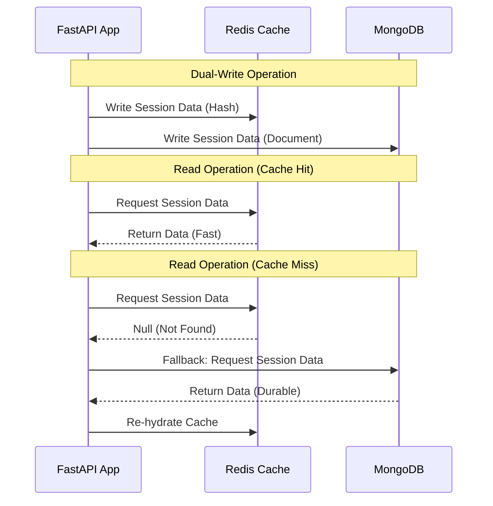

# Chapter 3: Data Persistence and Session Management for AI Chatbot

This chapter details the data layer architecture designed specifically for the AI chatbot component of the CareerIntel platform. The system leverages a polyglot persistence approach, utilizing MongoDB, Redis, Supabase, and Qdrant to manage conversational state, cache frequent queries, store persistent user profiles, and perform semantic vector searches.

## 3.1 MongoDB for Unstructured Conversation History

The chatbot handles highly unstructured and dynamic data, making a NoSQL document database like MongoDB the ideal choice for storing conversation history.

### Async I/O with Motor
To ensure high performance and non-blocking operations within the FastAPI backend, the system utilizes `AsyncIOMotorClient`. This allows the application to handle multiple concurrent database requests efficiently, which is critical for real-time chat interactions.

### Conversation History Collection
Each turn in the chat is stored in a dedicated collection. The schema includes the session identifier, the role (e.g., user, assistant, system), the message content, and a timestamp. To optimize retrieval speed when loading a user's chat history, a compound index is implemented on the session identifier and timestamp fields `("session_id", 1), ("timestamp", 1)`.

### GridFS for Raw File Storage
Users frequently upload PDF resumes for analysis. MongoDB's GridFS, accessed via `AsyncIOMotorGridFSBucket`, provides a robust mechanism for storing these raw, potentially large binary files. Each stored file is intrinsically linked to its corresponding session identifier, ensuring data coherence and easy retrieval.

### Conversation Summarization
To manage the context window limits of large language models, the system periodically generates extractive summaries of long conversations. These summaries are stored alongside the session metadata in a dedicated `sessions` collection, allowing the chatbot to maintain long-term context without continuously processing the entire chat history.

## 3.2 Dual-Write Session Management (Redis + MongoDB)

Session management requires both extreme speed for real-time interaction and durability to prevent data loss. This is achieved through a dual-write strategy using Redis and MongoDB.

### Redis Cache Layer
Redis serves as the primary, low-latency datastore for active sessions. Session data is stored using Redis Hashes, keyed by the session identifier (e.g., `session:{id}`). A Time-To-Live (TTL) is configured for 24 hours (`SESSION_TTL = 86400`), ensuring that inactive sessions are automatically purged to conserve memory.

### Synchronization and Durability
To balance speed and durability, the session manager employs a dual-write mechanism. When a session is updated (e.g., `set_resume`), the data is written to both the Redis cache for immediate subsequent reads and to MongoDB for permanent storage. If a session is requested but not found in Redis (a cache miss), the system seamlessly falls back to MongoDB to retrieve and re-hydrate the cache.

## 3.3 Supabase for Persistent User Profiles

While MongoDB handles ephemeral chat data, Supabase (PostgreSQL) is utilized for persistent, structured user data.

### Relational Storage
The platform stores analyzed resume data and extracted skills in a structured `user_resume_data` table. This table tracks the user identifier, the structured resume JSON, and a calculated quality score.

### Data Security
To ensure strict data privacy, Row Level Security (RLS) policies are enforced at the database level. This guarantees that users can only access and modify their own persistent resume data, maintaining strict tenant isolation.

## 3.4 Qdrant for Semantic Vector Search

To enable the chatbot to understand the semantic meaning of resumes and job descriptions, the system integrates Qdrant, a high-performance vector database.

### Vector Embeddings
The platform utilizes the `BGE-M3` embedding model to convert textual data into dense vector representations. These vectors are indexed and stored within Qdrant, allowing the system to perform complex semantic similarity searches—such as matching a user's skills against specific job requirements—with high accuracy and speed.
