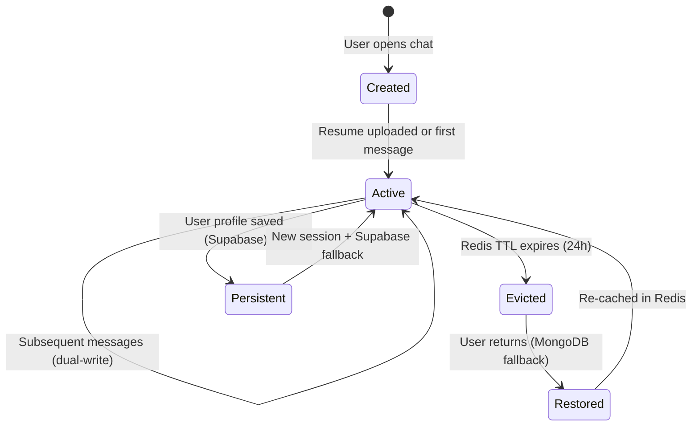
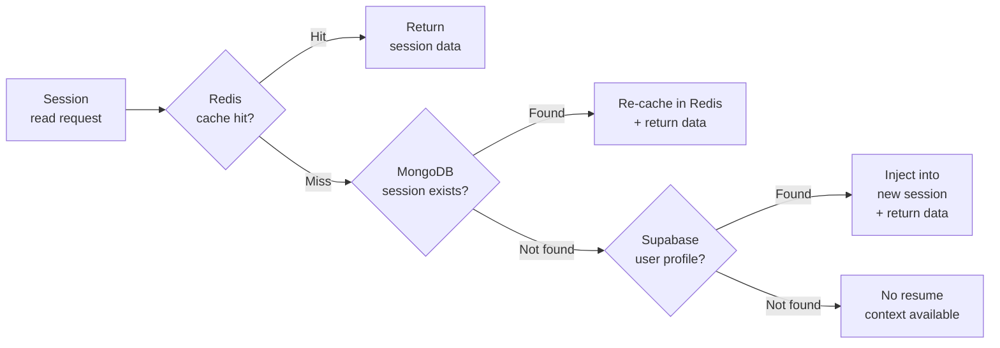
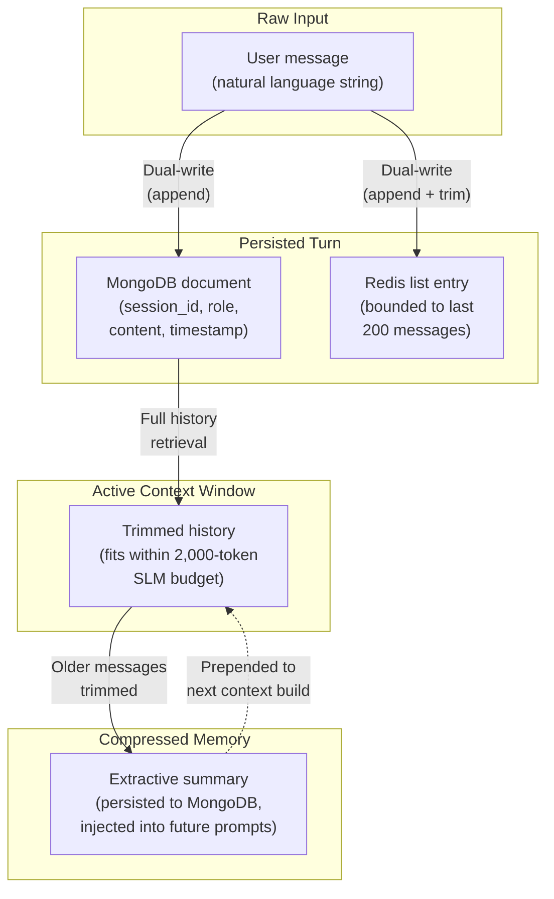
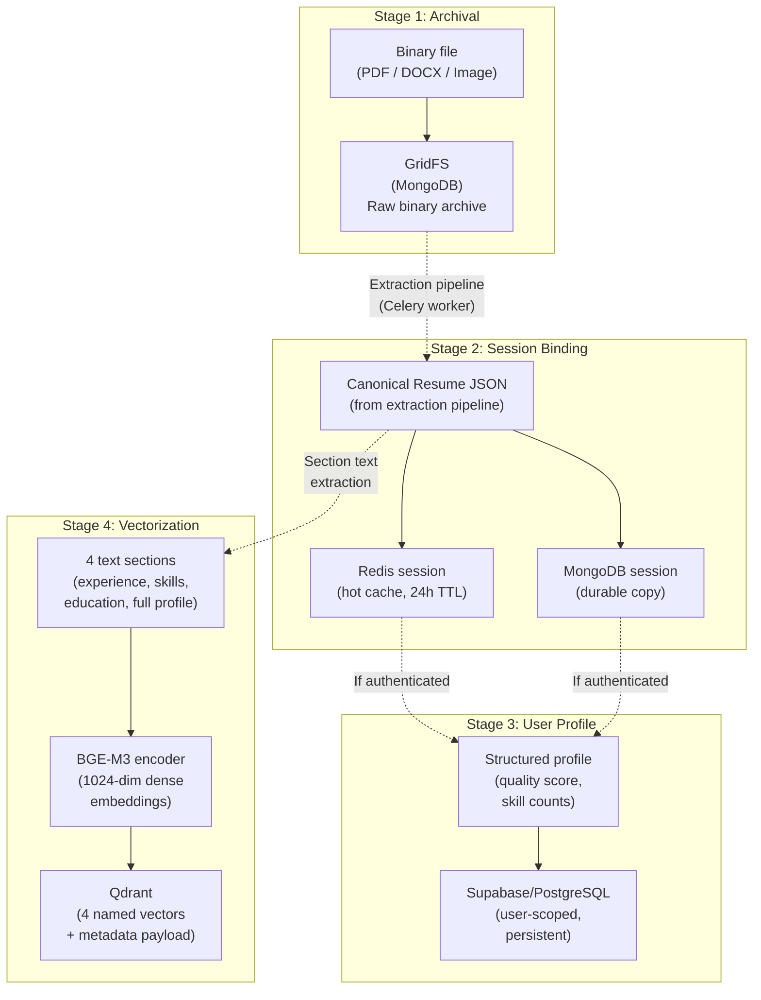

# Chapter 3: Polyglot Persistence Architecture

## 3.1 Overview

The AI chatbot operates across four distinct data access patterns that no single database can serve optimally: sub-millisecond reads of active session state, flexible document queries over unstructured conversation history, high-dimensional similarity search across vectorized resumes, and relational integrity for persistent user profiles with row-level tenant isolation. Rather than forcing these patterns into a single storage engine — accepting poor performance in at least three of the four — the system adopts a polyglot persistence strategy: each database is selected for the access pattern it was designed to optimize.

This chapter presents the architectural rationale behind the four-database topology, the data flows that connect them, and the design tradeoffs that govern their interaction. The focus is on three cross-cutting concerns: how session data moves through a lifecycle of creation, hydration, eviction, and restoration across database boundaries; how conversation state transforms from individual messages into a managed context window with extractive summarization; and how resume data flows from raw binary uploads through increasingly structured representations until it reaches a vector-searchable form. Chapter 1 introduced the Persistent Intelligence Domain as one of three computational domains; this chapter elaborates that domain's internal architecture in depth.

Redis provides the in-memory session cache — the first tier that every read request hits before falling through to slower, more durable stores. MongoDB serves as the durable document store for conversation history, session metadata, and raw binary files via GridFS, providing the source-of-truth that outlives Redis TTL eviction. Qdrant stores dense vector embeddings that enable semantic search and skill-gap analysis, capabilities that neither Redis nor MongoDB can provide. Supabase (PostgreSQL) provides the persistent, user-scoped storage layer with relational integrity and database-level access control, ensuring that resume data survives across chatbot sessions and that tenant isolation is enforced independently of application logic.

## 3.2 Session Lifecycle Pipeline

A chatbot session passes through five distinct states as it moves across the persistence layer. Understanding this lifecycle is essential to understanding why the system writes the same data to two databases simultaneously and why it maintains a three-tier fallback chain for reads.

**Created → Active**: When a user initiates a conversation or uploads a resume, the system creates a session entry in Redis with a 24-hour time-to-live. If a resume is attached, the parsed JSON is bound to the session alongside the Qdrant vector identifier and the original filename. This initial write also propagates to MongoDB through an upsert operation, establishing the durable copy that will outlive the cache.

**Active → Active (Dual-Write)**: Every session update — new resume binding, conversation turn, context summary — writes to both Redis and MongoDB in sequence. Redis provides the sub-millisecond read latency required for real-time chat interactions; MongoDB provides the durability guarantee that survives cache eviction and service restarts. The system prioritizes write consistency over write performance: both writes must succeed before the operation returns, ensuring the durable store never lags behind the cache.

**Active → Evicted → Restored**: When a session's 24-hour TTL expires in Redis, the data is silently evicted. If the user returns, the system detects the cache miss and transparently falls through to MongoDB, retrieves the session data, re-caches it in Redis with a fresh TTL, and resumes the conversation as though no interruption occurred. This fallback is invisible to the user and to the upstream chat endpoint — the session store abstracts the recovery behind a single read interface.

**Active → Persistent**: For authenticated users, resume data is additionally persisted to Supabase (PostgreSQL), creating a user-scoped record that survives not just cache eviction but session expiration entirely. This enables the third fallback tier: when a returning user starts a new chatbot session, the system checks Supabase for previously analyzed resume data and injects it into the new session context, eliminating the need for re-upload.

The three-tier fallback chain — Redis → MongoDB → Supabase — reflects a deliberate architectural ordering from fastest-but-ephemeral to slowest-but-permanent. Each tier serves a different temporal scope: Redis holds active sessions (minutes to hours), MongoDB holds session history (days to weeks), and Supabase holds user profiles (indefinitely).

## 3.3 Conversation State Machine

Conversation data undergoes a series of transformations as it moves through the persistence layer, progressing from individual user messages into a managed context window that fits within the small language model's token budget. This transformation pipeline is central to the system's ability to maintain coherent multi-turn conversations despite the base model's limited context capacity.

**Raw Input → Persisted Turn**: Each user or assistant message is appended to both MongoDB (as an individual document with session linkage and chronological timestamp) and Redis (as a serialized entry in a bounded list). The MongoDB copy is the source-of-truth: it retains the complete conversation history without length constraints. The Redis copy is a performance optimization: it caches the most recent turns for fast retrieval during active conversations, automatically discarding older entries to prevent unbounded memory growth.

The MongoDB collection uses a compound index on session identifier and timestamp, enabling chronologically ordered retrieval of an entire conversation thread through a single index scan. This index design eliminates the need for a sort operation at query time — the storage layer returns messages in the order they were spoken.

**Persisted Turn → Active Context Window**: When the chat endpoint prepares a prompt for the language model, it retrieves the full conversation history from MongoDB and passes it through the Context Window Manager (detailed in Chapter 7). The manager evaluates the total token count against the model's 2,000-token budget and trims older messages from the beginning of the history until the remaining turns fit within the budget.

**Active Context Window → Compressed Memory**: When messages are trimmed, they are not simply discarded. The Context Window Manager generates an extractive summary of the dropped messages — a compressed representation that preserves the key topics, decisions, and user preferences from earlier in the conversation. This summary is persisted to MongoDB and prepended to the context window on subsequent requests, giving the model awareness of conversational history that has been evicted from the active window.

This summary-and-reinject pattern is the architectural answer to a fundamental constraint: the SLM's limited context window cannot hold long conversations, but users expect conversational continuity across dozens of turns. Rather than truncating silently (losing context) or paginating (adding complexity), the system compresses old context into a summary that occupies a fraction of the original token count while preserving the information most relevant to ongoing dialogue.

## 3.4 Resume Data Pipeline

Resume data follows the most complex cross-database flow in the system, touching all four databases as it transforms from an unstructured binary file into a searchable, AI-ready vector representation. This pipeline is the persistence-layer counterpart to the four-stage CV Upload Pipeline described in Chapter 1 (§1.5.2) — where that section focused on the computational transformations (parsing, NER, embedding), this section traces the data's journey through the storage layer.

**Archival (MongoDB GridFS)**: The raw binary file is archived in MongoDB's GridFS immediately upon upload, before any processing begins. This archival serves two purposes: it provides an immutable record of the original document for audit and re-extraction, and it decouples the binary storage concern from the extraction pipeline — if extraction fails or needs to be re-run with improved algorithms, the original file is always available without requiring the user to upload again.

**Session Binding (Redis + MongoDB)**: Once the extraction pipeline produces a canonical resume JSON, the Celery worker binds it to the user's active session through the dual-write pattern described in §3.2. The resume JSON, the Qdrant vector identifier, and the original filename are written to both Redis and MongoDB, making the parsed resume immediately available to subsequent chat interactions. This binding is what enables the chatbot's resume-aware tools — CV assessment, job matching, interview preparation — to access the user's parsed profile without re-extraction.

**User Profile (Supabase)**: For authenticated users, the structured profile data — including the canonical resume JSON, quality score, and aggregate metrics (skill count, experience count) — is persisted to Supabase. This write is the bridge between session-scoped and user-scoped persistence: the session may expire, but the user profile endures. The data stored here is the same canonical JSON produced by the extraction pipeline, but associated with the user's identity rather than a transient session identifier.

**Vectorization (Qdrant)**: The extraction pipeline simultaneously generates four dense vector embeddings from different sections of the resume text, each encoding a different aspect of the candidate's profile. These vectors are stored as a single Qdrant point with four named vectors, enabling aspect-specific similarity search — a query against the skills vector returns resumes with similar skill profiles, while a query against the full profile vector returns holistically similar candidates.

The multi-vector architecture is a deliberate design choice that trades storage space (4× the vectors of a single-embedding approach) for retrieval precision. The chatbot's downstream tools exploit this granularity: job matching queries the skills vector for skill-gap analysis, while general resume search uses the full profile vector for holistic comparison. Each vector is accompanied by a metadata payload containing the candidate's structured attributes (seniority level, quality score, skill list), enabling filtered retrieval without secondary database lookups — the vector database serves as both the similarity engine and the metadata store for resume-aware operations.

## 3.5 Tenant Isolation Architecture

The system enforces data isolation at two architectural levels: database-level policies that are evaluated on every query regardless of application logic, and application-level ownership filters that restrict operations to the requesting user's data.

**Database-Level Isolation (Supabase)**: The persistent user profile table enforces Row Level Security (RLS) policies directly in PostgreSQL, ensuring that every SELECT, INSERT, UPDATE, and DELETE operation is automatically filtered to the authenticated user's records. These policies are evaluated by the database engine itself — even a direct SQL query bypassing the application layer cannot access another user's data. The policies extract the authenticated user's identity from the JWT token and compare it against the ownership column on every row access.

The chatbot's backend service requires an exception to this isolation: the Celery worker performs server-side writes on behalf of users during asynchronous CV extraction, a context where no user JWT is available. This is resolved through a trust boundary decision — the worker connects with an elevated service-role key that bypasses RLS, while all user-facing endpoints connect with the user's scoped JWT. This bifurcation ensures that the least-privilege principle is maintained: user-facing code can never exceed the user's own data scope, while background workers operate under explicit, auditable elevated privileges.

**Application-Level Isolation (MongoDB)**: The conversation management layer enforces ownership isolation through query-level filtering — every read, update, and delete operation includes the user's identity as a mandatory filter predicate. This provides defense-in-depth: even if a user somehow obtains another user's conversation identifier, the query filter prevents cross-tenant access. MongoDB does not natively support row-level security policies comparable to PostgreSQL's, making this application-level enforcement the primary isolation mechanism for conversation data.

## 3.6 Design Tradeoffs

### 3.6.1 Four Databases vs. One

The polyglot persistence strategy introduces operational complexity: four databases to deploy, monitor, back up, and maintain, each with its own failure mode and scaling characteristics. The alternative — consolidating into PostgreSQL (which can serve as a cache via `UNLOGGED` tables, a document store via JSONB, and a vector store via pgvector) — would simplify operations at the cost of performance in at least two access patterns. Redis outperforms PostgreSQL for session reads by an order of magnitude, and Qdrant's HNSW index provides sub-100ms approximate nearest-neighbor search at a scale where pgvector's exact search degrades significantly. The system accepts the operational cost because the chatbot's real-time responsiveness depends on each database operating within its designed performance envelope.

### 3.6.2 Dual-Write vs. Event Sourcing

The dual-write pattern (writing to both Redis and MongoDB in the same request path) introduces a consistency risk: if the MongoDB write fails after the Redis write succeeds, the cache contains data that the durable store does not. An event-sourcing architecture — where all state changes are appended to an immutable event log and materialized views are derived from replay — would eliminate this risk but add significant architectural complexity for a system where the failure mode is benign: a missed MongoDB write means the session cannot be restored after Redis eviction, but no data is corrupted. The system accepts this risk because session data is inherently ephemeral and can be regenerated by re-uploading a resume.

### 3.6.3 Embedded Messages vs. Referenced Documents

Conversation messages in the sidebar's persistence layer are embedded as an array within the conversation document rather than stored as individual referenced documents. This trades write amplification (every new message rewrites the parent document's array) for read atomicity (loading a conversation retrieves the complete thread in a single query without joins). For a chatbot where conversations rarely exceed a few hundred messages, the document size remains well within MongoDB's 16 MB limit, and the read performance benefit — a single round-trip instead of a join across two collections — directly impacts the sidebar's perceived responsiveness when switching between conversations.
