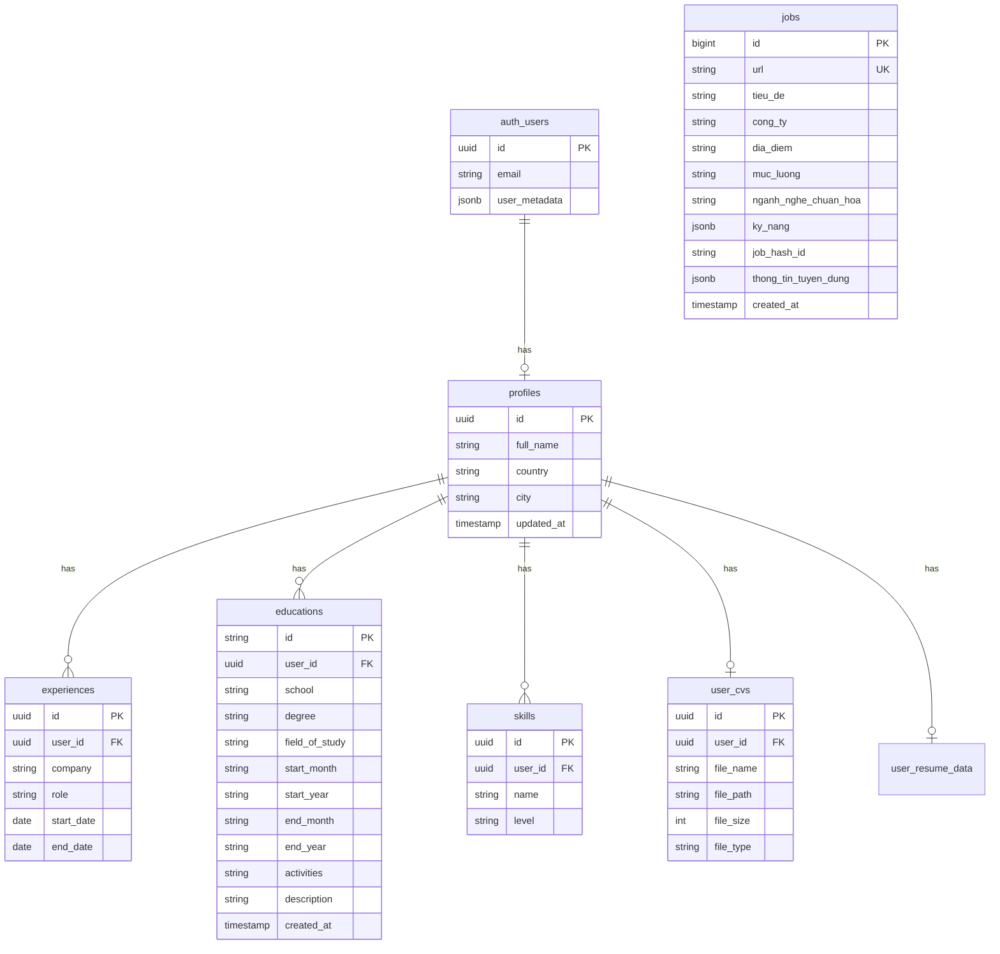
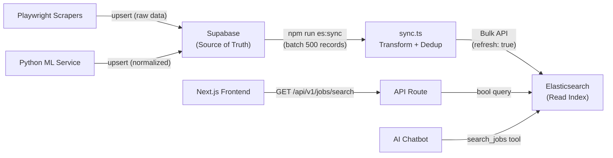

# Chapter 3: Polyglot Persistence and Search Infrastructure

## 3.1 Overview
This chapter outlines the core data architecture of the Job Market Analytics Platform. Managing diverse data types—ranging from highly structured user profiles to massive, unstructured job postings—requires a specialized approach. The system adopts a polyglot persistence strategy, utilizing five distinct databases (Supabase, Redis, MongoDB, Elasticsearch, and Qdrant), each selected to optimally address specific data shapes and access patterns.

This chapter focuses on the three core platform components: **Supabase** (relational), **Redis** (caching and security), and **Elasticsearch** (full-text search). MongoDB and Qdrant are covered in the companion thesis (Thesis 1) as they primarily serve the AI Chatbot subsystem.

## 3.2 Polyglot Persistence Justification

The platform handles several distinct data workloads that impose conflicting requirements on a database system:

| Workload | Access Pattern | Consistency Requirement | Optimal Database Type |
|----------|---------------|------------------------|----------------------|
| User accounts & profiles | Relational joins, ACID transactions | Strong consistency | PostgreSQL (Supabase) |
| Job search queries | Full-text search, faceted aggregations | Eventual consistency | Elasticsearch |
| Session tokens & cache | Sub-millisecond reads, automatic expiry | Best-effort | Redis |
| Chat conversation logs | Schema-less document appends | Eventual consistency | MongoDB |
| Resume embeddings | Approximate nearest neighbor search | Eventual consistency | Qdrant |

### Why Not a Monolithic Database?

A traditional, monolithic PostgreSQL approach was initially considered. However, the following trade-offs became evident:

| Criteria | Monolithic PostgreSQL | Polyglot Architecture |
|----------|----------------------|----------------------|
| **Full-text search** | `ILIKE` / `tsvector` — limited fuzzy search, no faceted aggregations | Elasticsearch BM25 with native facets |
| **Session caching** | Disk-based I/O per session lookup | Redis in-memory at sub-millisecond latency |
| **Vector similarity** | `pgvector` extension — single-node, limited indexing algorithms | Qdrant HNSW with named vector support |
| **Schema flexibility** | Rigid schema migrations for chat logs | MongoDB schemaless document appends |
| **Operational complexity** | Single database, simple operations | 5 databases, requires health checks and sync pipelines |

The polyglot approach trades operational complexity for optimized performance at each data access layer. The key architectural decision is to designate **Supabase as the single source of truth** and treat all other databases as **read-optimized replicas or caches**, following the Command Query Responsibility Segregation (CQRS) pattern.

## 3.3 Supabase (Core Relational Database)

Supabase, built on top of PostgreSQL, serves as the primary relational database for the application's core logic.

### Structured Entities
Supabase is responsible for managing structured entities that require strong ACID (Atomicity, Consistency, Isolation, Durability) guarantees. The relational model ensures data integrity and enforces complex business rules through foreign key constraints.

### Dual-Client Architecture
The application maintains two distinct Supabase client configurations to enforce access control separation:
- **Browser Client** (`@supabase/supabase-js`): Uses the public Anon Key, subject to Row Level Security (RLS) policies. Used for user-facing operations.
- **Server Client** (`@supabase/ssr`): Uses the Service Role Key, bypassing RLS. Used for administrative operations (scraper data ingestion, batch normalization).

## 3.4 Redis (Session, Cache, and Security Layer)

Redis is deployed as the high-speed, in-memory cache layer, serving three critical roles in the architecture: session management, query caching, and security enforcement.

### Singleton Connection Pattern
Within the application, Redis connections are managed via a **global singleton pattern** (`globalForRedis`). This approach prevents connection multiplication during Next.js hot-module-reload (HMR) cycles in development, where module re-imports would otherwise create a new TCP connection per reload. In production (`NODE_ENV=production`), the singleton is not cached globally since HMR is not active.

### Redis Key Space Architecture

The codebase employs structured key naming conventions with appropriate TTL strategies:

| Key Pattern | Purpose | TTL | Module |
|------------|---------|-----|--------|
| `rate_limit:{ip}:{window}` | Fixed-window rate limiting | `windowSeconds + 10` | `redisSecurity.ts` |
| `blacklist:{sha256_hash}` | JWT revocation on logout | Matches JWT `exp` claim | `redisSecurity.ts` |
| `session:{id}` | Chatbot session state | 24 hours | `session_store.py` |
| `session:{id}:history` | Chat history sync buffer | 24 hours | `session_store.py` |
| `job:{id}` | Async CV processing job status | 1 hour | `job_tracker.py` |

### Core Workloads
- **Authentication Security**: Redis handles both **JWT blacklisting** (SHA-256 hash with TTL matching token expiry) and **rate limiting** (Fixed Window Counter algorithm at 50 requests per 60 seconds per IP). These are detailed in Chapter 5.
- **Job Tracking**: Background processing tasks for CV extraction rely on Redis to track job state and progress with sub-millisecond updates.
- **Enum Caching**: Frequently accessed Elasticsearch aggregation results (cities, experience buckets, work types, categories) are cached in the server's RAM via the `EnumCache` class, with periodic async refresh from Elasticsearch every 3,600 seconds.

## 3.5 Elasticsearch (Full-Text Search Engine)

To power the core "job search" functionality, the system relies on Elasticsearch 8.13.0. Standard relational databases are not optimized for unstructured text search at scale.

### CQRS Data Flow

### Data Synchronization
Job posting data is synchronized from Supabase into Elasticsearch via a batch pipeline (`npm run es:sync`). The sync script employs a **full-rebuild strategy**: it deletes and recreates the entire index on each run, then re-indexes all records. While this approach is less efficient than incremental sync, it guarantees index consistency and eliminates stale-document accumulation. The pipeline processes records in paginated batches of 500, ordered by `created_at` descending (newest first), and applies in-memory URL-based deduplication via a JavaScript `Set`.

### Advanced Mapping and Indexing
Elasticsearch indices are carefully mapped to support diverse search requirements:

| Field | ES Type | Analyzer | Purpose |
|-------|---------|----------|---------|
| `url` | `keyword` | — | Unique document ID |
| `tieu_de` | `text` | `standard` | Job title full-text search (boosted ×3) |
| `cong_ty` | `text` | `standard` | Company name search (boosted ×2) |
| `cities` | `keyword` | — | Location faceted filter (63 provinces/cities) |
| `categories` | `keyword` | — | Industry domain faceted filter (66 domains) |
| `workTypes` | `keyword` | — | Work type faceted filter |
| `levels` | `keyword` | — | Seniority level faceted filter |
| `expBuckets` | `keyword` | — | Experience tier faceted filter (4 ranges) |
| `salaryBuckets` | `keyword` | — | Salary tier faceted filter (6 ranges) |
| `created_at` | `date` | — | Temporal ordering |
| `raw_data` | `object (enabled: false)` | — | Full job document stored but NOT indexed |

The `raw_data` field uses `enabled: false` to store the original job JSON without indexing its internal contents. This significantly saves system resources (RAM, CPU, disk) during indexing while retaining all data for retrieval — the frontend reads job details directly from `raw_data` without requiring a secondary query to Supabase.

## 3.6 Technology Choice: Elasticsearch vs Alternatives

| Criteria | Elasticsearch 8.13 | Typesense | Meilisearch | PostgreSQL Full-Text |
|----------|-------------------|-----------|-------------|---------------------|
| **Relevance algorithm** | BM25 (default since v5) | TF-IDF variant | Proximity-based | `ts_rank` with `tsvector` |
| **Faceted aggregations** | Native `terms` aggregations | Native facets | Native facets | `GROUP BY` (expensive at scale) |
| **Fuzzy search** | Levenshtein edit distance (`fuzziness: AUTO`) | Typo tolerance (1-2 chars) | Typo tolerance (built-in) | `ILIKE` / trigram similarity |
| **Vietnamese NLP** | Standard analyzer (tokenization, lowercasing) | No built-in CJK support | No built-in CJK support | `simple`/`pg_trgm` dictionaries |
| **Deployment** | Docker official image | Single binary | Single binary | Built into Supabase |
| **Scalability** | Horizontal sharding | Vertical scaling | Vertical scaling | Connection-limited |
| **Ecosystem** | Mature (REST API, Kibana) | Lightweight | Lightweight | Native PostgreSQL |
| **Memory usage** | ~512 MB (JVM heap) | ~50 MB | ~50 MB | Shared with main DB |

Elasticsearch was selected for its mature ecosystem, native Docker support, powerful `bool` query DSL, and production-proven aggregation capabilities. Its BM25 relevance scoring provides superior search quality compared to PostgreSQL's basic full-text capabilities, which is critical for a job search platform processing thousands of Vietnamese-language postings.

## 3.7 Key Quantitative Metrics

| Metric | Value |
|--------|-------|
| Total databases in polyglot architecture | 5 (Supabase, Redis, Elasticsearch, MongoDB, Qdrant) |
| Core databases (Thesis 2 scope) | 3 (Supabase, Redis, Elasticsearch) |
| Supabase tables | 7 (`profiles`, `experiences`, `educations`, `skills`, `user_cvs`, `jobs`, `user_resume_data`) |
| Redis key patterns | 5 distinct naming conventions |
| Redis rate limit threshold | 50 requests / 60 seconds / IP |
| EnumCache TTL | 3,600 seconds (1 hour) |
| ES index fields | 10 mapped fields + 1 stored-only (`raw_data`) |
| ES sync batch size | 500 records per Supabase fetch |
| ES JVM heap allocation | 512 MB initial / 512 MB maximum |
| Geographic entities (cities) | 63 entries (61 provinces + "Toàn quốc" + "Nước ngoài") |
| Industry domain categories | 66 standardized categories |
| Salary buckets | 6 ranges (0–3, 3–5, 5–10, 10–20, 20–50, 50+ triệu VND) |
| Experience buckets | 4 ranges (< 1, 1–2, 2–5, 5+ years) |
