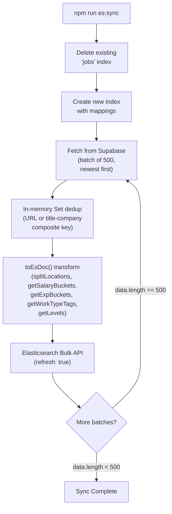
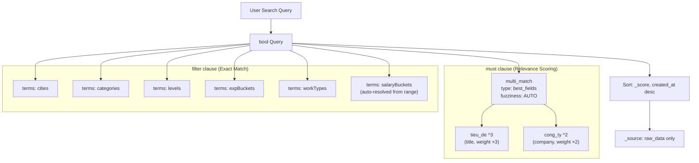

# Chapter 4: Full-Text Search Engine (Elasticsearch)

## 4.1 Search Architecture & Rationale

Building a job search system requires the ability to handle complex text queries, faceted filtering, and fast response times. In the initial phase, a relational database system (PostgreSQL via Supabase) was used as the primary data source. However, as the data volume grew and search requirements became more complex, this architecture revealed several limitations:

- **Limitations of SQL**: Full-text search queries or `ILIKE` operators in PostgreSQL are not optimized for natural language search, especially when handling spelling errors and relevance scoring. PostgreSQL's `tsvector` / `tsquery` system lacks native Vietnamese language support and provides limited relevance tuning compared to specialized search engines.
- **Faceted Aggregations**: Dynamically calculating filter categories (e.g., counting the number of jobs per city or salary range) consumes a lot of resources if executed directly on SQL using complex `GROUP BY` clauses. Each unique filter combination requires a separate query, leading to N+1 aggregation overhead.

To resolve these issues, the system architecture adopts the Command Query Responsibility Segregation (CQRS) pattern:
- **Supabase (PostgreSQL)** acts as the "Source of Truth" (Transactional Database), storing the original data after scraping and normalization.
- **Elasticsearch 8.13** is used as a "Read-only Index" (Analytical Database), dedicated to processing search queries and filtering data for the frontend and AI Chatbot. The Elasticsearch system is deployed as a single-node cluster via Docker (`elasticsearch:8.13.0` on port 9200), ensuring lightning-fast search capabilities and multi-language support.

## 4.2 Index Schema & Mapping Strategies

To optimize Elasticsearch for both relevance scoring and exact filtering, the index structure (`jobs`) is meticulously designed within the data synchronization configuration file.

Two main data type strategies are used:
1. **Keyword Mapping**: Applied to fields that require exact match filtering and aggregations, such as `url`, `cities` (63 geographic entities), `categories` (66 industry domains), `workTypes`, `levels`, `expBuckets` (4 tiers), and `salaryBuckets` (6 ranges). The `keyword` type allows Elasticsearch to build optimal data structures (inverted index on exact terms) for directly searching original text structures without tokenization.
2. **Text Mapping**: Applied to fields that require relevance scoring, such as `tieu_de` (job title) and `cong_ty` (company name), using the default `standard` analyzer. The standard analyzer performs Unicode-aware tokenization, lowercasing, and stop word removal, enabling BM25-based relevance ranking.

**Optimizing the "Document Store" with `enabled: false`**:
Instead of extracting every detail of the job for indexing, the `raw_data` field is configured as an `object` type with the `enabled: false` option. This option instructs Elasticsearch to store the original JSON string of the job without indexing its internal contents.
This approach significantly saves system resources (RAM, CPU, disk space) during the indexing process while retaining all the data. When a search query returns results, the frontend can immediately retrieve detailed job data from `raw_data` without needing an additional query to Supabase for the information.

## 4.3 Data Ingestion & Deduplication Pipeline (Sync Flow)

Data is updated from Supabase to Elasticsearch via a batch synchronization pipeline. This process is triggered by a Node.js script (`sync.ts`).

The sync pipeline employs a **full-rebuild strategy**: the existing index is deleted and recreated on each run, ensuring zero stale-document accumulation. While this is less efficient than incremental sync for very large datasets, it guarantees index consistency and eliminates the need for complex change-detection logic.

1. **Batch Fetching**: The system fetches data from Supabase in paginated batches (500 records per batch) ordered by `created_at` descending (newest first). Breaking the data down into batches helps prevent memory overflow.
2. **Memory-Resident Deduplication**: To avoid data duplication before pushing to Elasticsearch, an in-memory `Set` data structure (RAM) is used to track records that have already appeared. The primary deduplication key is the job URL. If the URL is missing, a composite key in the format `${tieu_de}-${cong_ty}` (title-company) is used as the fallback identifier.
3. **Normalization Transform**: Each job record passes through five normalization functions (`splitLocations`, `getSalaryBuckets`, `getExpBuckets`, `getWorkTypeTags`, `getLevels`) that convert unstructured Vietnamese text into standardized keyword facets.
4. **Bulk API**: The deduplicated and normalized data is pushed using the `_bulk` API, which exponentially improves write speeds compared to sequentially writing individual documents. These operations are executed with the `refresh: true` option to ensure that new data is searchable immediately after the sync completes.

## 4.4 Vietnamese NLP & Heuristic Normalization Logic

Due to the unstructured nature of Vietnamese job postings, an internal library (`helpers.ts`, 152 lines) was built to extract and normalize data through Heuristic and Regex techniques prior to indexing:

- **Location Parsing (`splitLocations`)**: Raw location strings (e.g., "Nơi làm việc: Hà Nội, Tp. HCM") are stripped of unnecessary prefixes, split by commas, and matched against a static array of **63 provinces/cities** (`CITY_PATTERNS`). The system applies Regex for noise filtering when job title keywords (such as "chuyên viên", "trưởng phòng") are mistakenly identified as locations. Notably, the parser implements a **negative lookbehind regex** `(?<!Bà Rịa) - (?!Vũng Tàu)` to prevent incorrectly splitting the compound province name "Bà Rịa - Vũng Tàu" on the hyphen delimiter — a critical edge case in Vietnamese geographic parsing.

- **Salary Bucketing (`getSalaryBuckets`)**: Foreign currency salaries are filtered out using a comprehensive regex matching **17 international currency codes** (USD, EUR, GBP, JPY, SGD, AUD, CAD, HKD, KRW, THB, MYR, INR, CNY, RMB, TWD, CZK, CHF). For VND salaries, the system uses Regex to extract number ranges (e.g., "10 - 15 triệu"), removes commas, converts them to floating-point decimals representing millions of VND, and classifies them into 6 fixed income ranges: 0–3, 3–5, 5–10, 10–20, 20–50, and over 50 million VND.

- **Experience Parsing (`getExpBuckets`)**: Text regarding experience (e.g., "dưới 1 năm", "trên 5 năm", or ranges like "1 - 2 năm") is scanned and normalized into a time range value in years. Month-based values (e.g., "2-5 tháng") are automatically converted to years by dividing by 12. It is then assigned to 4 static experience buckets: Under 1 year, 1–2 years, 2–5 years, Over 5 years.

- **Work Types (`getWorkTypeTags`)**: English slang or mixed Vietnamese keywords (e.g., "full-time", "part-time", "thời vụ", "wfh", "hybrid") are mapped to 5 standard tags: "Toàn thời gian" (Full-time), "Bán thời gian" (Part-time), "Thực tập" (Internship), "Thời vụ" (Contract), "Làm tại nhà" (Remote/WFH).

## 4.5 Multi-Field Search & Relevance Tuning

When a search command is received from the AI Chatbot or the frontend API, the query is constructed via the Python async Elasticsearch client (`data_clients.py`) using the `bool` Query DSL.

1. **Relevance Scoring (Must Clause)**: If the user provides a `keyword`, the query uses the `multi_match` command with the `best_fields` option. The job title (`tieu_de`) is weighted with a multiplier of 3 (`^3`), while the company name (`cong_ty`) receives a weight multiplier of 2 (`^2`). The `fuzziness: AUTO` feature enables Levenshtein edit-distance tolerance, allowing 0 edits for terms 1–2 characters, 1 edit for 3–5 characters, and 2 edits for 6+ characters. This handles common typos but is not Vietnamese-specific NLP — it operates at the character level.
2. **Strict Filtering (Filter Clauses)**: Optional parameters such as location, salary, and experience are passed in as `terms` filters, instructing the engine to strictly match the content against the defined `keyword` types. Filter clauses do not affect relevance scoring and are cached by Elasticsearch for performance.
3. **Salary Resolution**: When given an input range for desired salary (`min_salary` to `max_salary`), the algorithm automatically identifies all salary buckets that overlap with the request and injects them into the query as a list of valid keywords. For example, a request for 8–15 million VND would resolve to buckets "5 – 10 triệu" and "10 – 20 triệu".
4. **City Prioritization**: If a user searches by location, the returned payload within `raw_data` is automatically adjusted by moving the queried city to the top of the `cities` list. This reordering helps the frontend interface and AI better assess visual priority when displaying multiple locations.
5. **Source Filtering**: The `_source` field is restricted to `["raw_data"]` only, avoiding the transfer of redundant indexed fields in the response payload.

## 4.6 Aggregation & Memory-Resident Enum Caching

To build a UI filtering experience or to provide a valid set of parameters for the AI Chatbot's Tool Calling process, the system needs to know the available filter values (e.g., which cities currently have job postings).

- **Elasticsearch Aggregations**: The client sends queries with a size of 0 (`size: 0`) requesting `terms aggregations` to group distinct attributes (`distinct_cities` up to 1,000 buckets, `distinct_categories` up to 500 buckets).
- **EnumCache Pattern**: To avoid constantly sending Aggregation queries that consume Elasticsearch resources, the `EnumCache` class (`enum_cache.py`, 138 lines) maintains these lists directly in the server's memory (RAM) with a Time-To-Live (TTL) of 3,600 seconds (1 hour).
- **Async Background Refresh**: The cache refresh process runs as a background task via `asyncio.Task` (`_refresh_loop`). Therefore, any GET request from the frontend or Pydantic Validator from the Chatbot can retrieve these data tags in sub-millisecond times thanks to synchronous properties (`@property`), significantly improving the application's overall response speed.

## 4.7 Key Quantitative Metrics

| Metric | Value |
|--------|-------|
| ES Docker image version | `elasticsearch:8.13.0` |
| JVM heap allocation | 512 MB initial / 512 MB maximum |
| Sync batch size | 500 records per Supabase fetch |
| City patterns dictionary | 63 geographic entities |
| Industry domain categories | 66 standardized tags |
| Salary buckets | 6 ranges (VND millions) |
| Experience buckets | 4 ranges |
| Work type tags | 5 standard categories |
| Foreign currency filter | 17 international currency codes |
| Title boost weight | ×3 (`tieu_de^3`) |
| Company boost weight | ×2 (`cong_ty^2`) |
| EnumCache TTL | 3,600 seconds (1 hour) |
| Max aggregation buckets (cities) | 1,000 |
| Max aggregation buckets (categories) | 500 |
| helpers.ts complexity | 152 lines |
| enum_cache.py complexity | 138 lines |
