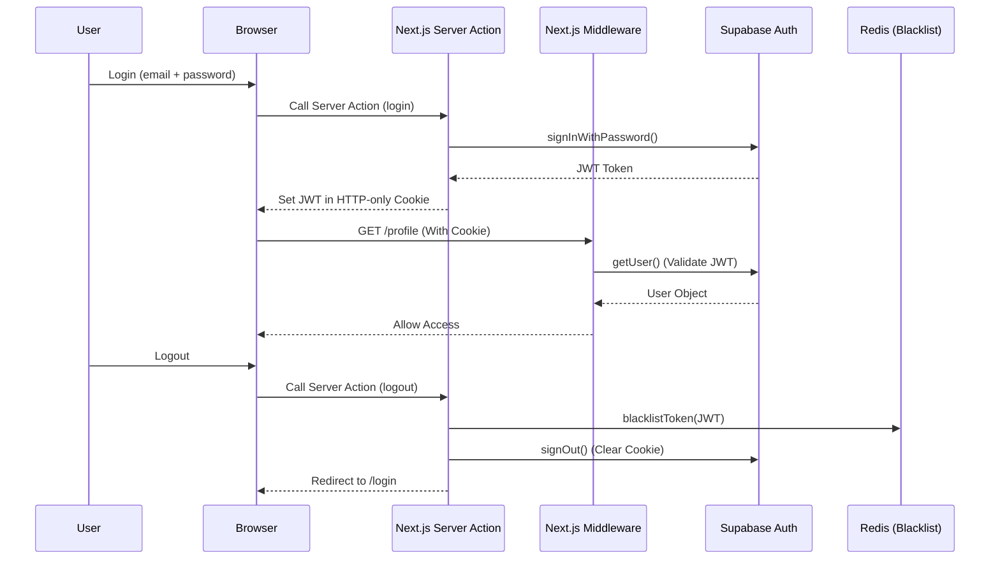
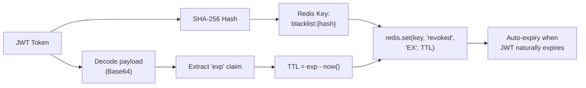

# Chapter 5: Authentication & Authorization

## 5.1 Architecture Overview

In the CareerIntel platform, securing user data and managing access control are pivotal. Instead of building and maintaining a custom JSON Web Token (JWT) issuance system from scratch, the project leverages a managed authentication model via **Supabase Auth**. Supabase provides a robust identity solution, backed by PostgreSQL, which integrates tightly with the Next.js 16 Middleware architecture.

To add an additional security layer, the platform integrates **Redis** to handle Token Revocation (Blacklisting) immediately when a user logs out, and **Rate Limiting** to protect API endpoints from abuse. The combination of Supabase (for identity verification) and Redis (for session state control and security enforcement) creates a system that is both secure and highly flexible.

### Technology Choice: Supabase Auth vs Alternatives

| Criteria | Supabase Auth | Auth0 | Firebase Auth | Custom JWT |
|----------|-------------|-------|--------------|-----------|
| **Hosting** | Managed (PostgreSQL-backed) | Managed SaaS | Managed (Google Cloud) | Self-hosted |
| **Pricing** | Free tier (50K MAU) | Free tier (7.5K MAU) | Free tier (10K verifications/month) | Infrastructure cost only |
| **Next.js integration** | `@supabase/ssr` with cookie management | `@auth0/nextjs-auth0` | `firebase-admin` SDK | Manual cookie/header management |
| **Database integration** | Native PostgreSQL RLS policies | External user store | Firestore integration | Custom user tables |
| **Social login** | Google, GitHub, OAuth | 30+ social providers | Google, Facebook, Twitter | Manual OAuth implementation |
| **JWT customization** | Limited (via PostgreSQL hooks) | Extensive (Actions/Rules) | Limited | Full control |
| **RLS (Row Level Security)** | Native support | Not applicable | Firestore Security Rules | Manual implementation |
| **Operational overhead** | Minimal | Minimal | Minimal | High (key rotation, revocation, migration) |

Supabase Auth was selected for its **native PostgreSQL Row Level Security (RLS) integration**, which allows database-level access control policies without custom middleware. Since the application already uses Supabase for its relational data layer, using its built-in auth system eliminates the need for a separate identity provider and reduces integration complexity.

## 5.2 Authentication Flow

The authentication process is designed around Server-side Cookies rather than storing tokens in the browser's Local Storage. This approach helps mitigate Cross-Site Scripting (XSS) attacks aimed at token theft.

1. **Login**: The user provides an email and password. The frontend calls a Server Action (utilizing Supabase's `signInWithPassword`).
2. **Token Issuance**: Supabase verifies the credentials and returns a JWT. This JWT is set into an HTTP-only Cookie by the Server Client.
3. **Request Validation**: Whenever the browser makes a request to protected pages, the Next.js Middleware reads the Cookie and validates the JWT using `supabase.auth.getUser()`.
4. **Logout**: When the user logs out, the current JWT is extracted and hashed, then stored in the Redis Blacklist with a Time-To-Live (TTL) corresponding to the token's remaining expiration time. Finally, the Supabase `signOut` function is called to clear the Cookie.

## 5.3 Route Protection Strategy

The platform's routing system is divided into two primary groups: Public Routes and Protected Routes. Access control is enforced in the `middleware.ts` file using the `createServerClient` from the `@supabase/ssr` library. The middleware intercepts every incoming request and validates the JWT before allowing access.

- **Protected Pages**: Pages such as `/profile`, `/ai`, `/search`, `/insights`, and `/job` (including all nested routes such as `/job/[id]`) strictly require a valid session. The `startsWith()` matching ensures all child routes inherit the protection policy.
- **Public vs Protected APIs**: Certain APIs like `/api/chatbot` and `/api/kie` are publicly accessible, whereas all other `/api/*` routes require authentication.

**Handling Unauthenticated Requests:**
The system handles requests intelligently based on their context.
- If a user attempts to access a protected page (UI) without a token, the Middleware responds with a `307 Redirect` to the `/login` page.
- However, if a request is made to a Protected API (for example, fetching personal data via a `fetch` call), a redirect is inappropriate and would cause client-side errors. In this scenario, the Middleware returns a `401 Unauthorized` status code in JSON format, allowing the frontend to catch and handle the error gracefully.

## 5.4 Advanced Security: JWT Blacklisting via Redis

An inherent drawback of Stateless JWT architecture is that a token cannot be revoked before its expiration time. To address this, the project implements a **JWT Blacklisting** mechanism using Redis within the `redisSecurity.ts` module.

### Optimized Storage Process:
Instead of storing the raw JWT string (which may contain sensitive payloads and consume more storage), the system employs the **SHA-256** algorithm to generate a Hash from the JWT via the `getTokenHash()` function. This hash serves as the key stored in Redis.
Furthermore, the key's Time-To-Live (TTL) in Redis is calculated based on the JWT's `exp` claim, by subtracting the current time from the expiration time (`getJwtExpiry()`). Consequently, Redis automatically frees up memory once the token expires, eliminating the need for manual garbage collection.

### Fail-Closed vs Fail-Open: Deliberate Security Trade-offs

The `redisSecurity.ts` module implements two distinct failure strategies depending on the security criticality of the operation:

| Function | Failure Strategy | Rationale |
|----------|-----------------|-----------|
| `isTokenBlacklisted()` | **Fail-Closed** (treat as blacklisted) | Security > Availability — prevents revoked tokens from slipping through if Redis is unreachable |
| `checkRateLimit()` | **Fail-Open** (allow request through) | Availability > Security — rate limiting failure should not block legitimate search requests |

This deliberate contrast ensures that authentication-critical operations prioritize security (forcing affected users to re-login temporarily), while non-critical operations like rate limiting prioritize availability (allowing requests through with degraded protection).

## 5.5 Rate Limiting

In addition to JWT blacklisting, the `redisSecurity.ts` module implements **API Rate Limiting** using the **Fixed Window Counter** algorithm.

### Mechanism:
1. A Redis key is constructed from the client's IP address and the current time window: `rate_limit:{ip}:{floor(now / windowSeconds)}`.
2. Each incoming request atomically increments the key using `redis.incr(key)`.
3. If the key is newly created (count = 1), a TTL of `windowSeconds + 10` seconds is set to ensure automatic cleanup.
4. If the count exceeds the configured limit (default: **50 requests per 60 seconds**), the request is rejected.

### Design Decisions:
- **Fixed Window vs Sliding Window**: The Fixed Window algorithm was chosen for its simplicity and minimal Redis operations (single `INCR` per request). While it can allow up to 2× burst at window boundaries (a known limitation), this trade-off is acceptable for the platform's traffic patterns.
- **TTL Buffer (+10s)**: The extra 10 seconds on the TTL ensures that the Redis key outlives the window, preventing a race condition where the key expires mid-window and resets the counter.

## 5.6 Form Management and Input Validation

The processing of authentication forms (Login, Signup, Profile Update) is handled through the **Next.js Server Actions** (`'use server'`) paradigm. This approach completely eliminates the need to create intermediary API routes solely for receiving form data, thereby reducing network complexity and improving processing speed.

All input data is strictly validated using the **Zod** library (`LoginSchema`, `SignupSchema`). Actions that record profile data (Experience, Education, Skill, CV) into public PostgreSQL tables (via the Supabase client) are tightly bound to the current `user_id`. This ensures data integrity and prevents Insecure Direct Object Reference (IDOR) vulnerabilities — a user can only create, update, or delete records where `user_id` matches their authenticated session.

## 5.7 Key Quantitative Metrics

| Metric | Value |
|--------|-------|
| Protected page routes | 5 (`/profile`, `/ai`, `/search`, `/insights`, `/job`) |
| Public API routes | 2 (`/api/chatbot`, `/api/kie`) |
| Rate limit threshold | 50 requests / 60 seconds / IP |
| Rate limit algorithm | Fixed Window Counter |
| JWT hash algorithm | SHA-256 |
| Blacklist TTL | Dynamic (matches JWT `exp` claim) |
| Default fallback TTL | 3,600 seconds (1 hour) |
| Rate limit TTL buffer | +10 seconds beyond window |
| Auth validation schemas | 2 (`LoginSchema`, `SignupSchema`) |
| Profile CRUD tables | 5 (`profiles`, `experiences`, `educations`, `skills`, `user_cvs`) |
| redisSecurity.ts complexity | 126 lines |
| middleware.ts complexity | 59 lines |
| actions.ts complexity | 297 lines (12 Server Actions) |
