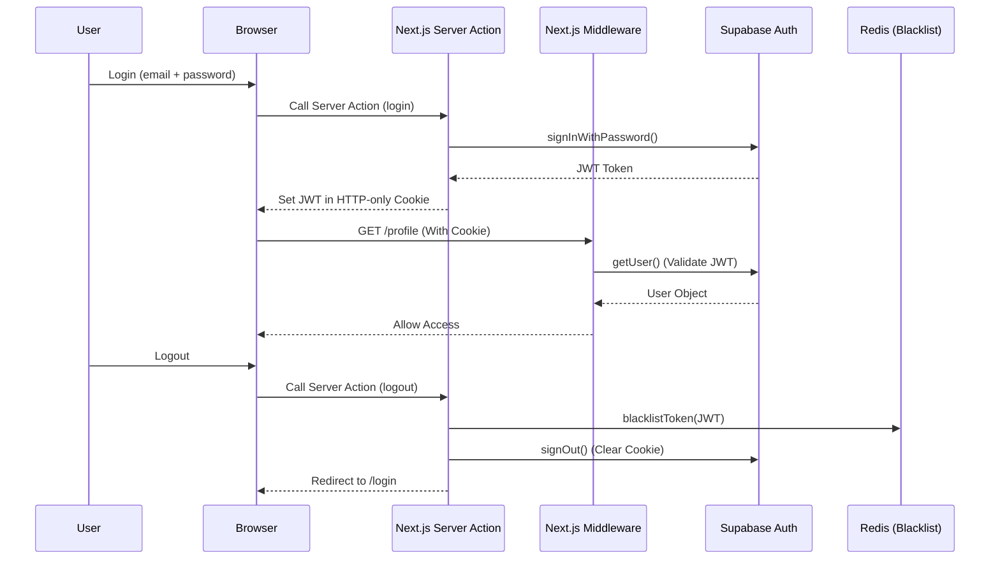

# Chapter 5: Authentication & Authorization

## 5.1 Architecture Overview

In the CareerIntel platform, securing user data and managing access control are pivotal. Instead of building and maintaining a custom JSON Web Token (JWT) issuance system from scratch, the project leverages a managed authentication model via **Supabase Auth**. Supabase provides a robust identity solution, backed by PostgreSQL, which integrates tightly with the Next.js 16 Middleware architecture.

To add an additional security layer, the platform integrates **Redis** to handle Token Revocation (Blacklisting) immediately when a user logs out. The combination of Supabase (for identity verification) and Redis (for session state control) creates a system that is both secure and highly flexible.

## 5.2 Authentication Flow

The authentication process is designed around Server-side Cookies rather than storing tokens in the browser's Local Storage. This approach helps mitigate Cross-Site Scripting (XSS) attacks aimed at token theft.

1. **Login**: The user provides an email and password. The frontend calls a Server Action (utilizing Supabase's `signInWithPassword`).
2. **Token Issuance**: Supabase verifies the credentials and returns a JWT. This JWT is set into an HTTP-only Cookie by the Server Client.
3. **Request Validation**: Whenever the browser makes a request to protected pages, the Next.js Middleware reads the Cookie and validates the JWT using `supabase.auth.getUser()`.
4. **Logout**: When the user logs out, the current JWT is extracted and hashed, then stored in the Redis Blacklist with a Time-To-Live (TTL) corresponding to the token's remaining expiration time. Finally, the Supabase `signOut` function is called to clear the Cookie.

## 5.3 Route Protection Strategy

The platform's routing system is divided into two primary groups: Public Routes and Protected Routes. Access control is enforced in the `middleware.ts` file using the `createServerClient` from the `@supabase/ssr` library.

- **Protected Pages**: Pages such as `/profile`, `/ai`, `/search`, `/insights`, and `/job` strictly require a valid session.
- **Public vs Protected APIs**: Certain APIs like `/api/chatbot` and `/api/kie` are publicly accessible, whereas the remaining APIs require authentication.

**Handling Unauthenticated Requests:**
The system handles requests intelligently based on their context.
- If a user attempts to access a protected page (UI) without a token, the Middleware responds with a `307 Redirect` to the `/login` page.
- However, if a request is made to a Protected API (for example, fetching personal data via a `fetch` call), a redirect is inappropriate and would cause client-side errors. In this scenario, the Middleware returns a `401 Unauthorized` status code in JSON format, allowing the frontend to catch and handle the error gracefully.

## 5.4 Advanced Security: JWT Blacklisting via Redis

An inherent drawback of Stateless JWT architecture is that a token cannot be revoked before its expiration time. To address this, the project implements a **JWT Blacklisting** mechanism using Redis within the `redisSecurity.ts` module.

### Optimized Storage Process:
Instead of storing the raw JWT string (which may contain sensitive payloads and consume more storage), the system employs the **SHA-256** algorithm to generate a Hash from the JWT via the `getTokenHash()` function. This hash serves as the key stored in Redis.
Furthermore, the key's Time-To-Live (TTL) in Redis is calculated based on the JWT's `exp` claim, by subtracting the current time from the expiration time (`getJwtExpiry()`). Consequently, Redis automatically frees up memory once the token expires, eliminating the need for manual garbage collection.

### Fail-Closed Strategy:
In distributed systems, connection failures to the cache layer (Redis) are always a possibility. The authentication module adopts a **Fail-Closed** strategy to prioritize security (Security > Availability).
If the `isTokenBlacklisted` function cannot connect to Redis, the system evaluates the token as "rejected" (Blacklisted = true). This decision is intended to prevent security breaches while Redis is down, forcing affected users to temporarily log in again rather than allowing revoked tokens to slip through.

## 5.5 Form Management and Input Validation

The processing of authentication forms (Login, Signup, Profile Update) is handled through the **Next.js Server Actions** (`'use server'`) paradigm. This approach completely eliminates the need to create intermediary API routes solely for receiving form data, thereby reducing network complexity and improving processing speed.

All input data is strictly validated using the **Zod** library (`LoginSchema`, `SignupSchema`). Actions that record profile data (Experience, Education, Skill, CV) into public PostgreSQL tables (via the Supabase client) are tightly bound to the current `user_id`. This ensures data integrity and prevents Insecure Direct Object Reference (IDOR) vulnerabilities.
