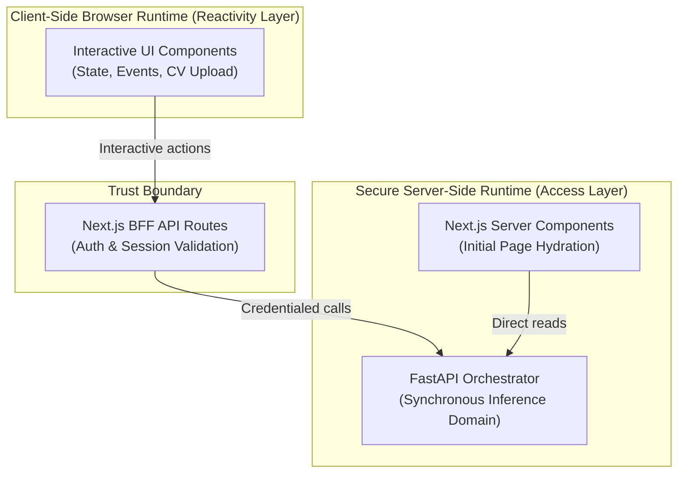
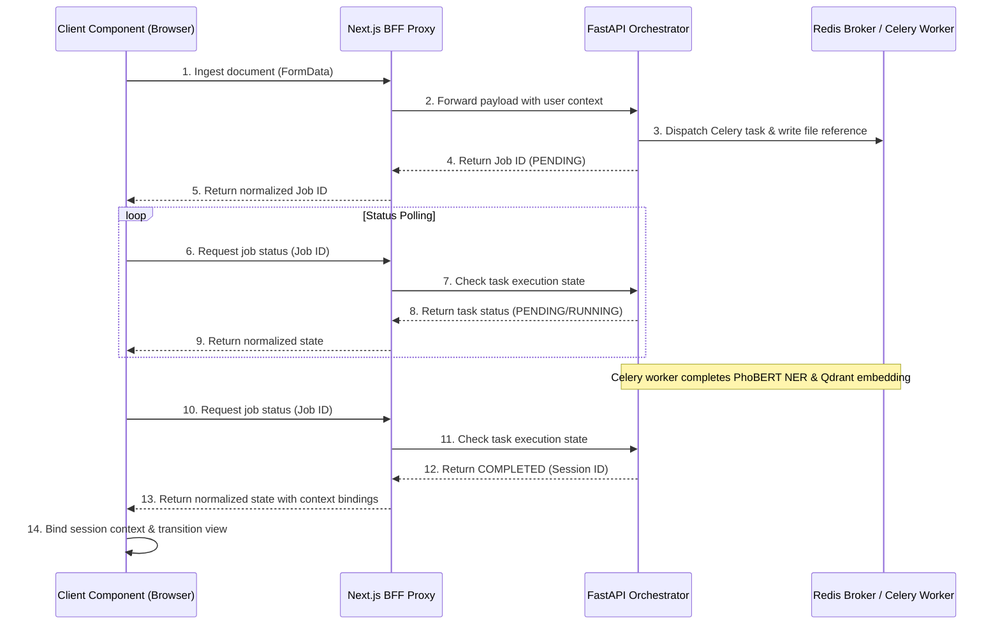
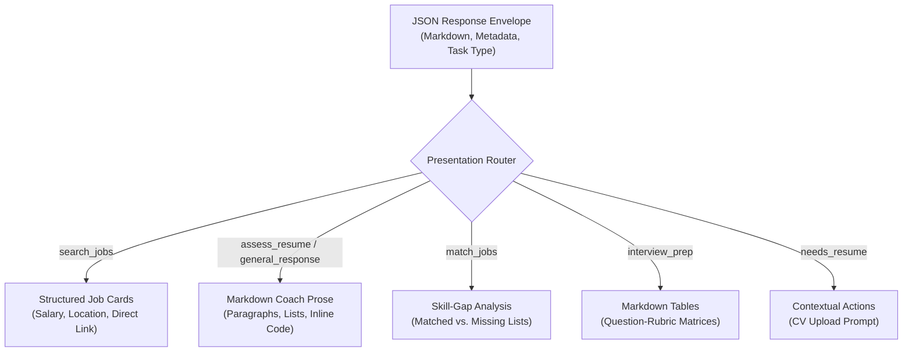

# Chapter 6: Frontend AI Presentation Layer (Next.js)

## 6.1 Overview

The frontend presentation layer serves as the user-facing coordination surface for the CareerIntel platform, bridging the interface with the synchronous inference and asynchronous processing domains (introduced in Chapter 1). Built on the Next.js App Router paradigm, the presentation layer translates user interactions into API orchestration calls while managing state reactivity, asynchronous machine learning tasks, and conversation history.

This chapter details the frontend orchestration architecture. It describes how the server-client rendering boundary isolates backend credentials while maintaining a responsive UI; how the asynchronous task pipeline handles file uploads, polling coordination, and backend failure mitigation; how conversation state integrates with the polyglot persistence layer; and how the presentation layer routes and renders responses based on upstream AI adapters. The chapter concludes with an analysis of the core architectural tradeoffs governing the presentation layer's design.

## 6.2 Server-Client Rendering Boundary

The presentation layer utilizes the Next.js App Router to separate server-side data fetching and authentication from client-side UI reactivity. Rather than mixing credential management with UI execution, the architecture enforces a strict **Trust Boundary Pattern** that dictates where application logic is executed.

### 6.2.1 Secure Server Components
The entry point for the conversational interface (`/ai`) runs exclusively within the secure server runtime. Server Components manage:
- **Credential Isolation**: Performing tenant authentication and session verification without exposing database connection strings, security tokens, or environment keys to the browser.
- **Initial Hydration**: Querying the FastAPI orchestrator directly during page generation to retrieve the user's active session metadata and recent conversation list. This eliminates the latency of a secondary client-side API round-trip during the initial load.

### 6.2.2 Reactive Client Components
The interactive chat elements operate inside the client-side browser runtime, separated by the `"use client"` declaration boundary. Client Components handle:
- **Interactive State**: Maintaining the local message feed, capture of file-upload payloads, and dynamic sidebar updates in response to user inputs.
- **Micro-interactions**: Orchestrating local layout adjustments, typing indicators, and user-initiated actions that require immediate response without server latency.

---

## 6.3 Asynchronous Task Coordination Pipeline

Processing unstructured resumes involves computationally heavy tasks (such as parsing, Named Entity Recognition, and embedding generation) that exceed standard HTTP timeout limits. To keep the UI responsive, the presentation layer orchestrates uploads and status checks through a decoupled, asynchronous pipeline mediated by a Backend-For-Frontend (BFF) proxy.

### 6.3.1 Ingestion and Task Dispatch
When a user attaches a CV, the presentation layer captures the file, runs initial type checks, and transmits the payload to the BFF upload proxy. The BFF forwards the request to the FastAPI orchestrator, which archives the raw document in MongoDB GridFS, writes the file to the shared volume, and dispatches a background processing task to the Redis-backed Celery worker (as described in §1.4.2). The API immediately returns a unique job identifier, freeing the client from waiting for the extraction process to complete.

### 6.3.2 Status Polling and Progress Tracking
Upon receiving the job identifier, the client UI transitions to a processing state and enters a polling loop. The client queries the BFF status endpoint at regular intervals to trace task execution. If the task remains active, the UI displays dynamic progress updates to manage user expectations. If the task fails or times out, the client handles the transition gracefully, allowing the user to retry without losing conversation state.

### 6.3.3 BFF Error Normalization Boundary
The Next.js API routes act as an **Error Normalization Boundary** between the frontend and the upstream AI services. If the FastAPI backend encounters a database timeout, an out-of-memory error during inference, or is temporarily unreachable, the BFF intercepts these raw failures. Instead of exposing raw stack traces or throwing unhandled exceptions that could crash the React UI, the BFF normalizes these responses into a standard JSON error payload. This structure allows the client component to transition to a controlled error state and offer context-specific recovery paths.

---

## 6.4 Conversation State Architecture

The conversational sidebar manages active session states, historical list retrieval, and session renaming or archiving. This layer interacts directly with Chapter 3's polyglot persistence architecture.

### 6.4.1 Conversation Lifecycles
Conversation documents are persisted in MongoDB (as described in §3.5). The presentation layer manages these states through server-side CRUD endpoints:
- **Title Generation**: To eliminate manual title entry, the system automatically derives a thread title from the initial user turn, trimming it to fit the sidebar constraints.
- **Soft Deletion**: Archiving operations mark records as soft-deleted to keep the sidebar list clean while preserving historical records for potential restoration.
- **Tenant Isolation**: Every CRUD operation is verified at the BFF layer by cross-checking the requester's authenticated identifier against the record owner, preventing cross-tenant access.

### 6.4.2 Session Identity Linkage
When a conversation starts, it receives a client-side identity. If the user subsequently uploads a resume, the extraction pipeline binds the generated parsed context to a backend session ID (see §3.4). The presentation layer links these identifiers together. When a user switches between sidebar conversations, the client passes the linked backend session ID to the FastAPI orchestrator, allowing the backend to restore vector search parameters and retrieve CV embeddings from Qdrant without reprocessing the original document.

---

## 6.5 Response Rendering Pipeline

The presentation layer uses a **Presentation Router Pattern** to handle structured outputs from the different backend AI adapters. The frontend acts as a template compiler, routing responses based on their declared type to ensure specialized data formats are rendered correctly.

### 6.5.1 Task-Type Presentation Routing
The backend returns a unified JSON response envelope containing the text payload, execution metadata, and a classification label (`task_type`). The presentation layer parses this label and routes the payload to the appropriate UI layout:
- **Coaching and Conversations** (`assess_resume`, `general_response`): Routed to the standard Markdown renderer, displaying paragraphs, bold highlights, lists, and inline code generated by Adapter B.
- **Structured Preparation Matrices** (`interview_prep`): Formatted as multi-column Markdown tables that align interview questions, candidate evaluation rubrics, and recommended study paths generated by Adapter C.
- **Job Search Listings** (`search_jobs`): Bypasses standard Markdown rendering. The UI compiles the raw search results from Elasticsearch into structured, interactive job cards containing salary badges, locations, and direct application links.
- **Skill Gap Assessments** (`match_jobs`): Renders visual lists that compare candidate skills against job requirements, grouping them into matched and missing lists for easy scanning.
- **Contextual Actions** (`needs_resume`): Renders helper prompts and action buttons (such as triggering the file attachment workflow) when a resume is required but has not yet been bound to the session.

---

## 6.6 Design Tradeoffs

### 6.6.1 Asynchronous Long-Polling vs. WebSockets vs. SSE
The choice of client-polling over persistent connection protocols (such as WebSockets or Server-Sent Events) represents a trade of connection overhead for system simplicity:
- **WebSockets and SSE**: Offer lower latency and real-time push capability, but they require persistent server connections. This complicates load balancing, increases memory consumption at the BFF layer under high concurrent loads, and requires complex client-side reconnection logic.
- **Long-Polling**: Operates over standard, stateless HTTP requests. It works out-of-the-box with serverless and edge infrastructure, integrates with standard authentication models, and avoids holding open long-lived sockets. Polling every two seconds introduces negligible network overhead for the relatively low frequency of CV uploads, while drastically simplifying the BFF deployment.

### 6.6.2 BFF Error Normalization vs. Upstream Proxying
The error normalization boundary adds development complexity but significantly increases frontend resilience:
- **Upstream Proxying**: Directly forwarding raw backend responses reduces BFF code and simplifies debugging during development, but it exposes the client to raw framework errors, database tracebacks, or system timeouts.
- **BFF Error Normalization**: Intercepting and wrapping all upstream exceptions into standardized frontend states ensures the client UI never crashes due to unexpected backend failures. This trade prioritizes user-facing durability and graceful degradation over raw error visibility.

### 6.6.3 Embedded Messages vs. Client-Side State Management
Managing conversation state directly through server-side MongoDB reads (leveraging the embedded messages structure in §3.6.3) trades client-side flexibility for structural simplicity:
- **Client-Side State Management**: Using complex global state containers allows for advanced offline editing and client-side filtering, but it increases code bundle sizes and introduces consistency issues when sync operations fail.
- **Embedded Messages**: Keeps the client state stateless. Clicking a conversation fetches the entire thread in a single, fast document query. The UI remains simple, reactivity is handled by React's local state, and the server retains the authoritative conversation history, ensuring a consistent user experience across multiple devices.
