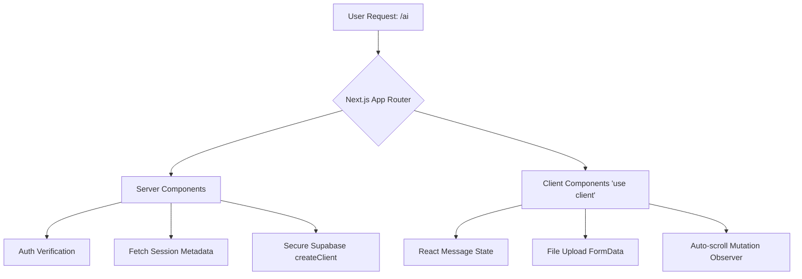
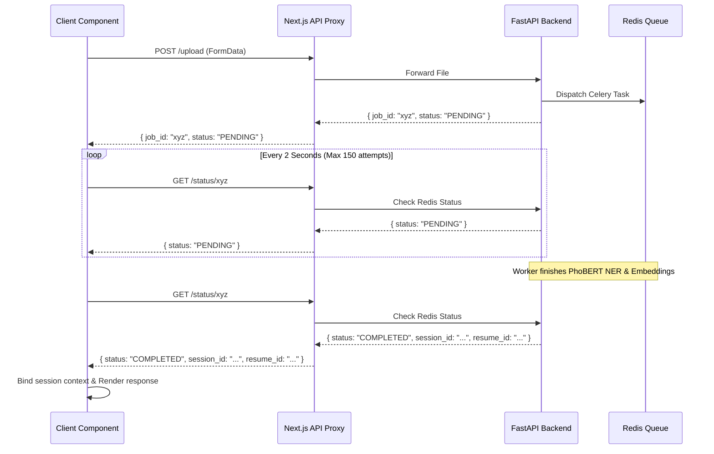
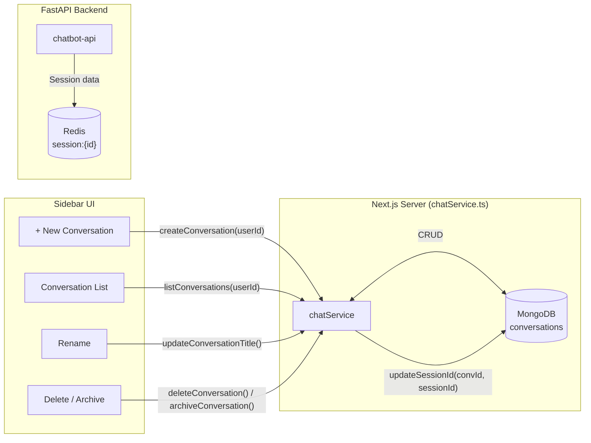

# Chapter 6: Frontend AI Presentation Layer (Next.js)

## 6.1 Overview
The frontend presentation layer provides the interactive conversational interface for the AI-driven features of the CareerIntel platform. Built on the Next.js 16 App Router architecture, the application utilizes a hybrid paradigm, combining Server Components for secure data fetching and Client Components for real-time reactivity. This chapter details the technical architecture of the AI chat interface (`/ai`), focusing on message state management, asynchronous long-polling for machine learning tasks, and the Backend-For-Frontend (BFF) proxy pattern.

## 6.2 Next.js App Router Architecture
The Next.js 16 App Router fundamentally shifts the rendering strategy by delineating Server Components and Client Components.

### 6.2.1 Component Boundaries
The entry point for the `/ai` route is a Server Component, responsible for initial authentication validation and secure retrieval of the user's conversational history. It executes exclusively in the Node.js runtime, accessing the database securely without exposing credentials to the browser.
Conversely, the primary chat UI relies on the `"use client"` directive. This boundary enables the use of React hooks (`useState`, `useEffect`, `useRef`) required for managing dynamic message lists, observing DOM mutations for auto-scrolling, and processing `FormData` for CV uploads.

## 6.3 Real-Time Conversational Interface
The `/ai` route implements a stateful conversational UI that mirrors the behavior of persistent websocket connections using strictly HTTP-based mechanisms.

### 6.3.1 Local State Management
The UI state is governed by an array of `Message` objects tracking the `role` (user, assistant, or system), `content` (Markdown format), and `taskType` (e.g., standard response vs. interview roadmap). This abstraction allows the UI to dynamically alter rendering strategies based on the AI adapter's output format.
To maintain the illusion of real-time responsiveness, user inputs are optimistically appended to the local state before the upstream request resolves. Concurrently, a temporary `system` message acts as an animated typing indicator.

### 6.3.2 DOM Reactivity and Auto-Scrolling
A dedicated `useEffect` hook monitors state transitions within the `messages` array. Upon mutation, it invokes `scrollIntoView` on a DOM reference anchored to the end of the message container. This guarantees that newly streamed content or appended responses immediately enter the user's viewport, mitigating manual scroll fatigue during lengthy AI generations.

## 6.4 Asynchronous ML Task Orchestration
Extracting data from unstructured CVs and generating vector embeddings via Celery workers are computationally expensive operations that exceed standard HTTP timeout thresholds. To prevent connection drops and browser timeouts, the frontend implements an asynchronous long-polling pattern combined with a BFF proxy.

### 6.4.1 The Long-Polling Pattern
When a user uploads a CV, the payload is transmitted to the Next.js API proxy (`/api/chatbot/upload`). The backend validates the binary, pushes a task to the Celery queue, and immediately returns an HTTP 200 response containing a `job_id` and a `PENDING` status.
Upon receiving the `job_id`, the client component initiates a `pollJobStatus` loop. This loop sends an HTTP GET request to `/api/chatbot/status/:id` every 2 seconds, with a strict ceiling of 150 attempts (equating to a 5-minute maximum execution window).

### 6.4.2 Progressive UX Degradation
To manage user expectations during prolonged ML inference tasks, the polling loop maintains an internal counter. If the loop reaches attempt 30 (approximately 60 seconds of waiting), the UI dynamically swaps the generic "Processing" placeholder with an extended message ("Trích xuất CV — bước này có thể mất tới 3 phút..."). This progressive status update reduces bounce rates associated with perceived application hangs.

### 6.4.3 Backend-For-Frontend (BFF) Firewall
The `/api/chatbot/status/[jobId]/route.ts` API acts as a BFF firewall. It intercepts raw HTTP codes from the upstream FastAPI server and normalizes them. Even if the FastAPI backend returns a `404 Not Found` or crashes with a `500 Internal Server Error`, the BFF always returns an HTTP `200 OK` to the frontend, wrapping the failure within a JSON payload (e.g., `{ status: "ERROR", error: "upstream_error" }`). This ensures that the frontend React application never crashes due to unhandled HTTP exceptions and can gracefully render the specific error state within the chat UI. Once the polling loop detects a `COMPLETED` status, it parses the returned `session_id` and `resume_id` to bind the extracted CV context to the current conversation scope.

## 6.5 Conversation Sidebar and Session Management

The `/ai` page implements a full conversation management system through a sidebar component that enables users to create, list, rename, archive, and delete conversations. The persistence layer for this feature is a MongoDB `conversations` collection, accessed through a dedicated `chatService.ts` module on the Next.js server side.

### 6.5.1 Conversation Data Model

Each conversation document in MongoDB encapsulates the complete message thread, ownership metadata, and lifecycle state:

| Field | Type | Description |
|-------|------|-------------|
| `_id` | ObjectId | MongoDB auto-generated unique identifier |
| `userId` | String | Supabase Auth user ID (tenant isolation key) |
| `title` | String | Auto-generated from first message (max 60 chars + ellipsis) |
| `messages` | Array[ChatMessage] | Embedded array of all messages in the conversation |
| `createdAt` | Date | Conversation creation timestamp |
| `updatedAt` | Date | Last activity timestamp (updated on each new message) |
| `sessionId` | String (optional) | Links to FastAPI backend session for CV context |
| `isArchived` | Boolean | Soft-delete flag (default: `false`) |

The `ChatMessage` subdocument contains: `role` (user, assistant, or system), `content` (Markdown text), and `createdAt` (timestamp). Messages are embedded rather than referenced to ensure atomic reads — loading a conversation retrieves the complete thread in a single MongoDB query without joins.

### 6.5.2 Auto-Title Generation

When a conversation is created with an initial message, the title is automatically generated from the first message content. If the content exceeds 60 characters, it is truncated with an ellipsis (`…`). If no initial message is provided, the title defaults to "Cuộc hội thoại mới" (New conversation). This eliminates the need for users to manually name conversations while maintaining scannable sidebar entries.

### 6.5.3 CRUD Operations and Ownership Isolation

The `chatService.ts` module exposes seven operations, each enforcing ownership isolation by filtering on `userId`:

| Operation | Method | Ownership Check | Description |
|-----------|--------|----------------|-------------|
| `createConversation` | INSERT | Sets `userId` at creation | Creates new conversation with optional first message |
| `getConversation` | FIND | `{ _id, userId, isArchived: false }` | Retrieves single conversation with full messages |
| `listConversations` | FIND + SORT | `{ userId, isArchived: false }` | Returns paginated list (default 20), sorted by `updatedAt` descending |
| `appendMessage` | FIND_AND_UPDATE | `{ _id, userId, isArchived: false }` | Pushes single message via `$push`, updates `updatedAt` |
| `appendMessages` | FIND_AND_UPDATE | `{ _id, userId, isArchived: false }` | Pushes multiple messages atomically via `$push` + `$each` |
| `updateConversationTitle` | FIND_AND_UPDATE | `{ _id, userId, isArchived: false }` | Allows manual title rename |
| `deleteConversation` | DELETE_ONE | `{ _id, userId }` | Hard delete (permanent) |
| `archiveConversation` | UPDATE_ONE | `{ _id, userId }` | Soft delete via `isArchived: true` |

Every operation includes the `userId` in its query filter, ensuring that a user can never read, modify, or delete another user's conversations — even with a valid conversation ID. This provides defense-in-depth beyond the application-level authentication check.

### 6.5.4 Session Linking

The `updateSessionId()` operation links a MongoDB conversation to a FastAPI backend session by storing the 8-character session UUID in the conversation document. This linkage enables the frontend to restore CV context when a user returns to a previously active conversation — the stored `sessionId` is passed to the backend, which retrieves the associated resume data from its Redis/MongoDB session store.

### 6.5.5 MongoDB Indexes

Three indexes are created idempotently on the `conversations` collection to optimize the most frequent query patterns:

| Index | Fields | Purpose |
|-------|--------|---------|
| User lookup | `{ userId: 1 }` | Filter all conversations belonging to a user |
| Sort optimization | `{ updatedAt: -1 }` | Descending sort for "most recent first" sidebar ordering |
| Archive filter | `{ isArchived: 1 }` | Exclude soft-deleted conversations from listings |

## 6.6 File Upload UX and Validation

The file upload feature allows users to submit CVs directly within the chat interface. The system enforces validation at both the frontend and backend layers to prevent unsupported or oversized files from consuming processing resources.

### 6.6.1 Supported File Formats

The backend validates the file extension against a whitelist of supported document and image formats:

| Format | Extension | Processing Method |
|--------|-----------|------------------|
| PDF (text-based) | `.pdf` | PyMuPDF text extraction |
| PDF (scanned/image) | `.pdf` | OCR fallback via Tesseract (Vietnamese + English) |
| Word Document | `.docx`, `.doc` | python-docx paragraph extraction |
| Image (photo of CV) | `.png`, `.jpg`, `.jpeg` | Tesseract OCR (Vietnamese + English) |

Files with extensions outside this whitelist receive an HTTP 400 `unsupported_file_type` error. The OCR fallback for scanned PDFs is triggered automatically when PyMuPDF extracts an empty text string, rendering each page as a 200-DPI image before passing it to Tesseract with the `vie+eng` language pack.

### 6.6.2 Size Constraints

The maximum file size is enforced at 20 MB (`20 × 1,024 × 1,024` bytes). Files exceeding this limit receive an HTTP 400 `file_too_large` error. Empty files (zero bytes after reading) are similarly rejected with `empty_file`.

### 6.6.3 Upload-to-Processing Flow

The complete upload lifecycle spans four system boundaries:

1. **Frontend**: User selects file via the attachment button (📎) in the chat input area. The file is wrapped in a `FormData` object along with the current `session_id` and `user_id`.
2. **BFF Proxy**: The Next.js API route (`/api/chatbot/upload`) forwards the multipart form data to the FastAPI backend, adding any necessary authentication headers.
3. **FastAPI Backend**: Validates the file, writes it to the `shared_tmp` volume, uploads the raw binary to MongoDB GridFS, generates a `job_id`, and dispatches a Celery task with the file path.
4. **Celery Worker**: Reads the file from `shared_tmp`, runs the Phase 2–3 extraction pipeline, stores embeddings in Qdrant, updates the session with resume data, and marks the job as `COMPLETED`.

The frontend then enters the long-polling loop (§6.4.1) to track the extraction progress.

## 6.7 Markdown Rendering and Task-Type Differentiation

The chat interface renders assistant responses as rich Markdown content, with the rendering strategy dynamically adapted based on the `taskType` field returned in the backend's response envelope.

### 6.7.1 Response Envelope Structure

Every response from the FastAPI backend follows a consistent JSON envelope:

| Field | Type | Description |
|-------|------|-------------|
| `response` | String | Markdown-formatted assistant message |
| `task_type` | String | Identifies the tool that generated the response |
| `session_id` | String | Active session identifier |
| `metadata` | Object | Tool-specific data (latency, parameters, hit counts) |

### 6.7.2 Task-Type Rendering Strategies

The `taskType` determines how the frontend renders the response content:

| Task Type | Source Adapter | Rendering Strategy |
|-----------|---------------|-------------------|
| `search_jobs` | Elasticsearch (direct) | Structured job cards with title, company, salary, location badges |
| `assess_resume` | Adapter B (HR Coach) | Free-form Markdown prose with coaching feedback, bullet points, and emphasis |
| `match_jobs` | Adapter B (HR Coach) | Skill-gap analysis with matched/missing skill lists |
| `interview_prep` | Adapter C (Structured Gen) | Formatted tables with interview questions, rubric criteria, or learning roadmaps |
| `general_response` | Adapter B (HR Coach) | Conversational Markdown with paragraphs and lists |
| `needs_resume` | System (no adapter) | Styled prompt message asking user to upload a CV |
| `upload` | Celery Worker | Extraction summary with skill/experience counts and quality score |

This task-type differentiation ensures that the UI can provide specialized formatting for structured outputs (such as job search results with salary badges) while gracefully falling back to standard Markdown rendering for free-form coaching responses. The frontend Markdown renderer supports tables, headers, bullet lists, bold/italic emphasis, and inline code — covering the full range of formatting patterns produced by the three SLM adapters.

