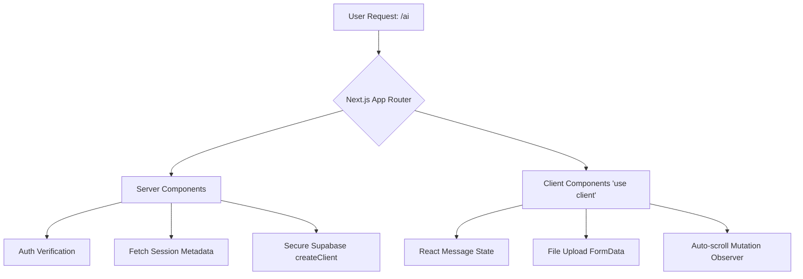
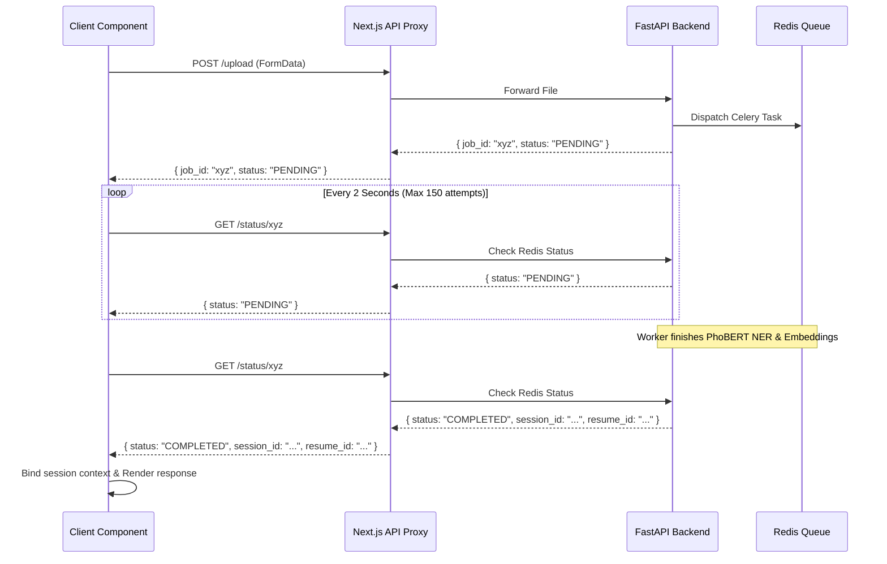

# Chapter 6: Frontend AI Presentation Layer (Next.js)

## 6.1 Overview
The frontend presentation layer provides the interactive conversational interface for the AI-driven features of the CareerIntel platform. Built on the Next.js 16 App Router architecture, the application utilizes a hybrid paradigm, combining Server Components for secure data fetching and Client Components for real-time reactivity. This chapter details the technical architecture of the AI chat interface (`/ai`), focusing on message state management, asynchronous long-polling for machine learning tasks, and the Backend-For-Frontend (BFF) proxy pattern.

## 6.2 Next.js App Router Architecture
The Next.js 16 App Router fundamentally shifts the rendering strategy by delineating Server Components and Client Components.

### 6.2.1 Component Boundaries
The entry point for the `/ai` route is a Server Component, responsible for initial authentication validation and secure retrieval of the user's conversational history. It executes exclusively in the Node.js runtime, accessing the database securely without exposing credentials to the browser.
Conversely, the primary chat UI relies on the `"use client"` directive. This boundary enables the use of React hooks (`useState`, `useEffect`, `useRef`) required for managing dynamic message lists, observing DOM mutations for auto-scrolling, and processing `FormData` for CV uploads.

## 6.3 Real-Time Conversational Interface
The `/ai` route implements a stateful conversational UI that mirrors the behavior of persistent websocket connections using strictly HTTP-based mechanisms.

### 6.3.1 Local State Management
The UI state is governed by an array of `Message` objects tracking the `role` (user, assistant, or system), `content` (Markdown format), and `taskType` (e.g., standard response vs. interview roadmap). This abstraction allows the UI to dynamically alter rendering strategies based on the AI adapter's output format.
To maintain the illusion of real-time responsiveness, user inputs are optimistically appended to the local state before the upstream request resolves. Concurrently, a temporary `system` message acts as an animated typing indicator.

### 6.3.2 DOM Reactivity and Auto-Scrolling
A dedicated `useEffect` hook monitors state transitions within the `messages` array. Upon mutation, it invokes `scrollIntoView` on a DOM reference anchored to the end of the message container. This guarantees that newly streamed content or appended responses immediately enter the user's viewport, mitigating manual scroll fatigue during lengthy AI generations.

## 6.4 Asynchronous ML Task Orchestration
Extracting data from unstructured CVs and generating vector embeddings via Celery workers are computationally expensive operations that exceed standard HTTP timeout thresholds. To prevent connection drops and browser timeouts, the frontend implements an asynchronous long-polling pattern combined with a BFF proxy.

### 6.4.1 The Long-Polling Pattern
When a user uploads a CV, the payload is transmitted to the Next.js API proxy (`/api/chatbot/upload`). The backend validates the binary, pushes a task to the Celery queue, and immediately returns an HTTP 200 response containing a `job_id` and a `PENDING` status.
Upon receiving the `job_id`, the client component initiates a `pollJobStatus` loop. This loop sends an HTTP GET request to `/api/chatbot/status/:id` every 2 seconds, with a strict ceiling of 150 attempts (equating to a 5-minute maximum execution window).

### 6.4.2 Progressive UX Degradation
To manage user expectations during prolonged ML inference tasks, the polling loop maintains an internal counter. If the loop reaches attempt 30 (approximately 60 seconds of waiting), the UI dynamically swaps the generic "Processing" placeholder with an extended message ("Trích xuất CV — bước này có thể mất tới 3 phút..."). This progressive status update reduces bounce rates associated with perceived application hangs.

### 6.4.3 Backend-For-Frontend (BFF) Firewall
The `/api/chatbot/status/[jobId]/route.ts` API acts as a BFF firewall. It intercepts raw HTTP codes from the upstream FastAPI server and normalizes them. Even if the FastAPI backend returns a `404 Not Found` or crashes with a `500 Internal Server Error`, the BFF always returns an HTTP `200 OK` to the frontend, wrapping the failure within a JSON payload (e.g., `{ status: "ERROR", error: "upstream_error" }`). This ensures that the frontend React application never crashes due to unhandled HTTP exceptions and can gracefully render the specific error state within the chat UI. Once the polling loop detects a `COMPLETED` status, it parses the returned `session_id` and `resume_id` to bind the extracted CV context to the current conversation scope.
