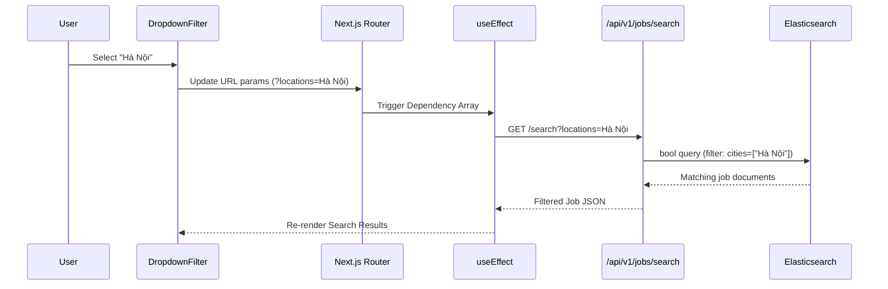

# Chapter 6: Core Frontend Layer (Next.js)

## 6.1 Overview
The core frontend of the CareerIntel platform is constructed using the Next.js 16 App Router architecture. This layer serves as the primary gateway for users, offering a cohesive application shell, robust job search interfaces, and comprehensive profile management tools. This chapter details the foundational frontend architecture, focusing on server-side rendering strategies for authentication, the URL-driven state of faceted search interfaces, and the offloading of Vietnamese Natural Language Processing (NLP) to the client.

### Technology Choice: Next.js App Router vs Alternatives

| Criteria | Next.js App Router | Next.js Pages Router | React + Vite (SPA) | Nuxt.js (Vue) |
|----------|-------------------|---------------------|--------------------|-|
| **Rendering model** | Hybrid SSR + Client | SSR via `getServerSideProps` | Client-only (CSR) | Hybrid SSR + Client |
| **Server Components** | Native (React Server Components) | Not supported | Not applicable | Not supported |
| **Auth data fetching** | Server-side cookie access in RSC | `getServerSideProps` only | Client-side only (flash of unauth content) | `useAsyncData` in server middleware |
| **Route protection** | `middleware.ts` edge function | `_middleware.ts` (experimental) | Manual route guards | `definePageMeta` middleware |
| **API layer** | File-based API routes in `app/api/` | File-based in `pages/api/` | Separate backend required | `server/api/` directory |
| **Server Actions** | Native `'use server'` for forms | Not supported | Not applicable | `useAsyncData` with API calls |
| **Streaming/Suspense** | Native `loading.tsx` + Suspense | Manual implementation | Not applicable | `<Suspense>` support |
| **Bundle splitting** | Automatic per-route | Manual `dynamic` imports | Manual `lazy` imports | Automatic per-route |

Next.js App Router was selected for its native Server Components support, which enables secure server-side authentication cookie handling, eliminates the "flash of unauthenticated content" common in SPAs, and provides built-in Server Actions that remove the need for intermediary API routes for form submissions.

## 6.2 SSR Data Fetching and User-Aware Rendering
Next.js 16 introduces a clear delineation between Server Components and Client Components. The application leverages Server Components as the default execution environment, heavily optimizing Time to Interactive (TTI) and securing the authentication flow.

To render personalized content based on the user's authentication state, Server-Side Rendering (SSR) data fetching is deeply integrated with Supabase. The application utilizes a server-side Supabase client instantiated via `createClient()`. This client intercepts the incoming HTTP request in the Node.js runtime, reads the secure, HttpOnly JWT cookies, and validates the user session before emitting any HTML to the browser.
This architectural choice allows protected routes, such as the `/profile` page, to be fully hydrated with the user's specific data (experiences, education, skills) on the server. This eliminates the "flash of unauthenticated content" typical of Single Page Applications (SPAs) and enhances security by preventing client-side interception of raw tokens.

## 6.3 Faceted Search Architecture
The job search interface, located at `/search`, provides users with an Elasticsearch-powered faceted search experience. Managing the complex state of numerous interdependent filters requires a robust state management strategy.

### 6.3.1 URL-Driven State Management
Instead of relying on isolated React state (`useState` or Redux), the search interface anchors its state entirely to the browser's URL query parameters via Next.js's `useSearchParams()`.
When a user interacts with the custom `DropdownFilter` component (e.g., selecting "Ho Chi Minh City" and "Senior Level"), the client component immediately updates the URL. This mutation triggers a shallow route update, prompting a `useEffect` hook to serialize the parameters and invoke the `/api/v1/jobs/search` API endpoint.

This architecture ensures that complex search queries are entirely linkable, shareable, and resilient to page reloads, maintaining a stateless and predictable data flow.

### 6.3.2 Supported Filter Parameters

| URL Parameter | ES Field | Type | Example |
|--------------|----------|------|---------|
| `q` | `tieu_de`, `cong_ty` | `multi_match` (keyword) | `?q=developer` |
| `locations` | `cities` | `terms` filter | `?locations=Hà Nội` |
| `categories` | `categories` | `terms` filter | `?categories=IT Phần mềm` |
| `levels` | `levels` | `terms` filter | `?levels=Quản lý` |
| `expBuckets` | `expBuckets` | `terms` filter | `?expBuckets=2 – 5 năm` |
| `salaryBuckets` | `salaryBuckets` | `terms` filter | `?salaryBuckets=10 – 20 triệu` |
| `workTypes` | `workTypes` | `terms` filter | `?workTypes=Toàn thời gian` |
| `page` | ES `from` | Pagination offset | `?page=2` |

## 6.4 Client-Side Vietnamese NLP Processing
While the core Machine Learning normalization pipeline processes job data asynchronously on the backend, the frontend implements lightweight, deterministic Natural Language Processing (NLP) tailored for the Vietnamese language. This offloading strategy reduces API overhead and allows for instantaneous client-side formatting and data binning.

### 6.4.1 Location and Geographic Parsing (`splitLocations`)
Job postings on Vietnamese platforms frequently concatenate multiple geographic regions into unstructured strings (e.g., "Khu vực: Hồ Chí Minh, Hà Nội - Đà Nẵng"). The frontend implements a `splitLocations` parser utilizing a predefined dictionary of **63 valid geographic entities** (61 Vietnamese provinces/cities plus "Toàn quốc" and "Nước ngoài") and localized regex patterns.

The parser performs the following operations:
1. **Prefix stripping**: Removes common Vietnamese location prefixes ("Nơi làm việc:", "Khu vực:", "Tại:").
2. **Intelligent delimiter splitting**: Splits on commas and semicolons. For hyphens, a **negative lookbehind regex** `(?<!Bà Rịa) - (?!Vũng Tàu)` is employed to prevent incorrectly splitting the compound province "Bà Rịa - Vũng Tàu" — a critical Vietnamese geographic edge case where the dash is part of the official name.
3. **Dictionary matching**: Each fragment is matched against `CITY_PATTERNS`. The `normalizeLocation` function additionally filters out false positives by rejecting fragments that match job title keywords (e.g., "chuyên viên", "trưởng phòng", "giám đốc") using a Vietnamese occupational regex filter.

### 6.4.2 Unstructured Salary Categorization (`getSalaryBuckets`)
Salary information poses a significant parsing challenge, often appearing as free text such as "15 - 20 Triệu", "Lên đến 1000$", or "Thoả thuận". The frontend utilizes a `getSalaryBuckets` function executing heuristic regex matching.

The parser first filters out **17 foreign currency codes** (USD, EUR, GBP, JPY, SGD, AUD, CAD, HKD, KRW, THB, MYR, INR, CNY, RMB, TWD, CZK, CHF) via regex to exclude non-VND salaries. It then identifies numeric ranges, standardizes values into millions of VND, and mathematically evaluates the bounds (`[lo, hi]`) against 6 predefined salary tiers. This transforms free text into indexable categorizations like "10 – 20 triệu" without requiring a backend round-trip.

### 6.4.3 Experience Tier Mapping (`getExpBuckets`)
The `getExpBuckets` parser processes strings like "Dưới 1 năm", "trên 5 năm", or "2-5 tháng". It handles four Vietnamese expression patterns:
1. **"dưới" (under)**: e.g., "dưới 1 năm" → range [0, 0.99]
2. **"trên/hơn/ít nhất" (over/more than/at least)**: e.g., "trên 5 năm" → range [5.01, ∞]
3. **Range expressions**: e.g., "1 - 2 năm" → range [1, 2]
4. **Single values**: e.g., "3 năm" → range [3, 3]

It converts all parsed numeric values into a standardized yearly metric (dividing month-based values by 12) and determines intersection overlaps with 4 predefined experience tiers ("Dưới 1 năm", "1 – 2 năm", "2 – 5 năm", "Trên 5 năm"). By executing these deterministic parsers directly in the browser's JavaScript engine, the frontend remains highly responsive while ensuring data conforms strictly to the schema expected by the Elasticsearch backend.

## 6.5 Page Architecture

| Route | Server/Client | Key Features |
|-------|:---:|---------|
| `/` (Home) | Server + Client | Hero section, search bar with dropdown filters, feature cards |
| `/search` | Client | ES-powered faceted search with 7 filters, pagination, URL-driven state |
| `/profile` | Server + Client | Profile CRUD (experience, education, skills, CV upload via Supabase Storage) |
| `/insights` | Server + Client | Market analytics dashboard |
| `/login` | Client | Login form with Zod validation, Server Action submission |
| `/signup` | Client | Registration form with email confirmation flow |
| `/job/[id]` | Server | Individual job detail page (dynamic route) |

## 6.6 Key Quantitative Metrics

| Metric | Value |
|--------|-------|
| Total page routes | 7 distinct pages |
| API routes | 9 route handlers |
| Geographic entities in dictionary | 63 (61 provinces + 2 meta-regions) |
| Foreign currency codes filtered | 17 |
| Salary buckets | 6 ranges |
| Experience buckets | 4 ranges |
| Work type categories | 5 standard tags |
| Vietnamese expression patterns (exp) | 4 distinct regex patterns |
| Shared components | 2 (`Navbar.tsx`, `RequireLogin.tsx`) |
| helpers.ts shared parser | 152 lines |
