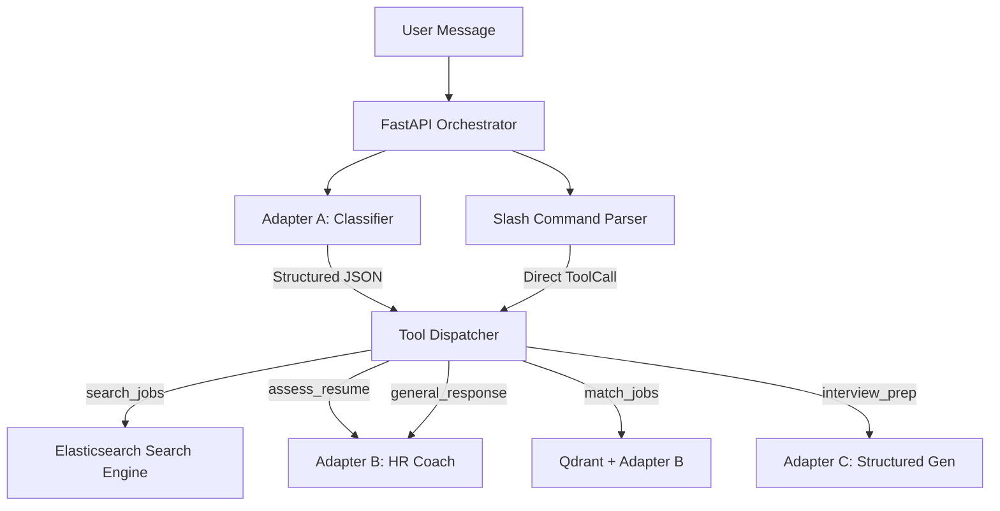
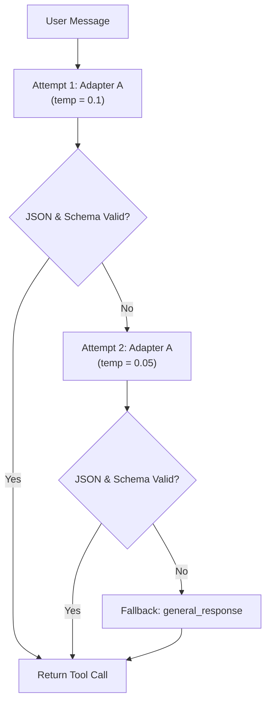
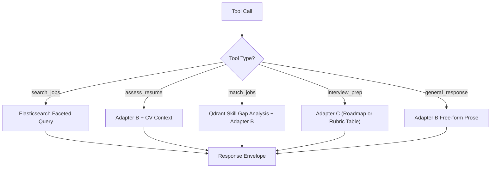

# Chapter 7: AI Chatbot Orchestrator — SLM Multi-Adapter Architecture

## 7.1 Overview

The AI chatbot orchestrator serves as the central coordination surface of the CareerIntel platform. It organizes real-time user interactions through a **Multi-Adapter Small Language Model (SLM) architecture**, in which three specialized adapters—fine-tuned via QLoRA—are mounted on a single shared Qwen2.5:1.5B base weights model. Rather than relying on a monolithic model configured with varying system prompts, this architecture decomposes the user experience into task-specific sub-problems. This approach minimizes latency, ensures predictable output formatting, and fits within the memory constraints of consumer-grade hardware.

The orchestrator is structured around a FastAPI server that acts as a traffic router. It resolves session state, determines intent using **Adapter A** (intent classifier), and delegates execution to the **Tool Dispatcher**. The dispatcher routes requests to specialized search indices or downstream generation adapters: **Adapter B** (HR career coach) for natural Vietnamese prose, or **Adapter C** (structured content generator) for interview preparation matrices and roadmap tables.

---

## 7.2 Multi-Adapter Design

### 7.2.1 Design Rationale

Partitioning the platform's features across three specialized adapters rather than a single general-purpose model addresses a fundamental constraint: small language models (under 3 billion parameters) suffer a severe performance drop when forced to generalize across structured and unstructured domains simultaneously. A model fine-tuned for empathetic Vietnamese conversation struggle to consistently generate valid, un-nested JSON or rigid markdown tables. 

Decomposing these tasks yields three core benefits:
- **Inference Latency Optimization**: Each adapter's generation parameters are tuned to its task length and complexity. The classification adapter executes with tight token bounds in under a second, while the prose generation adapter is permitted a larger token budget.
- **Syntactic Reliability**: The classification adapter is bound to structured JSON syntax through inference-level constraints, avoiding the need for complex regular expression repair functions on the application side.
- **Resource Footprint Conservation**: By sharing the base weights of the 1.5B model in GPU memory and hot-swapping the lightweight adapter matrices (QLoRA weights), the orchestrator runs efficiently on a single consumer GPU or CPU instance without reloading the core base weights.

### 7.2.2 Parameter Tuning and Generation Strategy

The generation parameters for each adapter are mapped dynamically at the orchestrator level, tailoring model behavior to the safety and creativity requirements of each task:

- **Intent Classifier (Adapter A)**: Configured with a near-greedy temperature ($0.1$) and a low max-token boundary ($256$). This ensures high predictability and deterministic routing.
- **Career Coach (Adapter B)**: Configured with a moderate temperature ($0.5$) and a mid-range token limit ($1024$) to allow fluent, natural-sounding Vietnamese prose while maintaining strict factual grounding in the candidate's CV data.
- **Structured Generator (Adapter C)**: Configured with a low-to-moderate temperature ($0.3$) and a high token limit ($2048$) to generate comprehensive, properly formatted multi-column markdown tables without truncation.

During developmental phases where specialized weights are not initialized, the orchestrator routes calls to the vanilla base model. This fallback enables complete pipeline testing and verification before fine-tuning is completed.

---

## 7.3 Intent Classification Pipeline

### 7.3.1 Constrained Generation and Intent Routing

The intent router is the gateway of the chat execution pipeline, translating unstructured user queries into machine-readable tool execution schemas. The classification adapter (Adapter A) is trained to parse the user message and emit a JSON object containing the target tool name and normalized parameters.

A key design choice is that the classification step is **stateless and single-turn**. The orchestrator does not feed historical message threads to Adapter A. This design decision directly reflects the dataset synthesis process (detailed in Chapter 8), which trains the classifier exclusively on single-turn user utterances. By stripping conversational history from the classification prompt, the system prevents context drift from biasing intent routing.

### 7.3.2 Resilience and Override Logic

To safeguard the orchestrator against malformed JSON outputs or parameter parsing errors, the intent router implements a multi-tier **Resilience Cascade**:

1. **Attempt 1 (Standard Sampling)**: Adapter A is run at temperature $0.1$. The output is validated against structured schema definitions, normalizing user inputs (such as matching Vietnamese location synonyms to indexed cities).
2. **Attempt 2 (Near-Greedy Decoding)**: If validation fails, the orchestrator retries the inference at a reduced temperature of $0.05$. Lowering the sampling variance resolves boundary cases where the model oscillates between two competing tools.
3. **Conversational Fallback**: If the retry fails to generate valid structured data, the router falls back to a conversational response task type (`general_response`), routing the message to the prose coach (Adapter B) to maintain interaction continuity.

Downstream of the router, the orchestrator applies a **Context-Aware Override** for conversational edge cases. Small language models struggle to map short, context-dependent affirmative phrases (such as "ok" or "có") to complex tools without historical context. If the classifier yields a `general_response` but the session has an active resume and the preceding assistant turn prompted the user for CV evaluation, the orchestrator overrides the intent classification to `assess_resume`. This hybrid pattern combines the high speed of stateless classification with the accuracy of stateful, heuristic state corrections.

---

## 7.4 Tool Dispatch Architecture

### 7.4.1 Dispatch as a Strategy Pattern

The Tool Dispatcher acts as a Strategy Pattern coordinator, translating the structured tool calls into concrete backend operations. Based on the selected tool, the dispatcher gathers required inputs, queries data indices or vector stores, constructs prompt contexts, and selects the target generation adapter.

The dispatcher coordinates five execution strategies:

| Tool Intent | Data Source | Primary Adapter | Core Output Modality |
| :--- | :--- | :--- | :--- |
| `search_jobs` | Elasticsearch | None (Direct Query) | Structured Job Listing Cards |
| `assess_resume` | MongoDB (Resume JSON) | Adapter B (HR Coach) | Formatted Performance Prose |
| `match_jobs` | Qdrant (Vectors) | Adapter B (HR Coach) | Skill-Gap Analysis Narrative |
| `interview_prep` | MongoDB (Resume JSON) | Adapter C (Structured Gen) | Question-Rubric Tables / Roadmaps |
| `general_response` | MongoDB (Session History) | Adapter B (HR Coach) | Conversational Vietnamese Dialogue |

### 7.4.2 Slash Commands as Deterministic Bypass

For power users and predictable workflows, the orchestrator supports deterministic slash commands (such as `/coach`, `/match`, and `/interview`). The parser intercepts these commands at the entry point of the chat pipeline, bypassing Adapter A's inference step entirely. This design optimization reduces server latency to zero for structured requests while ensuring absolute classification accuracy.

---

## 7.5 Context Window Management

### 7.5.1 The Token Budget Constraint

Although modern SLM architectures support long context limits in theory, quantized 1.5B parameter models experience severe semantic degradation when inputs exceed a few thousand tokens. In long conversations containing parsed CV structures and multiple turn histories, attention heads lose coherence, leading to repetitive or irrelevant generation. To maintain coherence, the orchestrator enforces a strict token budget.

### 7.5.2 Sliding Window with Extractive Summarization

The orchestrator manages context using a two-tier budget: a **history budget** ($2,000$ tokens) for verbatim message tracking and a **summary budget** ($500$ tokens) for historical memory. When history exceeds this limit, the oldest turns are evicted from the active window and routed to a zero-latency **Extractive Summarizer**.

The summarizer extracts key information using lightweight heuristics rather than costly LLM compression passes:
1. **Initial Intent**: Captures and retains the first user message of the thread.
2. **Boundary Continuity**: Preserves the final message of the evicted block to maintain structural transition.
3. **Keyword Filtering**: Scans evicted messages for high-signal career-related keywords (e.g., CV, skills, salary, interviews) and retains matches.

The resulting summary is prepended to subsequent generations as a specialized system message. This ensures the model retains historical context without blowing through its token budget.

---

## 7.6 Asynchronous Task Tracking

Because parsing unstructured CV documents, performing named entity extraction, and generating multi-vector embeddings are computationally intensive tasks ($30$ to $180$ seconds), the orchestrator offloads this work to background Celery workers via a Redis broker.

This asynchronous pipeline uses two primary optimizations:
- **Model Warmup**: To eliminate the $50$-second cold-start latency associated with initial PyTorch model loading, the background workers execute dummy inference passes for the NER and embedding models during process startup. This pre-warms the attention weights and CUDA compilation kernels.
- **Transient State Tracking**: The orchestrator registers and updates job states (`PENDING` $\rightarrow$ `PROCESSING` $\rightarrow$ `COMPLETED` or `FAILED`) in Redis with a one-hour time-to-live. Once complete, the worker triggers a dual-write binding to both Redis and MongoDB (as detailed in §3.2) to make the structured resume context immediately available to the chat loop.

---

## 7.7 Design Tradeoffs

### 7.7.1 Stateless vs. Stateful Intent Classification

Using a stateless classifier (Adapter A) ensures rapid, predictable intent routing, but prevents the model from resolving conversational dependencies (such as short affirmative answers to previous questions). Rather than resolving this by passing the full history to the classifier—which would increase latency and introduce intent drift—the system combines a stateless classifier with a stateful server-side heuristic override. This hybrid model keeps inference fast and predictable while resolving conversational dependencies at the application layer.

### 7.7.2 Multi-Adapter Decomposition vs. Monolithic LLM

Decomposing the application into three task-specific QLoRA adapters trades single-model simplicity for inference-time flexibility and resource efficiency. A single monolithic LLM would simplify application-level routing but requires significantly higher hardware specifications (VRAM and compute) and yields lower accuracy on structured generation tasks. The multi-adapter pattern allows a tiny 1.5B model to achieve task-specific alignment at a fraction of the hardware cost.

### 7.7.3 Extractive vs. Abstractive Summarization

To manage context limits, the system utilizes a rule-based extractive summarizer rather than a generative LLM-based summarization task. Generative summarization produces smoother narrative summaries but adds secondary inference latency to the chat pipeline and risks introducing model hallucinations. The extractive approach uses zero-latency keyword indexing to extract raw, factual segments, preserving context integrity at zero runtime cost.
