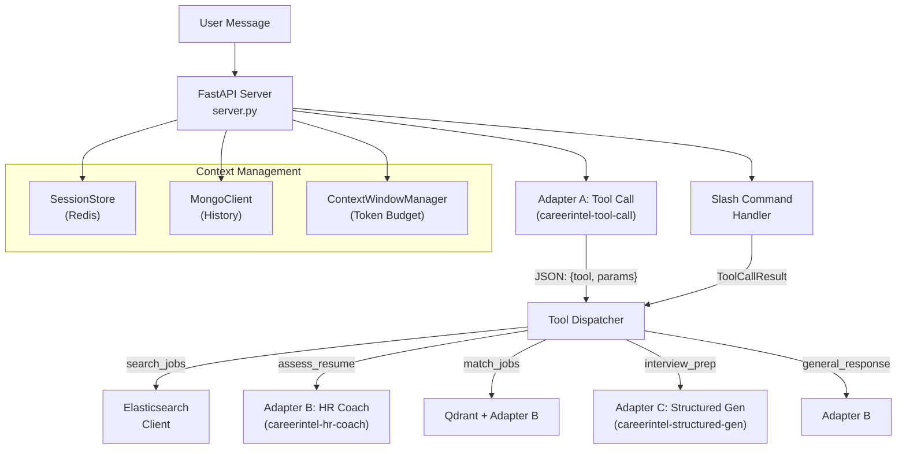
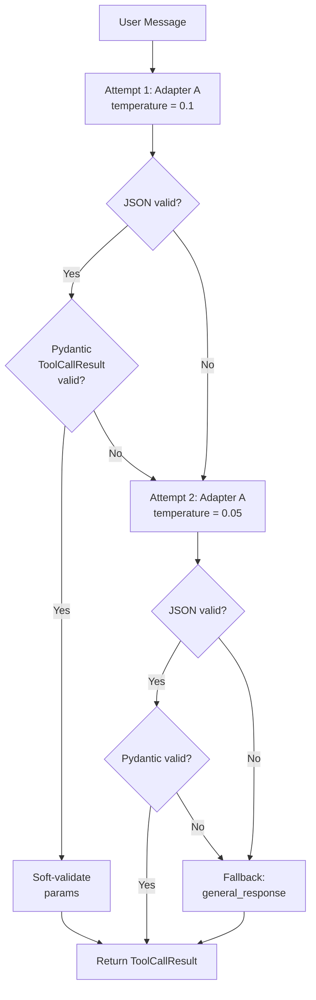
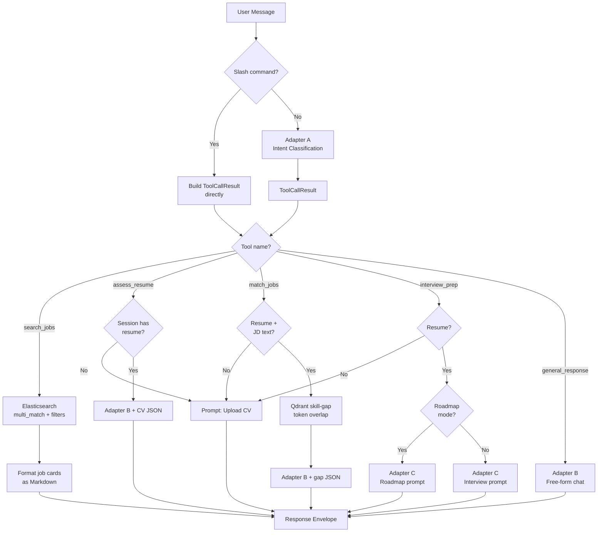
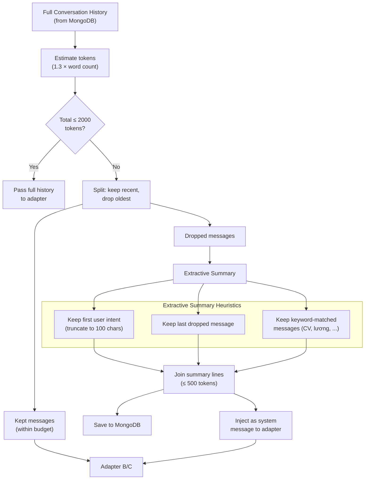
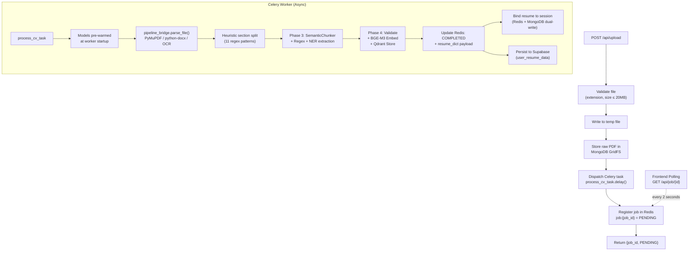
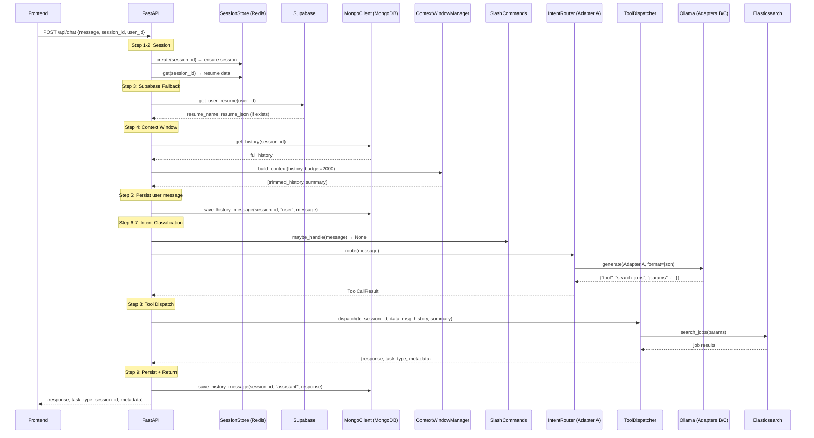

# Chapter 7: AI Chatbot Orchestrator — SLM Multi-Adapter Architecture

## 7.1 Overview

The AI chatbot orchestrator represents the central technical innovation of the CareerIntel platform: a **Multi-Adapter Small Language Model (SLM) architecture** in which three specialized QLoRA-finetuned adapters, each mounted on the same Qwen2.5:1.5B base model, collaborate through a unified FastAPI server to handle the full spectrum of user intents — from job searching and resume assessment to interview preparation and general career counseling. Unlike conventional chatbot deployments that rely on a single general-purpose Large Language Model (LLM) invoked with varying prompts, this architecture decomposes the problem into discrete, fine-tuned sub-tasks, thereby achieving lower inference latency, higher task-specific accuracy, and more efficient resource utilization on consumer-grade hardware.

The orchestrator is implemented as a FastAPI application that exposes five HTTP endpoints: a synchronous chat endpoint, an asynchronous CV upload endpoint, a standalone Key Information Extraction (KIE) endpoint, a job status polling endpoint, and a health probe. Upon receiving a user message, the server delegates intent classification to **Adapter A** (a tool-call classifier), which outputs a structured JSON object identifying which of five predefined tools should handle the request. A **Tool Dispatcher** then routes the validated tool call to the appropriate handler, which may query Elasticsearch for job listings, invoke **Adapter B** (an HR coaching specialist) for conversational career advice, or engage **Adapter C** (a structured content generator) for interview questions and learning roadmaps.

This chapter details the technical architecture of the orchestrator across six dimensions: the multi-adapter design rationale and generation parameter configuration (§7.2), the intent classification pipeline with its retry-with-temperature-drop strategy (§7.3), the tool dispatch decision tree and its five execution branches (§7.4), the context window management system that enables multi-turn conversations within strict SLM token budgets (§7.5), the asynchronous CV processing pipeline powered by Celery workers (§7.6), and the complete chat turn lifecycle that ties all components together (§7.7).

## 7.2 Multi-Adapter Architecture Design

### 7.2.1 Design Rationale

The decision to employ three specialized adapters rather than a single monolithic language model stems from a fundamental trade-off between generality and precision in small language models. A 1.5-billion parameter model, while efficient enough to run on consumer hardware without GPU acceleration, lacks the capacity to simultaneously excel at JSON-structured intent classification, empathetic Vietnamese career counseling, and rigidly formatted table generation. By partitioning these responsibilities across three QLoRA adapters — each fine-tuned on task-specific datasets — the system achieves performance characteristics that would otherwise require a model several times larger.

This architectural choice yields three concrete benefits. First, **inference latency** is reduced because each adapter's generation parameters are calibrated for its specific output format: the tool-call adapter generates at most 256 tokens with a temperature of 0.1, producing terse JSON in under one second, while the HR coaching adapter generates up to 1024 tokens at a moderate temperature of 0.5 for fluent Vietnamese prose. Second, **output reliability** improves because the tool-call adapter is constrained to emit valid JSON through Ollama's native `format="json"` parameter, eliminating the need for brittle post-processing heuristics. Third, **resource efficiency** is maximized because all three adapters share the same Qwen2.5:1.5B base weights in Ollama's memory, with only the lightweight LoRA delta matrices differing between them — a pattern that consumes roughly the same VRAM as loading a single model.

### 7.2.2 Adapter Configuration

The three adapters are served through Ollama, which runs on the host machine rather than inside Docker Compose containers. This decision ensures that Ollama can leverage host GPU resources (if available) without the complexity of Docker GPU passthrough. Containers within the Docker network reach the Ollama inference server via the `host.docker.internal` bridge address.

Each adapter is registered as a separate Ollama model with its own Modelfile pointing to the corresponding QLoRA-finetuned weights. The generation parameters for each adapter are centralized in a dedicated configuration module that maps adapter identifiers to their runtime parameters:

| Adapter | Ollama Model Name | Temperature | Top-p | Max Tokens | Format |
|---------|-------------------|-------------|-------|------------|--------|
| **A: Tool Call** | `careerintel-tool-call` | 0.1 | 0.9 | 256 | JSON |
| **B: HR Coach** | `careerintel-hr-coach` | 0.5 | 0.9 | 1024 | Free text |
| **C: Structured Gen** | `careerintel-structured-gen` | 0.3 | 0.9 | 2048 | Markdown tables |

The low temperature assigned to Adapter A (0.1) reflects the deterministic nature of its task — intent classification must consistently map the same user input to the same tool, making near-greedy decoding the optimal strategy. Adapter B employs a moderate temperature (0.5) to generate natural, varied Vietnamese prose while maintaining factual grounding. Adapter C uses an intermediate temperature (0.3) because structured content generation benefits from some creativity in formulating questions and recommendations, but must adhere to rigid formatting constraints.

### 7.2.3 Adapter Manager

The `AdapterManager` class serves as the unified interface through which all components of the orchestrator interact with the Ollama inference server. Rather than scattering Ollama API calls across multiple modules, the adapter manager centralizes model selection, message assembly, and parameter override logic within a single `generate()` method.

When invoked, the adapter manager constructs a message array following the OpenAI-compatible chat format. The first element is always a system message containing the adapter's specialized prompt. If a conversation summary exists (produced by the context window manager for conversations exceeding the token budget), it is injected as a second system message, providing the adapter with condensed context from prior turns without consuming the full history token budget. The conversation history, if provided, is then appended as alternating user-assistant message pairs, followed by the current user message as the final element.

The `format` parameter warrants special attention: Ollama implements JSON-constrained generation as a top-level chat argument (not as an option within the `options` dictionary), requiring the adapter manager to extract it from the generation parameters and pass it separately. This architectural detail ensures that Adapter A's output is always valid JSON, regardless of the model's natural language tendencies.

For development environments where the trained adapter weights are not yet available, the configuration module falls back to the vanilla `qwen2.5:1.5b` model. This allows developers to test the full orchestrator pipeline with degraded — but functional — model responses before the fine-tuning process is complete.

### 7.2.4 System Prompts

Each adapter's system prompt is centralized in a dedicated prompt module and is designed to match exactly the prompts used during the training phase (Phases 6 and 7 of the ML pipeline). This alignment between training-time and inference-time prompts is critical for QLoRA adapter performance, as the model has learned to associate specific behavioral patterns with the precise wording of its system instructions.

Adapter A's system prompt enumerates all five available tools along with their parameter schemas in a structured format, instructing the model to respond exclusively with a JSON object containing the selected tool name and its parameters. Adapter B's prompt establishes the persona of a Vietnamese career counselor who provides empathetic, metric-driven feedback using the Action-Metric-Result framework. Adapter C's prompt varies between two variants depending on whether the user requests interview preparation or a learning roadmap, with each variant specifying the expected output format (five-star rubric tables or timeline-based learning paths, respectively). A conversation summary template is also provided to maintain contextual coherence during long multi-turn interactions.

## 7.3 Intent Classification via Constrained Generation

### 7.3.1 The Intent Router

The intent router is the first stage of the chat turn pipeline, responsible for converting a natural-language user message into a structured tool call that the dispatcher can execute. This is accomplished by invoking Adapter A with the user's message and the tool-call system prompt, then parsing and validating the resulting JSON output.

A critical design decision, documented explicitly in the codebase, is that Adapter A operates in a **stateless, single-turn mode**: conversation history is intentionally not passed to the tool-call adapter. This decision reflects the training methodology — the Phase 6 dataset synthesis produced single-turn prompt-response pairs for the tool-call adapter, meaning the model was never trained to interpret multi-turn context. Passing history to a model trained without it would degrade classification accuracy rather than improve it.

### 7.3.2 Retry-with-Temperature-Drop Strategy

Despite the JSON format constraint, the tool-call adapter occasionally produces output that fails structural validation — particularly when user messages are ambiguous, contain code-switching between Vietnamese and English, or reference tools that do not exist. To handle these edge cases gracefully, the intent router implements a three-stage resilience strategy:

1. **First attempt** at the default temperature (0.1): The adapter generates a response, which is parsed by a safe JSON parser that handles common model artifacts such as Markdown code fences wrapping the JSON output. If parsing succeeds, the result is validated against the Pydantic `ToolCallResult` envelope (which verifies that the tool name is one of the five registered tools), and the tool-specific parameters undergo soft validation.

2. **Retry at near-greedy temperature** (0.05): If the first attempt produces invalid JSON or an unrecognized tool name, the router retries with a lower temperature to reduce sampling variance. This near-greedy decoding often resolves borderline cases where the model wavered between two competing tool selections.

3. **Fallback to `general_response`**: If both attempts fail, the router gracefully degrades by returning a synthetic `ToolCallResult` pointing to the `general_response` tool, which passes the user's message directly to Adapter B for free-form conversational handling. This guarantees that the user always receives a meaningful response, even when intent classification fails entirely.

### 7.3.3 Schema Validation and Enum Cache

The validation layer extends beyond simple JSON parsing to include domain-specific semantic validation of tool parameters. Five Pydantic model classes define the parameter schemas for each tool, incorporating field-level validators that normalize user input against known values from the Elasticsearch index.

The `SearchJobsParams` schema illustrates this pattern most clearly. When a user specifies a location, the validator first checks a static alias dictionary that maps common abbreviations and colloquial names (such as "SG," "HCM," or "Sài Gòn") to their canonical equivalents ("Hồ Chí Minh"). If no alias matches, the validator performs a fuzzy substring match against a cached list of valid cities obtained from Elasticsearch aggregations. This approach bridges the gap between the natural-language locations that users type in conversational Vietnamese and the normalized city names stored in the search index.

The `EnumCache` provides the runtime data for these validators. At application startup, the cache pre-fetches distinct values for cities, experience buckets, work types, categories, and levels from the Elasticsearch `jobs` index via aggregation queries. A background refresh task, implemented as an `asyncio.create_task` coroutine, automatically re-populates the cache at hourly intervals to reflect newly scraped job listings without requiring a server restart. The cached values are exposed as synchronous properties — a deliberate design choice that allows Pydantic field validators (which execute synchronously) to access them without blocking the event loop.

A subtle but important design feature is the concept of **soft validation**: even if a parameter value fails semantic validation (for example, an unrecognized city name), the tool call is not rejected. Instead, the invalid value passes through with a warning log, and the tool dispatcher proceeds with the user's original intent. This philosophy prioritizes user experience over data purity — it is better to execute a search with an imperfect filter than to return a cryptic validation error.

### 7.3.4 Context-Aware Intent Override

A limitation of the single-turn design is that Adapter A cannot interpret short affirmative replies ("ok," "có," "được," "vâng") in the context of the preceding conversation. When the system has just extracted a user's CV and prompted "Bạn muốn mình đánh giá ngay không?" (Do you want me to evaluate now?), a user reply of "ok" would be misclassified as `general_response` by the stateless tool-call adapter.

To address this, the orchestrator implements a **context-aware override** mechanism at the server level, downstream of the intent router. The server maintains a set of recognized affirmative words in both Vietnamese and English (28 entries including diacritical variants). After receiving the tool call result, the server checks whether three conditions are simultaneously met: the classified tool is `general_response`, the session contains a previously uploaded resume (`resume_id` is non-null), and the user's message is a short affirmative reply (four words or fewer, with at least one word matching the affirmative set). If all three conditions hold, the server additionally verifies that the last assistant message in the conversation history contains the CV evaluation prompt keywords ("trích xuất" and "đánh giá"). When this full conjunction is satisfied, the server overrides the Adapter A classification, replacing `general_response` with `assess_resume` and injecting a default `focus_areas` parameter of `["overall"]`.

This pattern exemplifies a broader architectural principle: the stateless SLM adapter handles the common case efficiently, while the stateful server layer provides contextual corrections for edge cases that require multi-turn awareness.

## 7.4 Tool Dispatch and Execution

### 7.4.1 Dispatch Architecture

The tool dispatcher serves as the execution engine of the orchestrator, translating validated `ToolCallResult` objects into concrete actions. It receives the tool call from either the intent router or the slash command parser, along with session context (session ID, session data including any bound resume, user message, conversation history, and conversation summary), and returns a standardized response envelope containing the generated markdown response, the task type identifier, and a metadata dictionary.

The dispatcher's control flow follows a straightforward pattern: a cascading conditional structure that matches the tool name and invokes the corresponding handler. Before executing any resume-dependent tool (`assess_resume`, `match_jobs`, or `interview_prep`), the dispatcher checks whether the current session contains a bound resume. If the `resume_id` field is absent from the session data, the dispatcher short-circuits with a user-facing Vietnamese prompt instructing the user to upload their CV via the file attachment button — a guard that prevents confusing error messages from the downstream adapters.

### 7.4.2 Slash Commands

In addition to Adapter A's natural-language intent classification, the system provides a set of deterministic slash commands that bypass the language model entirely. Five commands are registered: `/coach` and `/review` (both mapping to `assess_resume`), `/match` (for `match_jobs` with the remainder of the message as JD text), `/interview` (for `interview_prep` without a roadmap), and `/roadmap` (for `interview_prep` with roadmap generation enabled).

The slash command parser operates as the first checkpoint in the chat pipeline, before Adapter A is invoked. If the user's message begins with a registered slash prefix, the parser constructs a `ToolCallResult` directly and returns it, saving the latency of an Adapter A inference call. This mechanism serves both as a power-user shortcut and as a fallback for situations where Adapter A struggles with certain phrasings.

### 7.4.3 The Five Tool Branches

**search_jobs** routes directly to the Elasticsearch client without invoking any language model adapter. The client constructs a boolean query combining a `multi_match` clause (for keyword search across job titles with a boost factor of 3 and company names with a boost factor of 2, using the `best_fields` strategy with automatic fuzziness) with `filter` clauses for each facet (location, category, level, experience, work type, and salary bucket). Salary filtering is notable: rather than using range queries on numeric fields, the system maps user-specified salary ranges (in millions of VND) to a set of predefined salary bucket labels, then applies a `terms` filter against the `salaryBuckets` keyword field. The search results (capped at 8 hits by default) are sorted by relevance score when a keyword is present, or by recency when only facet filters are applied. Each hit's `raw_data` payload — the complete job document from the scraper — is then formatted into a Vietnamese markdown card displaying the job title, company name, location, and salary, with the title linked to the original job posting URL.

**assess_resume** requires an active resume in the session. The dispatcher serializes the resume's structured JSON representation into a formatted user prompt, prepending the CV data and appending the user's original message. This composite prompt is passed to Adapter B with the HR coaching system prompt, along with the conversation history and any conversation summary for multi-turn context. The adapter generates a comprehensive assessment in Vietnamese markdown, evaluating the CV across dimensions such as experience quality, skill relevance, educational background, and presentation clarity.

**match_jobs** combines vector database capabilities with natural language generation. The user provides a job description (JD) text, and the dispatcher invokes the Qdrant client's skill-gap comparison function. This function retrieves the user's skill set from the Qdrant `resumes` collection (stored as a `skills_flat` payload field) and performs a token-overlap analysis against the JD text — a computationally lightweight approach that identifies which of the user's existing skills appear in the JD and which are absent. The resulting gap analysis JSON (containing `have`, `present_in_jd`, and `missing` arrays) is then passed to Adapter B, which generates a natural-language interpretation of the match quality, highlighting strengths and recommending specific skills for the user to develop.

**interview_prep** bifurcates into two sub-modes based on the `generate_roadmap` parameter. When roadmap generation is disabled (the default), the dispatcher invokes Adapter C with the interview system prompt, which instructs the model to generate three technical interview questions based on the user's actual project experience (extracted from their CV JSON), accompanied by a five-star scoring rubric. When roadmap generation is enabled, the dispatcher switches to the roadmap system prompt, which instructs the model to produce a markdown table with columns for learning topics, timelines, recommended resources, and priority levels. Both sub-modes feed the user's target role and full CV JSON to Adapter C, leveraging the model's structured generation capabilities to produce well-formatted tabular output.

**general_response** serves as the catch-all for conversational queries that do not map to a specific tool — greetings, career advice questions, labor market inquiries, or any user message that Adapter A classifies as requiring free-form dialogue. The dispatcher passes the user's raw message directly to Adapter B with the HR coaching system prompt, allowing the model to generate contextually appropriate Vietnamese prose.

## 7.5 Context Window Management

### 7.5.1 The Token Budget Problem

Small language models impose strict context window limitations that are significantly more constrained than those of their larger counterparts. The Qwen2.5:1.5B model, while capable of handling context windows up to 32,768 tokens in theory, exhibits substantial quality degradation when the input length exceeds a few thousand tokens — a well-documented phenomenon in quantized small models where attention mechanisms lose coherence over long sequences. For the CareerIntel chatbot, where a single CV assessment can consume hundreds of tokens and conversations may span dozens of turns, unmanaged history accumulation would rapidly exceed the model's effective context capacity, leading to incoherent or repetitive responses.

The `ContextWindowManager` addresses this challenge through a **sliding window with extractive summarization** strategy that operates entirely without LLM assistance, avoiding the circular dependency of needing a language model to compress context for that same language model.

### 7.5.2 Sliding Window Strategy

The context window manager operates with two configurable budgets: a **history token budget** of 2000 tokens for the retained conversation history, and a **summary token budget** of 500 tokens for the extractive summary of dropped messages. When the total token count of the full conversation history exceeds the history budget, the manager identifies the split point by iterating backward from the most recent message, accumulating token counts until the budget is exhausted. Messages beyond this point are dropped from the direct context and processed through the extractive summarizer.

Token estimation employs a word-based heuristic calibrated for Vietnamese text: each whitespace-delimited word is counted as approximately 1.3 tokens. This multiplier accounts for the subword tokenization behavior of the Qwen2.5 tokenizer on Vietnamese text, where diacritical marks and compound words often result in slightly more than one token per word. While not perfectly precise, this estimation is computationally free (requiring only a string split and multiplication) compared to running the actual tokenizer, making it suitable for the latency-sensitive chat pipeline.

### 7.5.3 Extractive Summarization

The extractive summarizer produces a condensed representation of dropped messages using three selection heuristics, applied in order:

First, the **initial user intent** is preserved: the first user message in the dropped segment is extracted and truncated to 100 characters if necessary, capturing the original topic of the conversation. Second, the **most recent dropped message** is included to maintain conversational flow continuity across the sliding window boundary. Third, **keyword-matched messages** are selectively included: any dropped message whose content contains domain-specific keywords (such as "CV," "kinh nghiệm," "kỹ năng," "lương," "phỏng vấn," or "việc làm") is added to the summary with a role indicator ("Người dùng" or "Hệ thống"), as these messages are most likely to contain information relevant to subsequent career-related queries.

The resulting summary lines are joined into a single string. If the summary exceeds the 500-token budget, middle lines are iteratively removed (preserving the first and last entries) until the budget is satisfied. This extractive approach — in contrast to abstractive summarization via an LLM — ensures deterministic, zero-latency summarization that never introduces hallucinated facts into the conversation context.

### 7.5.4 Summary Injection into Adapters

When a conversation summary is produced, it is injected into the adapter's message array as a dedicated system message positioned between the primary system prompt and the conversation history. The summary is wrapped in a Vietnamese-language template: "Tóm tắt các lượt trò chuyện trước đó: {summary}. Sử dụng thông tin trên làm ngữ cảnh khi trả lời." This explicit framing signals to the adapter that the summary represents condensed prior context rather than a new instruction, allowing the model to reference earlier topics without having access to the full verbatim history.

The summary is persisted to MongoDB alongside the session metadata through the `MongoClient.save_conversation_summary()` method. On subsequent requests, if the context window manager does not generate a new summary (because the history still fits within the budget), the previously saved summary is retrieved from MongoDB and reused. This persistence ensures that conversation context survives server restarts and is available even when the Redis-cached history is evicted.

## 7.6 Asynchronous CV Processing Pipeline

### 7.6.1 Architecture and Motivation

The CV extraction process — parsing a PDF, splitting it into semantic sections, running Named Entity Recognition (NER), generating vector embeddings, and storing results in Qdrant — is computationally intensive, routinely requiring 30 to 180 seconds depending on document complexity and available hardware. This duration far exceeds the acceptable latency threshold for synchronous HTTP responses. To prevent connection timeouts and maintain UI responsiveness, the system offloads CV processing to a dedicated Celery worker that communicates asynchronously via a Redis-backed message broker.

The Celery application is configured with Redis as both broker and result backend, using a dedicated `ml` queue to isolate machine learning tasks from any other background work. The task routing configuration ensures that only the `process_cv_task` function and its associated imports are loaded in worker processes, keeping the worker footprint minimal and avoiding unintended side effects from FastAPI module initialization.

### 7.6.2 Model Warmup Strategy

The most significant performance optimization in the async pipeline is the **pre-warmup strategy** for machine learning models at worker startup. When a Celery worker process initializes, the `worker_process_init` signal triggers a warmup function that eagerly loads the PhoBERT NER model and the BGE-M3 embedding model, then runs a single dummy inference pass through each. This dummy pass triggers PyTorch's JIT compilation and CUDA kernel caching (if GPU is available), ensuring that the first real CV upload does not incur the approximately 50-second cold-start penalty associated with initial model loading.

The warmup function operates on lazy-initialized pipeline singletons: the `SemanticExtractionPipeline` (Phase 3) and `ValidationStoragePipeline` (Phase 4) objects are created once per worker process and reused across all subsequent task invocations. The NER component processes a short Vietnamese sentence ("Nguyễn Văn A làm việc tại FPT Software") to prime the tokenizer and model weights, while the embedding model encodes the string "warmup" to load its dense retrieval parameters.

### 7.6.3 File Parsing

The pipeline bridge supports multiple document formats through a cascading parsing strategy. For PDF files, the system first attempts text extraction using PyMuPDF (the `fitz` library), which reads the PDF's embedded text layer without rendering. If the extracted text is empty — indicating a scanned or image-based PDF — the bridge falls back to Optical Character Recognition (OCR) using Tesseract with Vietnamese and English language packs, rendering each page as a 200 DPI image via PyMuPDF's pixmap functionality before passing it to the OCR engine. For DOCX files, the `python-docx` library extracts paragraph text directly. Image files (PNG, JPG, JPEG) are handled exclusively by Tesseract OCR.

The Dockerfile for the chatbot service explicitly installs `tesseract-ocr` and `tesseract-ocr-vie` system packages, ensuring that Vietnamese OCR capabilities are available in the containerized environment without requiring users to configure language packs manually.

### 7.6.4 Heuristic Section Splitting

Between file parsing and Phase 3 semantic chunking, the pipeline bridge performs a critical preprocessing step: **heuristic section splitting** that replaces the Phase 2 layout analysis component of the training pipeline. The full ML training pipeline (Chapter 8) includes a dedicated Phase 2 for layout analysis, but the real-time chatbot deployment bypasses this phase to avoid its computational overhead. Instead, the bridge applies a set of 11 compiled regular expression patterns that match common CV section headings in both Vietnamese and English, including "Kinh nghiệm làm việc" / "Work Experience," "Học vấn" / "Education," "Kỹ năng" / "Skills," "Dự án" / "Projects," and others.

The section splitter processes the raw text line by line. Each line is stripped of trailing colons and whitespace, then tested against the 11 section patterns. When a pattern matches, a new section bucket is created with the corresponding semantic label, and subsequent lines are accumulated into that bucket. Lines preceding the first detected heading are assigned to the `personal_info` section by default, capturing name, email, phone number, and other contact information that typically appears at the top of a CV without an explicit heading.

### 7.6.5 Phase 3 and Phase 4 Execution

The bridge invokes the training pipeline's Phase 3 (`SemanticExtractionPipeline`) and Phase 4 (`ValidationStoragePipeline`) components by dynamically loading their source modules using Python's `importlib.util.spec_from_file_location`. This approach is necessitated by the fact that the phase directories contain spaces in their names ("phase 3-semantic chunking") and both contain files named `pipeline.py`, which would create import conflicts under standard Python import resolution. The bridge explicitly registers each module under a disambiguated name (`phase3_pipeline`, `phase4_pipeline`) before executing them.

Phase 3 execution follows three steps: the `SemanticChunker` receives the section dictionary and produces a list of `Chunk` objects, the `RegexExtractor` applies pattern-based entity extraction (emails, phone numbers, dates), and the optional `NERExtractor` (PhoBERT-based, controlled by the `CHATBOT_USE_NER` environment variable) identifies additional Vietnamese named entities. Entities from both extractors are merged at the chunk level and assembled into a `CanonicalResume` data structure.

Phase 4 execution validates the canonical resume, generates BGE-M3 vector embeddings for four named dimensions (overall summary, skills, experience, and education), and upserts the result into the Qdrant `resumes` collection with a unique point ID. The point ID and quality score (computed by the multi-criteria `QualityScorer`) are returned to the Celery task for downstream use.

### 7.6.6 Job Tracking and Result Binding

Throughout the async processing pipeline, the `JobTracker` maintains real-time status visibility through a Redis hash keyed by `job:{job_id}`. The status progresses through a defined state machine: `PENDING` (job registered, task enqueued), `PROCESSING` (Celery worker has begun execution), and terminally either `COMPLETED` (with a full result payload) or `FAILED` (with an error message). Each job hash carries a one-hour TTL, after which Redis automatically evicts the tracking data.

A secondary Redis data structure — a sorted set keyed by `session:{session_id}:jobs` — maintains a per-session index of job IDs scored by creation timestamp, enabling the system to list a user's recent jobs in reverse chronological order. This structure supports future UI features such as an upload history panel.

Upon successful completion, the Celery worker performs three critical result-binding operations. First, it invokes `SessionStore.set_resume()` to write the extracted resume data to both Redis (for fast subsequent reads within the session) and MongoDB (for durable persistence that survives Redis eviction). This dual-write pattern, as described in Chapter 3, ensures that the resume context is immediately available for the next chat turn while also surviving infrastructure restarts. Second, if a `user_id` was provided with the upload request, the worker persists the structured resume JSON to the Supabase `user_resume_data` table via a synchronous client call, enabling the resume data to follow the user across sessions and devices. Third, the worker appends an assistant message to the conversation history announcing the extraction results ("Đã trích xuất xong CV — X kinh nghiệm, Y kỹ năng"), providing conversational continuity when the user returns to the chat interface.

## 7.7 Chat Turn Lifecycle

### 7.7.1 Request Processing Pipeline

The complete chat turn lifecycle orchestrates nine distinct steps, each implemented as a discrete operation within the FastAPI chat endpoint handler. This section traces the full request path from user input to response delivery, illustrating how the previously described components interconnect at runtime.

**Step 1 — Session Initialization.** The handler receives a `ChatRequest` containing the user's message, an optional session ID, an optional user ID, and a client-side conversation history array. The `SessionStore.create()` method either creates a new Redis-backed session (generating an 8-character UUID) or refreshes the TTL of an existing session, ensuring a 24-hour activity window.

**Step 2 — Session Data Retrieval.** The session data is loaded from Redis, returning the `resume_id`, `resume_dict`, and `resume_name` fields if a CV has been previously processed for this session.

**Step 3 — Supabase Fallback.** If a `user_id` is provided but the session does not yet contain a bound resume, the orchestrator queries the Supabase `user_resume_data` table for a previously persisted resume. This fallback ensures that returning users who have uploaded a CV in a prior session immediately have access to resume-dependent tools without re-uploading. The loaded resume data is injected into the session data in-memory for the duration of the current request, using the user ID as the resume identifier for database-loaded resumes.

**Step 4 — Contextualized History Retrieval.** The `SessionStore.get_contextualized_history()` method retrieves the full conversation history from MongoDB, then applies the context window manager's sliding window and extractive summarization. This step is performed before the current user message is persisted, preventing the user's message from appearing twice in the prompt.

**Step 5 — User Message Persistence.** The current user message is appended to both MongoDB (via `MongoClient.save_history_message()`) and Redis (via the session store's Redis list). This operation is wrapped in a try-except block with a warning log — a non-fatal failure here means the message will be missing from future history retrieval but does not prevent the current turn from completing.

**Step 6 — Intent Classification.** The slash command parser is checked first. If no slash command matches, Adapter A is invoked through the intent router's `route()` function with its retry strategy. A special case handles the `/search` prefix: if the user's message begins with `/search` but Adapter A fails to classify it as `search_jobs`, the system overrides the classification with a raw keyword search using the remainder of the message.

**Step 7 — Context-Aware Override.** The post-classification override logic (§7.3.4) checks whether a short affirmative reply after a CV upload prompt should be reclassified from `general_response` to `assess_resume`.

**Step 8 — Tool Dispatch.** The validated tool call, along with session context, user message, trimmed history, and conversation summary, is passed to the tool dispatcher for execution. The dispatcher returns a response envelope containing the generated markdown, task type, and metadata.

**Step 9 — Response Persistence and Delivery.** The assistant's response is appended to the conversation history (again non-fatally), a trace ID is injected into the metadata for debugging purposes, and the final response envelope is returned to the BFF proxy for delivery to the frontend.

### 7.7.2 Request Tracing

The orchestrator implements distributed request tracing through a FastAPI middleware that assigns a unique trace ID to every incoming request. If the upstream BFF proxy includes an `x-trace-id` header, the middleware propagates it to maintain tracing continuity across the Next.js → FastAPI boundary. If no trace ID is present (for direct API calls), the middleware generates a 12-character hexadecimal identifier. The trace ID is stored in the request state, included in the response headers, and injected into every response metadata payload, providing an end-to-end correlation identifier that operators can use to trace a specific chat turn across application logs, Celery worker outputs, and Elasticsearch query logs.

### 7.7.3 Health Probing and Lifecycle Management

The FastAPI application employs a lifespan context manager that orchestrates the startup and shutdown sequences for all dependent services. During startup, the manager initializes Redis connections for both the session store and job tracker, connects the MongoDB client, pre-populates the enum cache from Elasticsearch aggregations, and starts the background cache refresh task. During shutdown, these connections are closed in reverse order, and the cache refresh task is cancelled.

The health endpoint performs dependency probing across all five external services: Ollama (via model list), Redis (via ping), MongoDB (via database command), Qdrant (via collection list), and Elasticsearch (via ping). Each probe is wrapped in independent exception handling, allowing the health response to report per-service status rather than failing entirely when a single dependency is unreachable. Docker Compose uses this endpoint as a container health check, enabling orchestration-level restart policies when critical services become unavailable.
