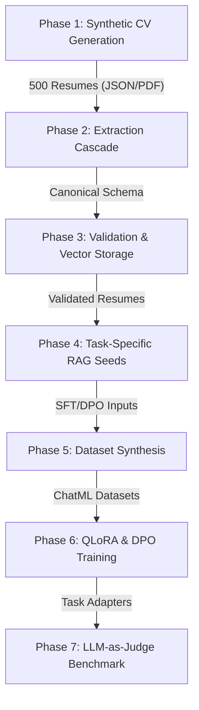
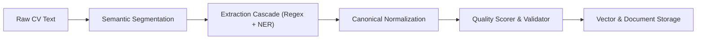
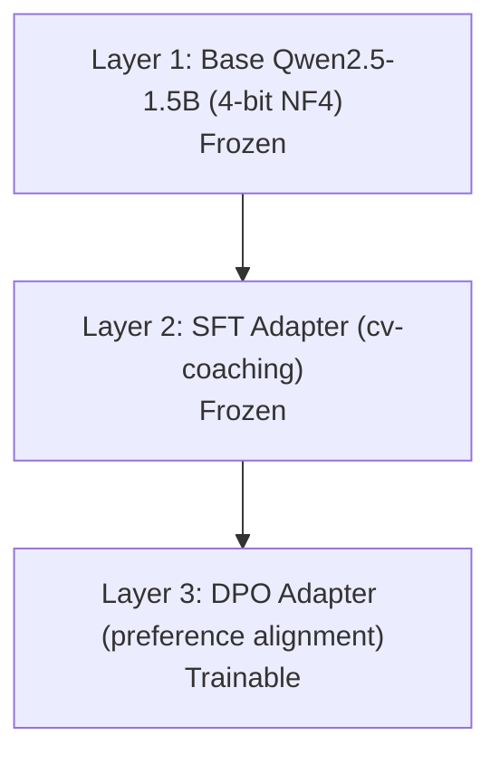

# Chapter 8: ML Training Pipeline — Data-to-Adapter Architecture

## 8.1 Overview

While Chapter 7 documents the multi-adapter runtime orchestrator, this chapter details the offline training pipeline designed to produce and align the specialized adapter models. The pipeline operates as a sequential data transformation pipeline, shifting unstructured data configurations through specialized learning representations to produce three task-specific QLoRA adapters. The training process runs end-to-end on a single NVIDIA RTX A5000 GPU ($24$ GB VRAM) within approximately $13$ hours.

The pipeline progresses from raw domain specifications to validated adapter models through a continuous flow of data representations:
$$\text{Role Configurations} \rightarrow \text{Structured CV Content} \rightarrow \text{Canonical Schema} \rightarrow \text{Quality-Scored Vector Embeddings} \rightarrow \text{Task Seed Outputs} \rightarrow \text{ChatML Datasets} \rightarrow \text{QLoRA Adapters}$$

---

## 8.2 Synthetic Data Foundation

### 8.2.1 Rationale for Synthetic Resumes
Fine-tuning the specialized adapters requires a dense training dataset containing diverse professional profiles with predetermined quality characteristics. Relying on real-world resumes presents two major challenges: privacy regulations (PII) restrict the storage and processing of candidate profiles, and real-world resumes lack structured quality controls. To train the HR coaching adapter to distinguish strengths from weaknesses, the training pipeline must control the presence of vague accomplishments, missing metrics, and formatting anomalies.

Synthetic generation resolves these issues by deterministically configuring candidate demographics, experience timelines, and professional details. This strategy allows the pipeline to assign ground-truth metadata tags—such as seniority levels, target domains, and overall quality flags—which serve as training labels and evaluation benchmarks.

### 8.2.2 Generation and Rendering Transformation
The synthetic generation process functions as a three-stage pipeline:
1. **Configuration Mapping**: The generator loads YAML definitions for $36$ distinct roles across seven industry domains. These configurations define skill taxonomies, educational standards, and role-specific performance metrics.
2. **LLM Content Generation**: A local $14$B parameter base model generates structured Vietnamese CV content. Crucially, the generator triggers a degraded mode for $10\%$ of the generated batch, forcing the model to omit performance metrics, write generic descriptions, and leave sections incomplete. This creates the ground-truth contrast required for the evaluation suite.
3. **Format Rendering**: The generated JSON structures are rendered into PDF and HTML documents using LaTeX templates, ensuring that the visual formatting matches standard professional layouts.

---

## 8.3 Data Structuring Pipeline

### 8.3.1 Semantic Extraction Cascade
The raw text parsed from generated resumes is mapped to a structured, typed `CanonicalResume` data contract through a multi-stage cascade:
- **Semantic Segmentation**: The document is partitioned into logical blocks (personal info, experience, education, skills, projects) using regex-based heading heuristics rather than arbitrary token boundaries.
- **Extraction Cascade**: A parallel regex and Transformer-based Named Entity Recognition (NER) pipeline processes each segment. Regex rules extract deterministic formats (emails, phone numbers, GPA, URLs, date ranges), while a pre-trained PhoBERT model extracts contextual entities such as organization names, locations, and candidate names.
- **Canonical Normalization**: Extracted entities are merged, prioritizing deterministic regex outputs for structured fields, and compiled into the canonical schema.

### 8.3.2 Quality Scoring and Vector Indexing
Once normalized, the candidate profiles undergo validation and indexing:
- **Logical Validation**: The validator identifies temporal overlaps in employment history, reversed date ranges, and out-of-scale GPAs, recording anomalies as validation alerts.
- **Quality Scorer**: A heuristic scorer evaluates the resume across four dimensions: completeness ($30\%$), specificity ($40\%$, checking for quantified metrics versus vague verbs), consistency ($20\%$, penalizing validation errors), and presentation ($10\%$, checking document length and link presence). Profiles scoring below $45$ are flagged as low-quality.
- **Multi-Vector Storage**: High-dimensional embeddings are generated across four independent representations (full profile, skills, experience, education) using a multi-lingual embedding model. The vectors are indexed in Qdrant to support task-specific semantic retrieval, while the structured profiles are persisted in MongoDB.

---

## 8.4 Task Seed Generation

Using the multi-vector indices, the pipeline runs RAG execution passes to produce task-specific seed data for training. The orchestrator injects candidate-specific profile contexts into specialized target prompts to generate three output modalities:
1. **CV Assessment**: Generates structured, constructive Vietnamese coaching feedback using a senior HR consultant persona. High-quality resumes receive reinforcement and polish suggestions; low-quality resumes receive detailed analysis of omissions and action-oriented rewrites of vague achievements.
2. **Job Matching**: Performs vector-based similarity matching against a database of active job descriptions, identifying key skill gaps, missing qualifications, and candidate-to-role suitability scores.
3. **Interview Preparation**: Generates tailored technical questions based on the candidate's documented projects, accompanied by multi-tiered scoring rubrics ($0$ to $4$ points) for hiring managers.

---

## 8.5 Dataset Architecture

To ensure the adapters adapt to the runtime orchestration environment, all training inputs are formatted as three-turn ChatML messages, matching the system prompts and boundaries they will receive at inference time.

The training pipeline compiles four distinct datasets:
- **Adapter A (Classifier)**: Built from intent classification queries, using data expansion and paraphrasing to cover linguistic variations of tool execution commands.
- **Adapter B (HR Coach)**: Formed by combining positive feedback seeds and critical assessment outputs, training the model to calibrate its feedback tone based on resume quality.
- **Adapter C (Structured Gen)**: Composed of structured markdown templates, interview question lists, and tabular learning roadmaps.
- **Adapter B (DPO)**: Created by pairing positive target outputs (Gemini teacher feedback) with rejected target outputs (untuned base model outputs) to optimize preference alignment.

| Dataset Target | Primary Purpose | SFT Train | SFT Val | DPO Pairs | Avg Token Length |
| :--- | :--- | :---: | :---: | :---: | :---: |
| **Adapter A** | Intent Classification | $4,869$ | $542$ | — | $355$ |
| **Adapter B** | Empathy & Metric Coaching | $1,656$ | $185$ | $1,841$ | $1,490$ |
| **Adapter C** | Markdown Tables & Rubrics | $820$ | $92$ | — | $1,024$ |

---

## 8.6 Training Architecture

### 8.6.1 QLoRA Parameter Efficiency
The core training architecture relies on QLoRA to fine-tune the $1.5$B base weights model within consumer-grade hardware limits ($2$ GB VRAM footprint for base weights). The base model parameters are frozen and quantized into $4$-bit NormalFloat (NF4) with double quantization enabled. Trainable low-rank parameter matrices (rank $r=16$, scaling $\alpha=32$) are injected across all seven attention and MLP linear projections, representing approximately $0.5\%$ ($7.5$ million parameters) of the total network footprint.

### 8.6.2 Three-Layer Stacked DPO Alignment
To align the coaching adapter (Adapter B) with human feedback preferences, the pipeline applies Direct Preference Optimization (DPO) using the Bradley-Terry preference model:
$$\mathcal{L}_{\text{DPO}} = -\mathbb{E}_{(x, y_w, y_l) \sim D} \left[ \log \sigma \left( \beta \log \frac{\pi_\theta(y_w|x)}{\pi_{\text{ref}}(y_w|x)} - \beta \log \frac{\pi_\theta(y_l|x)}{\pi_{\text{ref}}(y_l|x)} \right) \right]$$
where $y_w$ represents the chosen Gemini feedback, $y_l$ represents the rejected base model output, and $\beta=0.1$ controls the strength of the KL-divergence constraint relative to the reference model.

Rather than fine-tuning the SFT weights directly—which leads to performance degradation and formatting drift in small models—the pipeline stacks a new trainable DPO adapter layer on top of the frozen SFT adapter weights, maintaining a clear separation between domain formatting knowledge and style preference alignment.

### 8.6.3 Fine-Tuning Performance Summary
All three adapters were trained sequentially, using a paged 8-bit AdamW optimizer and cosine learning rate schedules:

| Adapter | Phase | Train Loss | Eval Loss | Compute Time | Saved Size |
| :--- | :--- | :---: | :---: | :---: | :---: |
| **Adapter A: Classifier** | SFT | $0.1537$ | $0.0918$ | $5.6$ hours | $81.4$ MB |
| **Adapter B: HR Coach** | SFT | $0.2837$ | $0.4901$ | $1.8$ hours | $81.4$ MB |
| **Adapter B: HR Coach** | DPO | $0.0345$ | $< 0.001$ | $4.3$ hours | $81.4$ MB |
| **Adapter C: Structured Gen** | SFT | $0.9651$ | $0.8684$ | $1.6$ hours | $81.4$ MB |

---

## 8.7 Evaluation Results

An automated evaluation framework running Gemini 3.1 Pro as an external judge benchmarks the pipeline and fine-tuned adapters against the unaligned base models across four evaluation tracks:

| Track | Target Component | Base Model Score | Fine-Tuned Adapter | Pass Threshold | Status |
| :--- | :--- | :---: | :---: | :---: | :---: |
| **1. Extraction** | Parsing Cascade | — | $97.3\%$ Schema Accuracy | $\ge 80.0\%$ Accuracy | ✅ PASS |
| **2. HR Feedback** | Adapter B (DPO) | $1.2 / 10$ | $7.8 / 10$ | $\ge 7.0 / 10$ | ✅ PASS |
| **3. Tool Calling** | Adapter A (Classifier) | $50.0\%$ | $98.0\%$ Accuracy | $\ge 90.0\%$ Accuracy | ✅ PASS |
| **4. Structured Gen** | Adapter C (Structured) | $3.6 / 10$ | $8.1 / 10$ | $\ge 7.0 / 10$ | ✅ PASS |

The benchmark results demonstrate three major architectural findings:
1. **Necessity of Adapter Tuning**: Base models perform close to random on structured classification and tabular generation tasks ($50\%$ tool calling, $3.6/10$ structured gen). Fine-tuning is required to bind tiny models to constrained schemas.
2. **Compounding Quality from DPO**: Stacking preference alignment on top of SFT achieves a $6.5\times$ quality improvement for HR coaching ($1.2 \rightarrow 7.8/10$), outperforming base models twice its size ($2.3/10$).
3. **Efficiency of Decomposed Weights**: Distributing features across three hot-swappable adapter matrices on a shared base weights model yields high task accuracy while maintaining a low GPU memory footprint during deployment.

---

## 8.8 Design Tradeoffs

### 8.8.1 Synthetic vs. Real Training Data
Relying on synthetic resumes eliminates data privacy concerns and enables deterministic quality labelling for evaluation. However, this introduces the risk of a distribution gap: the models may struggle to adapt to formatting nuances, language styles, and structural inconsistencies found in real-world resumes that were not modeled in the synthetic generation configurations.

### 8.8.2 Single-GPU Sequential vs. Parallelized Training
Sequential execution on a single NVIDIA RTX A5000 GPU minimizes infrastructure complexity and training costs, requiring simple scripting setups. The tradeoff is training throughput: an end-to-end run requires $13.3$ hours, limiting the velocity of prompt, configuration, and architecture experiments compared to multi-GPU parallelized training infrastructures.

### 8.8.3 Automated LLM-as-Judge vs. Human Evaluation
The automated evaluation framework enables fast, reproducible, and cheap evaluation across multiple validation sets. However, using an LLM judge introduces model-specific biases—including a preference for verbose phrasing, potential alignment with the judge's own output style, and the inability to assess the subjective value of HR recommendations with the accuracy of human domain experts.
