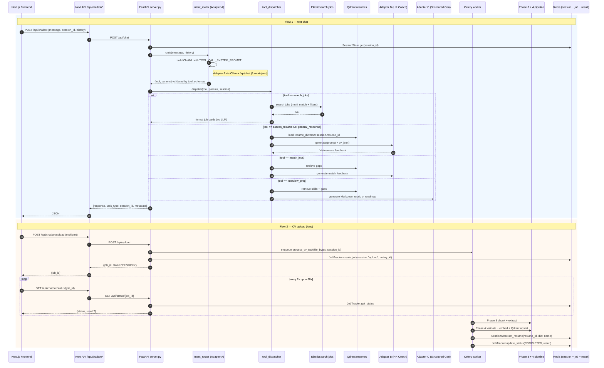

# Chatbot Pipeline Agent Guide — SLM Qwen2.5-1.5B + 3 Adapters

> **Audience**: Gemini code-pounder agents (backend + frontend) and Claude reviewer agents.
> **Author role**: Claude research/plan caveman. Me no write code. Me draw map only.
> **Status**: APPROVED by big chief (2026-06-10). 4 open questions answered (see §8). Gemini pounder may begin Step 1.
> **Caveman law**: All other agent talk shall sound like cave talk. No fancy word.

---

## 0. Big Picture in 5 Caveman Sentences

1. One small Qwen2.5-1.5B brain sit in cave. Three magic skins (LoRA adapter) swap on brain.
2. Skin A = router. Read user word → spit JSON `{tool, params}`. Always first.
3. Skin B = HR coach. Make warm Vietnamese feedback on CV.
4. Skin C = structured maker. Build Markdown table for roadmap or interview Q.
5. Phase 3 + Phase 4 in `chatbot/` folder = key info extractor (KIE) for uploaded CV → stored in Qdrant. Chatbot pull from there.

---

## 1. Current Rock Inventory (What Already In Cave)

Me look in cave. Me find:

### 1.1 Frontend (`frontend/ai assistant/page.tsx`)
- Chat UI ready. Hits 3 endpoints:
  - `POST /api/chatbot` — text chat (sync OR job_id polling)
  - `POST /api/chatbot/upload` — CV file upload (multipart)
  - `GET /api/chatbot/status/{jobId}` — poll async result
- Holds `sessionId`, `resumeId`, `resumeName`, message history.
- Already does 2-second polling up to 60 tries.

### 1.2 Next.js BFF (`app/api/chatbot/`)
- `route.ts` proxies POST → `${CHATBOT_BACKEND_URL}/api/chat`
- `upload/route.ts` proxies POST → `${CHATBOT_BACKEND_URL}/api/upload`
- `status/[jobId]/route.ts` — **EMPTY DIRECTORY**, must add `route.ts`
- Default backend URL = `http://localhost:8000`.

### 1.3 Backend chatbot service (`backend/chatbot/`)
Filled rocks (do NOT rewrite):
- `adapter_prompts.py` — system prompts for Adapter A/B/C (matches training)
- `tool_schemas.py` — Pydantic for 5 tools + city/exp/work_type validators
- `session_store.py` — Redis async session (24h TTL, key `session:{id}`)
- `job_tracker.py` — Redis async job tracker (1h TTL, key `job:{id}`)
- `Dockerfile` — Python 3.11 + tesseract-ocr-vie + copies `backend/chatbot` + mounts `chatbot/` for phase 3/4 modules

Empty rocks (need pounder fill):
- `adapter_config.py`
- `adapter_manager.py` ← critical: Ollama client OR PEFT in-memory
- `celery_app.py` ← Celery + Redis broker
- `intent_router.py` ← runs Adapter A, validates JSON
- `pipeline_bridge.py` ← bridges to `chatbot/phase 3` + `chatbot/phase 4`
- `requirements.txt`
- `response_formatter.py` ← shape final reply for frontend
- `server.py` ← FastAPI app (entry)
- `slash_commands.py` ← `/search`, `/coach`, `/review`, `/match`, `/interview`, `/roadmap`
- `tool_dispatcher.py` ← maps validated tool → action (ES query, adapter call)
- `ts_search_client.py` ← rename to `data_clients.py` (ES + Qdrant client)
- `worker_tasks.py` ← Celery tasks (long jobs)

### 1.4 Models on Disk
- `adapter_model.safetensors` at project root (~70 MB) — one merged adapter (tool-call most likely)
- `chatbot/models/qlora-qwen25-1-5b-*/final_adapter/` — three trained adapters
- 3 Ollama Modelfiles at project root:
  - `Modelfile.careerintel-tool-call`
  - `Modelfile.careerintel-hr-coach`
  - `Modelfile.careerintel-structured-gen`
- `.env`:
  ```
  MODEL_TOOL_CALL=qwen2.5:1.5b
  MODEL_HR_COACH=qwen2.5:1.5b
  MODEL_STRUCTURED_GEN=qwen2.5:1.5b
  ```
  Fallback to base Ollama model when adapter not yet built.

### 1.5 Infra (`docker-compose.yml`)
Current services: `redis`, `mongodb`, `elasticsearch`, `next-app`.
**MISSING**: `chatbot-api` (FastAPI), `celery-worker`, `qdrant`, `ollama`.

### 1.6 KIE Pipeline (`chatbot/phase 3-semantic chunking/` + `phase 4-validation and storage/`)
- Phase 3 = `SemanticExtractionPipeline` → `CanonicalResume` (PersonalInfo, Experience, Education, Projects, Skills, Certs, Courses)
- Phase 4 = `ValidationStoragePipeline` → ValidatedResume + bge-m3 embeddings + Qdrant upsert
- These will be invoked by `pipeline_bridge.py` from Celery worker.

---

## 2. Decision: Ollama vs Native PEFT

Two paths exist. Me recommend **Ollama path** because:

| Aspect | Ollama (3 models) | Native PEFT (1 base + swap) |
|---|---|---|
| VRAM | 3× ~1.6 GB | 1× ~1.6 GB |
| Swap latency | none (separate procs) | ~1 ms |
| Setup difficulty | low (`ollama create`) | high (PEFT + bitsandbytes in Docker) |
| Current state of cave | Modelfiles exist, `.env` already point here | Nothing wired yet |
| Streaming SSE | native | manual |

**Picked path = Ollama**. Path can pivot to PEFT later if VRAM gets tight.

> Adapter A merges with base on `ollama create` → resulting model name = `careerintel-tool-call`. Same for `careerintel-hr-coach`, `careerintel-structured-gen`. The `.env` MODEL_* vars become those custom names once built; current `qwen2.5:1.5b` is fallback for dev without GPU.

---

## 3. Full Pipeline Drawing



---

## 4. Component Build Order (Strict)

Pounders shall obey order. Each step has clear stop check.

### Step 1 — Infra additions to `docker-compose.yml`
Add services:
1. `qdrant` (image `qdrant/qdrant:latest`, port 6333, volume)
2. `ollama` (image `ollama/ollama:latest`, port 11434, volume for model weights, optional `gpus: all`)
3. `chatbot-api` (build from `backend/chatbot/Dockerfile`, port 8000, depends on redis/mongo/qdrant/ollama)
4. `celery-worker` (same image as `chatbot-api`, command `celery -A celery_app worker -l info`)

Env additions:
```
CHATBOT_BACKEND_URL=http://chatbot-api:8000  (in next-app)
OLLAMA_HOST=http://ollama:11434
QDRANT_URL=http://qdrant:6333
MODEL_TOOL_CALL=careerintel-tool-call
MODEL_HR_COACH=careerintel-hr-coach
MODEL_STRUCTURED_GEN=careerintel-structured-gen
```

**Stop check**: `docker compose up` brings 7 healthy containers.

### Step 2 — One-time Ollama model build (host shell)
```bash
ollama pull qwen2.5:1.5b
ollama create careerintel-tool-call    -f Modelfile.careerintel-tool-call
ollama create careerintel-hr-coach     -f Modelfile.careerintel-hr-coach
ollama create careerintel-structured-gen -f Modelfile.careerintel-structured-gen
ollama list   # confirm 3 names
```
Update `Modelfile.careerintel-tool-call` so `ADAPTER` line points at the actual `chatbot/models/qlora-qwen25-1-5b-tool-call/final_adapter` (currently it points at the root `.safetensors` which is ambiguous).

**Stop check**: `ollama run careerintel-tool-call "test"` returns JSON-looking output.

### Step 3 — `requirements.txt` (`backend/chatbot/`)
Minimum bones:
```
fastapi>=0.115
uvicorn[standard]>=0.30
pydantic>=2.7
redis[hiredis]>=5.0
celery>=5.4
httpx>=0.27
python-multipart>=0.0.9
qdrant-client>=1.10
elasticsearch>=8.13,<9
ollama>=0.3
sentence-transformers>=2.7   # bge-m3 for embedder
PyMuPDF>=1.24                # PDF
python-docx>=1.1             # DOCX
pytesseract>=0.3.10          # OCR
Pillow>=10
```
Phase 3 deps (transformers, torch) come in via the pipeline import copy. Confirm by trial Docker build.

### Step 4 — `adapter_config.py`
Simple constants:
```python
MODEL_TOOL_CALL = os.environ["MODEL_TOOL_CALL"]
MODEL_HR_COACH = os.environ["MODEL_HR_COACH"]
MODEL_STRUCTURED_GEN = os.environ["MODEL_STRUCTURED_GEN"]
OLLAMA_HOST = os.environ.get("OLLAMA_HOST", "http://ollama:11434")

GEN_PARAMS = {
  "tool_call":      {"temperature": 0.1, "top_p": 0.9, "num_predict": 256, "format": "json"},
  "hr_coach":       {"temperature": 0.5, "top_p": 0.9, "num_predict": 1024},
  "structured_gen": {"temperature": 0.3, "top_p": 0.9, "num_predict": 2048},
}
```
Adapter A uses Ollama `format: "json"` to force valid JSON at engine level.

### Step 5 — `adapter_manager.py`
One class. Async. Holds an `ollama.AsyncClient(host=OLLAMA_HOST)`.
```python
class AdapterManager:
    async def generate(self, adapter, system, user, **overrides) -> str:
        model = {"tool_call":MODEL_TOOL_CALL, "hr_coach":MODEL_HR_COACH,
                 "structured_gen":MODEL_STRUCTURED_GEN}[adapter]
        params = {**GEN_PARAMS[adapter], **overrides}
        msg = [{"role":"system","content":system},{"role":"user","content":user}]
        out = await client.chat(model=model, messages=msg, options=params)
        return out["message"]["content"]
```
No dynamic LoRA swap needed — each model already merged.

### Step 6 — `intent_router.py`
```python
async def route(user_msg: str, history: list[dict]) -> ToolCallResult:
    raw = await adapter_mgr.generate("tool_call",
            system=TOOL_CALL_SYSTEM_PROMPT, user=user_msg)
    data = json.loads(raw)
    return ToolCallResult(**data)
```
1 retry with stricter suffix on `ValidationError`. Second fail → fallback to `general_response`.

### Step 7 — `tool_dispatcher.py`
One async fn per tool. Returns:
```python
{ "response": "<markdown>", "task_type": "...", "metadata": {...} }
```
Mapping:
- `search_jobs` → data_clients.search_jobs → format card list (no LLM)
- `assess_resume` → load resume_dict from session → Adapter B
- `match_jobs` → Qdrant gap analysis → Adapter B
- `interview_prep` → load CV + skill gaps → Adapter C (roadmap OR interview)
- `general_response` → Adapter B free chat

If tool needs resume AND `session.resume_id is None` → short-circuit asking for upload.

### Step 8 — `ts_search_client.py` → rename `data_clients.py`
- `ElasticsearchClient.search_jobs(SearchJobsParams)` — multi_match + terms filter per `adapter_inference_guide.md` §Database Integration.
- `QdrantClient.get_resume(resume_id)`, `compare_skills(resume_id, jd_text)`.

### Step 9 — `response_formatter.py`
- `format_chat_response(task_type, response_md, session_id, metadata)` → dict matching frontend contract.
- `format_job_cards(es_hits)` → markdown list.
- `format_error(msg)` → dict.

### Step 10 — `celery_app.py`
```python
celery_app = Celery("chatbot",
  broker=os.environ["REDIS_URL"],
  backend=os.environ["REDIS_URL"],
)
celery_app.conf.task_routes = {"worker_tasks.*": {"queue": "ml"}}
```

### Step 11 — `worker_tasks.py`
Tasks:
- `process_cv_task(file_bytes, filename, session_id, job_id)`
- (optional) `assess_resume_task`, `match_jobs_task`

Wrap each: `JobTracker.update_status(PROCESSING)` → work → COMPLETED or FAILED with error string.

### Step 12 — `pipeline_bridge.py`
Folder names contain spaces and both files named `pipeline.py` (collision). Use importlib:
```python
import importlib.util, pathlib
def load(modname, path):
    spec = importlib.util.spec_from_file_location(modname, path)
    mod = importlib.util.module_from_spec(spec); spec.loader.exec_module(mod); return mod
P3 = load("phase3_pipeline", "/chatbot/phase 3-semantic chunking/pipeline.py")
P4 = load("phase4_pipeline", "/chatbot/phase 4-validation and storage/pipeline.py")
```
Function:
```python
def run_phase34(file_path) -> dict:
    text = parse_file(file_path)            # PyMuPDF / docx / OCR
    canonical = P3.SemanticExtractionPipeline().run(text)
    validated, point_id = P4.ValidationStoragePipeline().process(canonical)
    return {"resume_id": point_id,
            "resume_dict": canonical.model_dump(),
            "resume_name": pathlib.Path(file_path).name,
            "quality_score": validated.quality_score}
```

### Step 13 — `slash_commands.py`
Maps `/search`, `/coach`, `/review`, `/match`, `/interview`, `/roadmap` → pre-built `ToolCallResult` to skip Adapter A latency.
```python
SLASH = {
  "/search":   lambda rest: ToolCallResult(tool="search_jobs",   params={"keyword": rest}),
  "/coach":    lambda rest: ToolCallResult(tool="assess_resume", params={"focus_areas":[]}),
  "/review":   lambda rest: ToolCallResult(tool="assess_resume", params={"focus_areas":[]}),
  "/match":    lambda rest: ToolCallResult(tool="match_jobs",    params={"jd_text": rest}),
  "/interview":lambda rest: ToolCallResult(tool="interview_prep",params={"target_role": rest, "generate_roadmap": False}),
  "/roadmap":  lambda rest: ToolCallResult(tool="interview_prep",params={"target_role": rest, "generate_roadmap": True}),
}
def maybe_handle(msg) -> ToolCallResult | None: ...
```

### Step 14 — `server.py` (FastAPI entry)
Endpoints:
- `GET /health`
- `POST /api/chat` body `{message, session_id?, history?}` → `{response, task_type, session_id, metadata}`. Flow:
  1. `session_id = await session_store.create(session_id)`
  2. `tc = slash_commands.maybe_handle(message) or await intent_router.route(message, history)`
  3. `result = await tool_dispatcher.dispatch(tc, session_id)`
  4. return formatter output
- `POST /api/upload` multipart `file`, `session_id?` → enqueue Celery → `{job_id, status:"PENDING"}`
- `GET /api/status/{job_id}` → `JobTracker.get_status`
- Startup: connect session_store + job_tracker. Shutdown: close.

### Step 15 — Frontend gap fix
- Add `app/api/chatbot/status/[jobId]/route.ts` that proxies `GET ${BACKEND_URL}/api/status/{jobId}` (frontend already calls).
- SSE streaming = later, after MVP works.

### Step 16 — Smoke test (`scripts/smoke_chatbot.ps1`)
1. `POST /api/chat {"message":"chào"}` → task_type `general_response`
2. `POST /api/chat {"message":"Tìm việc Backend HCM lương 25 củ"}` → task_type `search_jobs` + ES hits
3. Upload sample CV → poll → COMPLETED + resume_id
4. `POST /api/chat {"message":"đánh giá cv giúp mình","session_id":<id>}` → Vietnamese feedback
5. `POST /api/chat {"message":"/roadmap Backend Developer"}` → Markdown table

---

## 5. Important Caves and Traps

| Trap | Why bite | How dodge |
|---|---|---|
| Folder names with spaces in `chatbot/phase 3-...` | `import` breaks | importlib `spec_from_file_location` |
| Two files named `pipeline.py` (phase 3 + phase 4) | Module collision | importlib with explicit module names |
| Adapter A returns text outside JSON | Breaks `json.loads` | Ollama `format:"json"` + 1 retry + fallback `general_response` |
| `general_response` returns no params | OK | `GeneralResponseParams` empty model handles |
| `location` like "SG" | Validator strict | `LOCATION_ALIASES` already covers |
| Frontend polling 2s × 60 = 2 min ceiling | Phase 3 may exceed | Bump to 120 attempts OR keep alive message |
| Ollama on Windows host, FastAPI in Docker | `localhost:11434` unreachable | Use `host.docker.internal:11434` OR run ollama as compose service |
| Adapter weights base mismatch | Garbage output | Modelfile `FROM qwen2.5:1.5b` MUST match training base in `qlora_config.py` |
| `adapter_model.safetensors` at root ambiguous | Wrong adapter risk | Decide: delete root file, point each Modelfile at its own folder |
| Redis already password-protected (`walkthrough.md`) | Celery + chatbot must auth | `redis://:${REDIS_PASSWORD}@redis:6379/0` |
| Existing `adapter_inference_guide.md` proposes PEFT | Pounder confusion | This guide picks Ollama; PEFT only if VRAM tight |

---

## 6. Acceptance Checklist (Reviewer Agent — Gemini 3.5 Pro)

- [ ] `docker compose up` brings `chatbot-api`, `celery-worker`, `qdrant`, `ollama` healthy.
- [ ] `ollama list` shows all 3 custom names.
- [ ] `GET http://localhost:8000/health` → `{"status":"ok"}`.
- [ ] `POST /api/chat` "Tìm việc Backend ở SG" → task_type `search_jobs` + ES hits.
- [ ] Upload sample PDF → PENDING → PROCESSING → COMPLETED ≤120 s, `session.resume_id` set.
- [ ] Subsequent chat with same `session_id` and "đánh giá CV" → Vietnamese feedback Adapter B.
- [ ] `/roadmap Backend Developer` → Markdown table with timeline + priority emojis (Adapter C).
- [ ] `intent_router` falls back when Adapter A non-JSON.
- [ ] No secret COPY into Docker layer.
- [ ] Public functions have docstring; no leftover print.
- [ ] Gemini coder writes `walkthrough.md` after pounding.

---

## 7. Out-of-Scope (Do NOT Touch)

- DPO retraining
- Phase 6/7/8 dataset/training/benchmark scripts
- New tools beyond the 5 in `tool_schemas.py`
- Supabase JWT plumbing into FastAPI (Next BFF guards)
- ClickHouse migration from `plan.md`

---

## 8. Decisions from Big Chief (LOCKED — 2026-06-10)

| # | Question | Big chief say | What this change in map |
|---|----------|---------------|--------------------------|
| 1 | Where Ollama run? | **HOST machine** (NOT compose service) | `OLLAMA_HOST=http://host.docker.internal:11434` for `chatbot-api` + `celery-worker`. Do NOT add `ollama` service to `docker-compose.yml`. Step 1 service list drops to 6 containers (3 existing + chatbot-api + celery-worker + qdrant). On Linux host, add `extra_hosts: ["host.docker.internal:host-gateway"]` to both backend containers. |
| 2 | Delete root `adapter_model.safetensors`? | **YES — delete it.** | Each `Modelfile.careerintel-*` must point `ADAPTER` at its own `chatbot/models/qlora-qwen25-1-5b-*/final_adapter/` directory. Pounder must `git rm adapter_model.safetensors` AND `rm adapter_config.json` at project root, then fix `Modelfile.careerintel-tool-call` (currently points at `adapter_model.safetensors`). |
| 3 | SSE streaming now? | **NO — JSON only for MVP.** | `adapter_manager.py` exposes only `generate()` (no `generate_stream`). `server.py` `/api/chat` returns plain JSON. Frontend polling stays 2s. SSE punted to v2. |
| 4 | Auth inside FastAPI? | **NO — trust Next.js BFF.** | FastAPI binds to `127.0.0.1:8000` on host network (or to docker internal network only). No JWT/Supabase check inside `server.py`. **Critical**: do NOT expose port 8000 to public internet — only `next-app` shall talk to it. In `docker-compose.yml`, drop `ports: - "8000:8000"` from `chatbot-api`; use `expose: - "8000"` so only sibling containers reach it. |

### Locked Stack Diagram

```
┌─ HOST machine ─────────────────────────────────────────────┐
│  ollama serve  (port 11434, careerintel-* models loaded)   │
│                                                            │
│  ┌─ docker compose network ──────────────────────────────┐ │
│  │  next-app (3000, PUBLIC) ──► chatbot-api (8000, INTERNAL) │
│  │                                  │                    │ │
│  │                                  ├──► redis           │ │
│  │                                  ├──► qdrant          │ │
│  │                                  ├──► elasticsearch   │ │
│  │                                  └──► celery-worker   │ │
│  │                                         │              │ │
│  │  All ──► host.docker.internal:11434 ◄───┘ (Ollama)    │ │
│  └────────────────────────────────────────────────────────┘ │
└────────────────────────────────────────────────────────────┘
```

### Step-1 docker-compose addendum (final shape)

```yaml
  qdrant:
    image: qdrant/qdrant:latest
    container_name: job-market-qdrant
    ports: ["6333:6333"]
    volumes: ["qdrant_data:/qdrant/storage"]
    restart: unless-stopped

  chatbot-api:
    build:
      context: .
      dockerfile: backend/chatbot/Dockerfile
    container_name: job-market-chatbot-api
    expose: ["8000"]                     # internal only — Next BFF talks to it
    env_file: [.env.docker]
    environment:
      - REDIS_URL=redis://:${REDIS_PASSWORD}@redis:6379/0
      - QDRANT_URL=http://qdrant:6333
      - ELASTICSEARCH_NODE=http://elasticsearch:9200
      - OLLAMA_HOST=http://host.docker.internal:11434
      - MODEL_TOOL_CALL=careerintel-tool-call
      - MODEL_HR_COACH=careerintel-hr-coach
      - MODEL_STRUCTURED_GEN=careerintel-structured-gen
    extra_hosts: ["host.docker.internal:host-gateway"]   # Linux compat
    depends_on:
      redis: {condition: service_healthy}
      qdrant: {condition: service_started}
      elasticsearch: {condition: service_healthy}
    restart: unless-stopped

  celery-worker:
    build:
      context: .
      dockerfile: backend/chatbot/Dockerfile
    container_name: job-market-celery
    command: celery -A celery_app worker -l info -Q ml
    env_file: [.env.docker]
    environment:
      - REDIS_URL=redis://:${REDIS_PASSWORD}@redis:6379/0
      - QDRANT_URL=http://qdrant:6333
      - OLLAMA_HOST=http://host.docker.internal:11434
      - MODEL_HR_COACH=careerintel-hr-coach
      - MODEL_STRUCTURED_GEN=careerintel-structured-gen
    extra_hosts: ["host.docker.internal:host-gateway"]
    depends_on: [redis, qdrant]
    restart: unless-stopped
```

Also bump `next-app` env: `CHATBOT_BACKEND_URL=http://chatbot-api:8000`.

Volumes block adds: `qdrant_data:`.

### Pre-flight Ollama on host (Windows)

```powershell
# One-time
winget install Ollama.Ollama       # or download installer
ollama serve                       # leave running in own terminal

# Build the 3 adapters (after §1 trap-2 cleanup)
ollama pull qwen2.5:1.5b
ollama create careerintel-tool-call       -f .\Modelfile.careerintel-tool-call
ollama create careerintel-hr-coach        -f .\Modelfile.careerintel-hr-coach
ollama create careerintel-structured-gen  -f .\Modelfile.careerintel-structured-gen
ollama list   # must show all 3
```

> **Trap re-stated**: Ollama on Windows binds to `127.0.0.1` by default. To accept connections from `host.docker.internal`, set env var `OLLAMA_HOST=0.0.0.0:11434` BEFORE `ollama serve`, OR run `setx OLLAMA_HOST "0.0.0.0:11434"` and restart the Ollama tray app. Without this, containers will get `connection refused`.

### Frontend polling — keep but extend

Because no SSE, the 2s × 60 = 120s polling ceiling in `frontend/ai assistant/page.tsx` is tight for Phase 3 (PhoBERT NER + LLM normalization). Pounder shall:
- Bump loop in `pollJobStatus` from `attempts < 60` to `attempts < 150` (5 min hard ceiling).
- After attempt 30 (≈1 min), swap placeholder text to `"⏳ Đang trích xuất CV — bước này có thể mất tới 3 phút..."` to keep user calm.

---

*End of guide. Big chief stamp received. Gemini pounder begin Step 1.*


