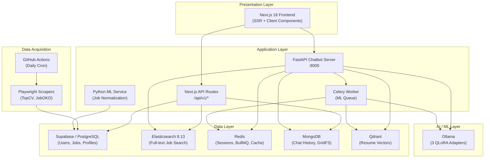
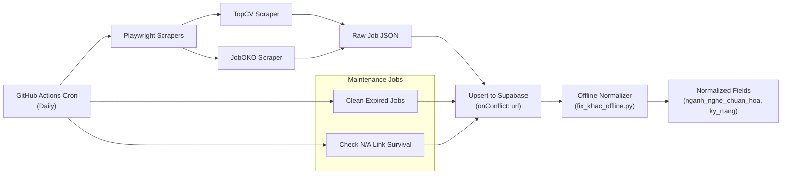
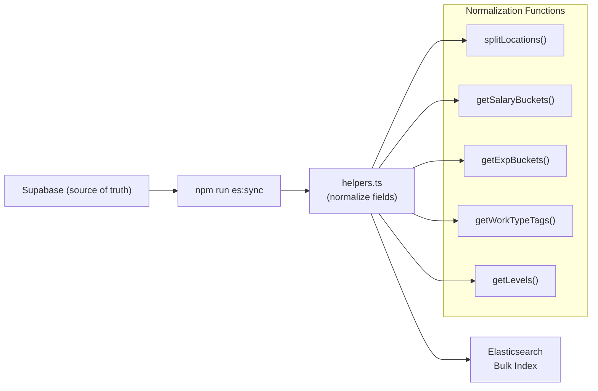
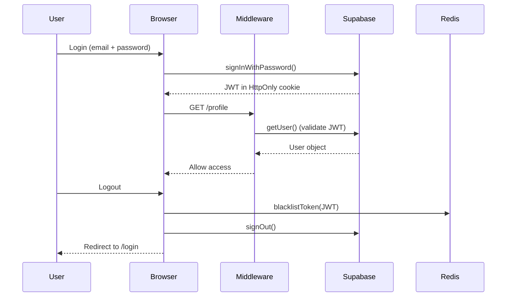
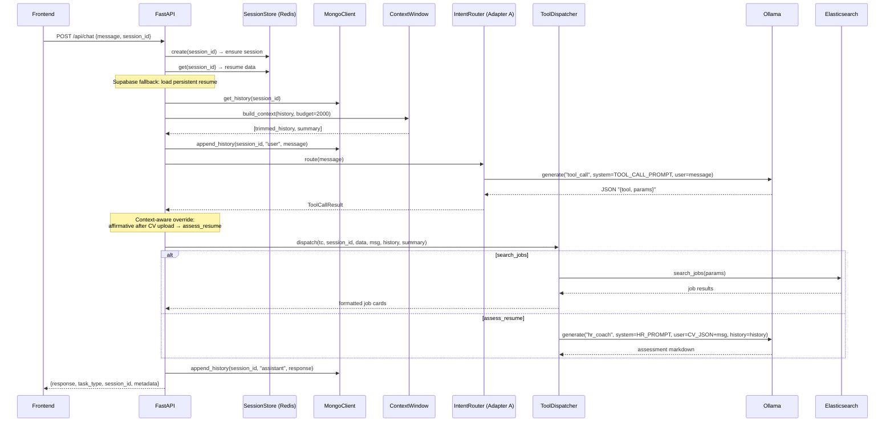
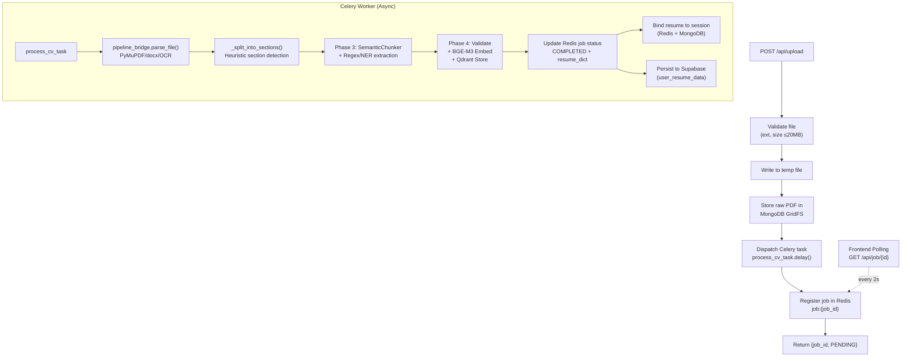
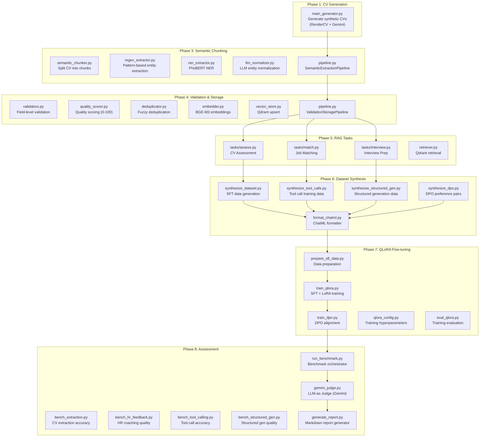

# CareerIntel — Thesis Technical Guide

> **Project**: Job Market Analytics Platform ("CareerIntel")  
> **Stack**: Next.js 16 + FastAPI + Ollama + Docker (Redis, MongoDB, Elasticsearch, Qdrant)  
> **Purpose**: Map the entire codebase into thesis-ready chapters with file-level references and flow diagrams.

---

## Table of Contents

| # | Chapter | Est. Pages | Key Technologies |
|---|---------|-----------|-----------------|
| 1 | [System Architecture & Infrastructure](#chapter-1-system-architecture--infrastructure-docker-compose) | 3–4 | Docker Compose, Microservices |
| 2 | [Data Acquisition Pipeline (Web Scraping)](#chapter-2-data-acquisition-pipeline-web-scraping) | 4–5 | Playwright, BullMQ, GitHub Actions |
| 3 | [Data Layer & Polyglot Persistence](#chapter-3-data-layer--polyglot-persistence) | 4–5 | Supabase/PostgreSQL, MongoDB, Redis, Qdrant |
| 4 | [Full-Text Search Engine](#chapter-4-full-text-search-engine-elasticsearch) | 3–4 | Elasticsearch 8.13, Vietnamese NLP helpers |
| 5 | [Authentication & Authorization](#chapter-5-authentication--authorization) | 2–3 | Supabase Auth, JWT, Redis Blacklist, Middleware |
| 6 | [Frontend Presentation Layer](#chapter-6-frontend-presentation-layer-nextjs) | 3–4 | Next.js App Router, SSR, React 19 |
| 7 | [AI Chatbot Orchestrator (SLM Multi-Adapter)](#chapter-7-ai-chatbot-orchestrator-slm-multi-adapter-architecture) | 6–8 | FastAPI, Ollama, QLoRA Adapters, Celery, Qdrant |
| 8 | [ML Training Pipeline (8-Phase QLoRA)](#chapter-8-ml-training-pipeline-8-phase-qlora-fine-tuning) | 5–7 | Gemini Synthesis, QLoRA, DPO, LLM-as-Judge |
| | **Total** | **~30–40** | |

---

## High-Level Architecture Diagram



---

## Chapter 1: System Architecture & Infrastructure (Docker Compose)

**Estimated pages: 3–4**

### 1.1 Overview

CareerIntel follows a **polyglot microservices architecture** orchestrated via Docker Compose. Seven containers run concurrently, each serving a specialized purpose.

### 1.2 Services Map

| Service | Image / Build | Port | Role |
|---------|--------------|------|------|
| `redis` | `redis:alpine` | 6379 | Session store, BullMQ broker, enum cache |
| `mongodb` | `mongo:latest` | 27017 | Chat history (Motor), GridFS (raw CVs) |
| `elasticsearch` | `elasticsearch:8.13.0` | 9200 | Full-text job search index |
| `qdrant` | `qdrant/qdrant:latest` | 6333 | Resume vector embeddings (BGE-M3) |
| `next-app` | Custom Dockerfile | 3000 | Next.js SSR frontend + API routes |
| `chatbot-api` | `backend/chatbot/Dockerfile` | 8000 | FastAPI orchestrator for AI chatbot |
| `celery-worker` | Same Dockerfile | — | Async CV processing (PhoBERT NER + BGE-M3) |

### 1.3 Key Files

| File | Purpose |
|------|---------|
| [docker-compose.yml](file:///d:/Job-Market-Analytics-Platform/docker-compose.yml) | All 7 services, volumes, health checks, env vars |
| [Dockerfile](file:///d:/Job-Market-Analytics-Platform/Dockerfile) | Next.js production build (multi-stage) |
| [backend/chatbot/Dockerfile](file:///d:/Job-Market-Analytics-Platform/backend/chatbot/Dockerfile) | Python 3.11 + PyMuPDF + Tesseract for CV processing |
| [.env.docker](file:///d:/Job-Market-Analytics-Platform/.env.docker) | Docker-specific environment variables |
| [system_design.md](file:///d:/Job-Market-Analytics-Platform/system_design.md) | Original system design document |

### 1.4 Thesis Topics to Cover

- Container orchestration strategy (health checks, `depends_on` ordering)
- Shared volume pattern (`shared_tmp`) for Celery ↔ FastAPI file handoff
- `host.docker.internal` bridge for Ollama running on host GPU
- Service discovery via Docker DNS (e.g., `http://chatbot-api:8000`)

---

## Chapter 2: Data Acquisition Pipeline (Web Scraping)

**Estimated pages: 4–5**

### 2.1 Overview

Job postings are scraped from **TopCV** and **JobOKO** using Playwright (headless Chromium), processed through a normalization pipeline, then stored in Supabase (PostgreSQL).

### 2.2 Architecture Flow



### 2.3 Key Files

| File | Purpose |
|------|---------|
| [backend/scrap/scrap_topcv.ts](file:///d:/Job-Market-Analytics-Platform/backend/scrap/scrap_topcv.ts) | Playwright scraper for TopCV (list → detail, 323 lines) |
| [backend/scrap/scrapers/joboko.ts](file:///d:/Job-Market-Analytics-Platform/backend/scrap/scrapers/joboko.ts) | Playwright scraper for JobOKO (29K bytes) |
| [backend/scrap/scrap.ts](file:///d:/Job-Market-Analytics-Platform/backend/scrap/scrap.ts) | Shared scraper utilities & `checkJobExists` |
| [backend/scrap/types.ts](file:///d:/Job-Market-Analytics-Platform/backend/scrap/types.ts) | TypeScript interfaces for scraped data |
| [backend/jobs/github_action.ts](file:///d:/Job-Market-Analytics-Platform/backend/jobs/github_action.ts) | GitHub Actions entry point — orchestrates all 3 jobs |
| [backend/jobs/queue.ts](file:///d:/Job-Market-Analytics-Platform/backend/jobs/queue.ts) | BullMQ worker for local development (Redis-backed) |
| [backend/jobs/cron.ts](file:///d:/Job-Market-Analytics-Platform/backend/jobs/cron.ts) | Cron scheduler for periodic scraping |
| [python-ml-service/main.py](file:///d:/Job-Market-Analytics-Platform/python-ml-service/main.py) | FastAPI ML service for job normalization (4 phases) |
| [python-ml-service/pipeline/](file:///d:/Job-Market-Analytics-Platform/python-ml-service/pipeline) | 4-phase normalization: clean → semantic → hash → upsert |

### 2.4 Thesis Topics to Cover

- **Playwright vs traditional scrapers** (Scrapy/BeautifulSoup) — why browser automation needed for JS-heavy Vietnamese job sites
- **Anti-scraping countermeasures**: User-Agent spoofing, delay injection (10s between detail pages), proxy rotation strategy
- **Two-pass scraping pattern**: listing page → individual detail pages (DOM evaluation)
- **Data normalization pipeline** (python-ml-service): Phase 1 (regex cleaning) → Phase 2 (Gemini semantic normalization for tags/skills) → Phase 3 (content hashing for dedup) → Phase 4 (Supabase upsert)
- **Concurrency control**: `runWithConcurrency()` worker pool pattern for parallel N/A link checks
- **Data freshness**: Expired job cleanup (DD/MM/YYYY parsing), dead link detection via HEAD requests
- **CI/CD integration**: GitHub Actions workflow for daily automated scraping

---

## Chapter 3: Data Layer & Polyglot Persistence

**Estimated pages: 4–5**

### 3.1 Overview

The system uses **5 specialized databases**, each optimized for its data type — a textbook polyglot persistence pattern.

### 3.2 Database Roles

| Database | Use Case | Key Collections/Tables | Access Layer |
|----------|----------|----------------------|-------------|
| **Supabase (PostgreSQL)** | Users, profiles, jobs, CVs | `profiles`, `experiences`, `educations`, `skills`, `user_cvs`, `jobs` | `@supabase/supabase-js` + Service Role Key |
| **Redis** | Sessions, job tracking, BullMQ, enum cache | `session:{id}`, `job:{id}`, `session:{id}:history` | `redis.asyncio` (Python), `ioredis` (TS) |
| **MongoDB** | Chat history, CV file storage | `history`, `sessions`, GridFS | Motor (async), GridFS bucket |
| **Elasticsearch** | Full-text job search | `jobs` index (keyword + text fields) | `@elastic/elasticsearch` (TS), Python async client |
| **Qdrant** | Resume vector embeddings | `resumes` collection (4 named vectors per resume) | `qdrant-client` (Python) |

### 3.3 Key Files

| File | Purpose |
|------|---------|
| [backend/supabase/client.ts](file:///d:/Job-Market-Analytics-Platform/backend/supabase/client.ts) | Browser-side Supabase client |
| [backend/supabase/server.ts](file:///d:/Job-Market-Analytics-Platform/backend/supabase/server.ts) | Server-side Supabase client (cookie-based auth) |
| [backend/lib/redis.ts](file:///d:/Job-Market-Analytics-Platform/backend/lib/redis.ts) | Redis connection singleton (TypeScript) |
| [backend/lib/mongodb.ts](file:///d:/Job-Market-Analytics-Platform/backend/lib/mongodb.ts) | MongoDB connection singleton (TypeScript) |
| [backend/lib/elasticsearch.ts](file:///d:/Job-Market-Analytics-Platform/backend/lib/elasticsearch.ts) | Elasticsearch connection (TypeScript) |
| [backend/chatbot/mongo_client.py](file:///d:/Job-Market-Analytics-Platform/backend/chatbot/mongo_client.py) | Python Motor async MongoDB client (history, GridFS, session CV) |
| [backend/chatbot/session_store.py](file:///d:/Job-Market-Analytics-Platform/backend/chatbot/session_store.py) | Redis session store (resume binding, history sync) |
| [backend/chatbot/data_clients.py](file:///d:/Job-Market-Analytics-Platform/backend/chatbot/data_clients.py) | ES job search + Qdrant resume reader clients |
| [backend/mongodb/chatService.ts](file:///d:/Job-Market-Analytics-Platform/backend/mongodb/chatService.ts) | TypeScript chat service (conversation CRUD for frontend) |
| [backend/mongodb/client.ts](file:///d:/Job-Market-Analytics-Platform/backend/mongodb/client.ts) | MongoDB connection client (TypeScript) |
| [backend/mongodb/types.ts](file:///d:/Job-Market-Analytics-Platform/backend/mongodb/types.ts) | TypeScript types for chat/conversation documents |
| [backend/chatbot/job_tracker.py](file:///d:/Job-Market-Analytics-Platform/backend/chatbot/job_tracker.py) | Redis-based async job status tracking |
| [supabase_user_resume_data.sql](file:///d:/Job-Market-Analytics-Platform/supabase_user_resume_data.sql) | SQL schema for user_resume_data table |

### 3.4 Thesis Topics to Cover

- **Polyglot persistence justification**: Why 5 databases instead of 1 monolithic DB
- **Data flow diagram**: Scraper → Supabase → Elasticsearch sync → search queries
- **Session management**: Redis hash (`session:{id}`) with 24h TTL, fallback to MongoDB
- **Dual-write strategy**: Resume data written to both Redis (fast reads) + MongoDB (durability)
- **GridFS for CV storage**: Binary file storage in MongoDB with session linking
- **Vector database design**: Qdrant collection with 4 named vectors per resume (BGE-M3 embeddings)

---

## Chapter 4: Full-Text Search Engine (Elasticsearch)

**Estimated pages: 3–4**

### 4.1 Overview

Elasticsearch powers the job search feature, indexing scraped jobs with Vietnamese-specific field mapping and faceted filtering.

### 4.2 Index Schema

```
jobs index:
  url           → keyword (unique ID)
  tieu_de       → text (standard analyzer, boosted ^3)
  cong_ty       → text (standard analyzer, boosted ^2)
  cities        → keyword[] (faceted filter)
  categories    → keyword[] (faceted filter)
  workTypes     → keyword[] (faceted filter)
  levels        → keyword[] (faceted filter)
  expBuckets    → keyword[] (faceted filter)
  salaryBuckets → keyword[] (faceted filter)
  created_at    → date
  raw_data      → object (stored, not indexed)
```

### 4.3 Data Sync Flow



### 4.4 Key Files

| File | Purpose |
|------|---------|
| [backend/elasticsearch/sync.ts](file:///d:/Job-Market-Analytics-Platform/backend/elasticsearch/sync.ts) | Supabase → Elasticsearch batch sync with dedup |
| [backend/elasticsearch/helpers.ts](file:///d:/Job-Market-Analytics-Platform/backend/elasticsearch/helpers.ts) | Vietnamese NLP helpers: location parsing, salary/exp bucketing |
| [backend/chatbot/data_clients.py](file:///d:/Job-Market-Analytics-Platform/backend/chatbot/data_clients.py#L58-L184) | Python async Elasticsearch client for chatbot search |
| [backend/chatbot/enum_cache.py](file:///d:/Job-Market-Analytics-Platform/backend/chatbot/enum_cache.py) | Elasticsearch aggregation cache (cities, exp, work types) |

### 4.5 Thesis Topics to Cover

- **Index design decisions**: Why `keyword` for facets vs `text` for search
- **Vietnamese salary parsing**: Regex-based extraction of "10-20 triệu VND" → bucket classification
- **Multi-field search with boosting**: `tieu_de^3`, `cong_ty^2` via `multi_match`
- **Faceted filtering**: `bool` query with `must` (full-text) + `filter` (keyword terms)
- **Enum cache pattern**: Background refresh from ES aggregations (hourly TTL)
- **Deduplication**: URL-based dedup during sync

---

## Chapter 5: Authentication & Authorization

**Estimated pages: 2–3**

### 5.1 Overview

Authentication uses **Supabase Auth** (managed PostgreSQL-backed auth) with server-side session validation via Next.js middleware. Redis-based JWT blacklisting adds an extra security layer.

### 5.2 Auth Flow



### 5.3 Key Files

| File | Purpose |
|------|---------|
| [backend/auth/actions.ts](file:///d:/Job-Market-Analytics-Platform/backend/auth/actions.ts) | Server actions: login, signup, logout, profile/experience/education/skill/CV CRUD |
| [backend/auth/schemas.ts](file:///d:/Job-Market-Analytics-Platform/backend/auth/schemas.ts) | Zod validation schemas (LoginSchema, SignupSchema) |
| [backend/supabase/middleware.ts](file:///d:/Job-Market-Analytics-Platform/backend/supabase/middleware.ts) | Route protection middleware (protected vs public routes) |
| [backend/supabase/server.ts](file:///d:/Job-Market-Analytics-Platform/backend/supabase/server.ts) | Server-side Supabase client with cookie management |
| [backend/supabase/client.ts](file:///d:/Job-Market-Analytics-Platform/backend/supabase/client.ts) | Browser-side Supabase client |
| [backend/lib/redisSecurity.ts](file:///d:/Job-Market-Analytics-Platform/backend/lib/redisSecurity.ts) | JWT blacklisting, rate limiting via Redis |
| [middleware.ts](file:///d:/Job-Market-Analytics-Platform/middleware.ts) | Root middleware entry point |

### 5.4 Thesis Topics to Cover

- **Supabase Auth vs custom JWT**: Trade-offs (managed service vs self-hosted)
- **Server-side session refresh**: Cookie-based auth with `createServerClient`
- **Route protection levels**: Protected routes (`/profile`, `/ai`, `/search`) vs public API (`/api/chatbot`, `/api/kie`)
- **JWT blacklisting on logout**: Redis TTL-based token revocation
- **Server Actions pattern**: Next.js `'use server'` for form handling with Zod validation

---

## Chapter 6: Frontend Presentation Layer (Next.js)

**Estimated pages: 3–4**

### 6.1 Overview

The frontend uses **Next.js 16 App Router** with a hybrid SSR + Client Component architecture. TailwindCSS handles styling, Lucide React provides icons.

### 6.2 Page Map

| Route | Page Component | Key Features |
|-------|---------------|-------------|
| `/` | [frontend/home/page.tsx](file:///d:/Job-Market-Analytics-Platform/frontend/home/page.tsx) | Hero section, search bar with dropdown filters, feature cards |
| `/search` | [frontend/job search/page.tsx](file:///d:/Job-Market-Analytics-Platform/frontend/job%20search/page.tsx) | ES-powered job search with 6 faceted filters, pagination |
| `/ai` | [frontend/ai assistant/page.tsx](file:///d:/Job-Market-Analytics-Platform/frontend/ai%20assistant/page.tsx) | Full chat UI with sidebar, file upload, session management |
| `/profile` | [frontend/my profile/page.tsx](file:///d:/Job-Market-Analytics-Platform/frontend/my%20profile/page.tsx) | Profile CRUD (experience, education, skills, CV upload) |
| `/insights` | [frontend/market insights/page.tsx](file:///d:/Job-Market-Analytics-Platform/frontend/market%20insights/page.tsx) | Market analytics dashboard |
| `/login` | [frontend/login/page.tsx](file:///d:/Job-Market-Analytics-Platform/frontend/login/page.tsx) | Login form |
| `/signup` | [frontend/signup/page.tsx](file:///d:/Job-Market-Analytics-Platform/frontend/signup/page.tsx) | Registration form |
| `/kie` | [app/kie/](file:///d:/Job-Market-Analytics-Platform/app/kie) | Standalone KIE (Key Information Extraction) page |
| `/job/[id]` | [app/job/](file:///d:/Job-Market-Analytics-Platform/app/job) | Individual job detail page |

### 6.3 Shared Components

| Component | Purpose |
|-----------|---------|
| [Navbar.tsx](file:///d:/Job-Market-Analytics-Platform/frontend/components/Navbar.tsx) | Navigation bar with active tab indicator, user menu |
| [RequireLogin.tsx](file:///d:/Job-Market-Analytics-Platform/frontend/components/RequireLogin.tsx) | Authentication gate component |

### 6.4 API Routes (Next.js)

| Route | File | Purpose |
|-------|------|---------|
| `POST /api/chatbot` | [app/api/chatbot/route.ts](file:///d:/Job-Market-Analytics-Platform/app/api/chatbot/route.ts) | Proxy to FastAPI chatbot server |
| `POST /api/chatbot/upload` | [app/api/chatbot/upload/](file:///d:/Job-Market-Analytics-Platform/app/api/chatbot/upload) | Proxy CV upload to FastAPI |
| `GET /api/chatbot/status/:id` | [app/api/chatbot/status/](file:///d:/Job-Market-Analytics-Platform/app/api/chatbot/status) | Poll async job status |
| `GET /api/v1/jobs/search` | [app/api/v1/jobs/search/](file:///d:/Job-Market-Analytics-Platform/app/api/v1/jobs/search) | Elasticsearch-powered job search |
| `GET /api/v1/jobs/options` | [app/api/v1/jobs/options/](file:///d:/Job-Market-Analytics-Platform/app/api/v1/jobs/options) | Filter options (locations, categories) |
| `*/api/v1/chat/*` | [app/api/v1/chat/](file:///d:/Job-Market-Analytics-Platform/app/api/v1/chat) | Conversation CRUD (MongoDB-backed) |
| `*/api/v1/cv/upload` | [app/api/v1/cv/upload/](file:///d:/Job-Market-Analytics-Platform/app/api/v1/cv/upload) | CV upload to Supabase Storage |
| `*/api/v1/profile` | [app/api/v1/profile/route.ts](file:///d:/Job-Market-Analytics-Platform/app/api/v1/profile/route.ts) | Profile data API |
| `POST /api/kie` | [app/api/kie/route.ts](file:///d:/Job-Market-Analytics-Platform/app/api/kie/route.ts) | Anonymous CV extraction (standalone KIE) |

### 6.5 Thesis Topics to Cover

- **Next.js App Router architecture**: Server Components vs Client Components (`"use client"`)
- **SSR data fetching**: Server-side `createClient()` for user-aware page rendering
- **Real-time chat UI**: Message state management, auto-scroll, typing indicators, markdown rendering
- **Async job polling pattern**: `pollJobStatus()` with progressive status updates (30s timeout → extended message)
- **Faceted search UI**: DropdownFilter component with checkbox multi-select, client-side → server-side filtering
- **Vietnamese NLP in the browser**: `splitLocations()`, `getSalaryBuckets()`, `getExpBuckets()` client-side parsers

---

## Chapter 7: AI Chatbot Orchestrator (SLM Multi-Adapter Architecture)

**Estimated pages: 6–8** *(Most complex chapter — core innovation)*

### 7.1 Overview

The chatbot backend is a **FastAPI** server running a **Multi-Adapter SLM (Small Language Model) architecture**. Three QLoRA-finetuned adapters run on Ollama, each specialized for a different task. This is the core technical innovation of the project.

### 7.2 Multi-Adapter Architecture

```mermaid
flowchart TB
    USER["User Message"] --> SERVER["FastAPI Server<br>server.py"]
    
    SERVER --> SLASH["Slash Command<br>Handler"]
    SERVER --> ADAPTER_A["Adapter A: Tool Call<br>(careerintel-tool-call)"]
    
    ADAPTER_A -->|"JSON: {tool, params}"| DISPATCH["Tool Dispatcher"]
    SLASH -->|"ToolCallResult"| DISPATCH
    
    DISPATCH -->|"search_jobs"| ES["Elasticsearch<br>Client"]
    DISPATCH -->|"assess_resume"| ADAPTER_B["Adapter B: HR Coach<br>(careerintel-hr-coach)"]
    DISPATCH -->|"match_jobs"| QDRANT_B["Qdrant + Adapter B"]
    DISPATCH -->|"interview_prep"| ADAPTER_C["Adapter C: Structured Gen<br>(careerintel-structured-gen)"]
    DISPATCH -->|"general_response"| ADAPTER_B2["Adapter B"]
    
    subgraph "Context Management"
        SESSION["SessionStore<br>(Redis)"]
        MONGO_H["MongoClient<br>(History)"]
        CTX["ContextWindowManager<br>(Token Budget)"]
    end
    
    SERVER --> SESSION
    SERVER --> MONGO_H
    SERVER --> CTX
```



### 7.3 Three Adapters

| Adapter | Ollama Model | Purpose | Temperature | Output |
|---------|-------------|---------|------------|--------|
| **A: Tool Call** | `careerintel-tool-call` | Intent classification + parameter extraction | 0.1 | JSON `{tool, params}` |
| **B: HR Coach** | `careerintel-hr-coach` | Conversational career advice, CV assessment | 0.5 | Vietnamese markdown |
| **C: Structured Gen** | `careerintel-structured-gen` | Interview questions, learning roadmaps | 0.3 | Structured markdown tables |

### 7.4 Five Tool Types

| Tool | Parameters | Data Source | Adapter Used |
|------|-----------|-------------|-------------|
| `search_jobs` | keyword, company, location, salary, experience, work_type | Elasticsearch | (none — direct ES query) |
| `assess_resume` | focus_areas[] | Session resume (Qdrant/Redis) | Adapter B |
| `match_jobs` | target_role, jd_text | Qdrant skill vectors | Adapter B |
| `interview_prep` | target_role, generate_roadmap | Session resume JSON | Adapter C |
| `general_response` | (none) | — | Adapter B |

### 7.5 Chat Turn Lifecycle



### 7.6 CV Upload & Async Processing



### 7.7 Key Files

| File | Purpose |
|------|---------|
| [backend/chatbot/server.py](file:///d:/Job-Market-Analytics-Platform/backend/chatbot/server.py) | FastAPI app — endpoints, lifecycle, trace middleware |
| [backend/chatbot/intent_router.py](file:///d:/Job-Market-Analytics-Platform/backend/chatbot/intent_router.py) | Adapter A caller with retry (temp=0.1 → temp=0.05 → fallback) |
| [backend/chatbot/tool_dispatcher.py](file:///d:/Job-Market-Analytics-Platform/backend/chatbot/tool_dispatcher.py) | Routes validated ToolCallResult to appropriate handler + adapter |
| [backend/chatbot/tool_schemas.py](file:///d:/Job-Market-Analytics-Platform/backend/chatbot/tool_schemas.py) | Pydantic models for all 5 tools + location/exp/work_type validators |
| [backend/chatbot/adapter_manager.py](file:///d:/Job-Market-Analytics-Platform/backend/chatbot/adapter_manager.py) | Ollama client wrapper — routes to correct model per adapter |
| [backend/chatbot/adapter_config.py](file:///d:/Job-Market-Analytics-Platform/backend/chatbot/adapter_config.py) | Model names, generation params (temp, top_p, num_predict) |
| [backend/chatbot/adapter_prompts.py](file:///d:/Job-Market-Analytics-Platform/backend/chatbot/adapter_prompts.py) | All 3 adapter system prompts (matched to training data) |
| [backend/chatbot/pipeline_bridge.py](file:///d:/Job-Market-Analytics-Platform/backend/chatbot/pipeline_bridge.py) | Phase 3+4 bridge for Celery: parse → chunk → extract → embed → store |
| [backend/chatbot/worker_tasks.py](file:///d:/Job-Market-Analytics-Platform/backend/chatbot/worker_tasks.py) | Celery task: process_cv_task with warmup, result binding |
| [backend/chatbot/session_store.py](file:///d:/Job-Market-Analytics-Platform/backend/chatbot/session_store.py) | Redis session management + MongoDB history sync |
| [backend/chatbot/context_window.py](file:///d:/Job-Market-Analytics-Platform/backend/chatbot/context_window.py) | Token budget manager — extractive summarization of dropped history |
| [backend/chatbot/data_clients.py](file:///d:/Job-Market-Analytics-Platform/backend/chatbot/data_clients.py) | ES search client + Qdrant resume reader + skill-gap diff |
| [backend/chatbot/mongo_client.py](file:///d:/Job-Market-Analytics-Platform/backend/chatbot/mongo_client.py) | Async MongoDB (Motor) — history, sessions, GridFS |
| [backend/chatbot/enum_cache.py](file:///d:/Job-Market-Analytics-Platform/backend/chatbot/enum_cache.py) | ES aggregation cache for Pydantic validators |
| [backend/chatbot/slash_commands.py](file:///d:/Job-Market-Analytics-Platform/backend/chatbot/slash_commands.py) | Client-side slash command parser (/search, /assess, etc.) |
| [backend/chatbot/response_formatter.py](file:///d:/Job-Market-Analytics-Platform/backend/chatbot/response_formatter.py) | Format job cards, error responses, chat envelopes |
| [backend/chatbot/supabase_client.py](file:///d:/Job-Market-Analytics-Platform/backend/chatbot/supabase_client.py) | Supabase sync client for persistent resume data |
| [backend/chatbot/job_tracker.py](file:///d:/Job-Market-Analytics-Platform/backend/chatbot/job_tracker.py) | Redis-based async job status tracking |
| [backend/chatbot/celery_app.py](file:///d:/Job-Market-Analytics-Platform/backend/chatbot/celery_app.py) | Celery app configuration (Redis broker) |

### 7.8 Thesis Topics to Cover

- **Multi-Adapter SLM Architecture**: Why 3 specialized adapters vs 1 general model (latency, accuracy, resource efficiency)
- **Intent classification via constrained generation**: `format="json"` forcing structured output from Adapter A
- **Retry-with-temperature-drop strategy**: First attempt → retry at temp=0.05 → fallback to `general_response`
- **Context-aware intent override**: Affirmative detection after CV upload prompt → force `assess_resume`
- **Token budget management**: Sliding window + extractive summarization for SLM context limits
- **Async CV processing pipeline**: Celery + Redis job tracking + frontend polling pattern
- **Model warmup strategy**: Pre-loading PhoBERT NER + BGE-M3 at worker startup
- **Supabase fallback pattern**: Persistent resume data loaded when session is new but user has prior CV
- **Dual-write session management**: Redis (fast) + MongoDB (durable) for session state
- **Skill-gap analysis**: Token-overlap comparison between Qdrant resume vectors and JD text

---

## Chapter 8: ML Training Pipeline (8-Phase QLoRA Fine-tuning)

**Estimated pages: 5–7**

### 8.1 Overview

The chatbot's 3 adapters were trained through an **8-phase ML pipeline** that generates synthetic training data, processes real CVs through semantic chunking, validates and stores embeddings, and fine-tunes QLoRA adapters on Qwen2.5:1.5B.

### 8.2 Pipeline Flow



### 8.3 Phase-by-Phase File Map

#### Phase 1: CV Generation

| File | Purpose |
|------|---------|
| [chatbot/phase 1-generator/main_generator.py](file:///d:/Job-Market-Analytics-Platform/chatbot/phase%201-generator/main_generator.py) | Main CV generator using RenderCV + Gemini |
| [chatbot/phase 1-generator/llm_generation/](file:///d:/Job-Market-Analytics-Platform/chatbot/phase%201-generator/llm_generation) | LLM-based CV content generation |
| [chatbot/phase 1-generator/role_configs/](file:///d:/Job-Market-Analytics-Platform/chatbot/phase%201-generator/role_configs) | Role-specific configuration files |
| [chatbot/phase 1-generator/utils/](file:///d:/Job-Market-Analytics-Platform/chatbot/phase%201-generator/utils) | Utility functions for generation |

#### Phase 3: Semantic Chunking & Extraction

| File | Purpose |
|------|---------|
| [chatbot/phase 3-semantic chunking/pipeline.py](file:///d:/Job-Market-Analytics-Platform/chatbot/phase%203-semantic%20chunking/pipeline.py) | `SemanticExtractionPipeline` — main orchestrator |
| [chatbot/phase 3-semantic chunking/semantic_chunker.py](file:///d:/Job-Market-Analytics-Platform/chatbot/phase%203-semantic%20chunking/semantic_chunker.py) | Section-aware CV chunking |
| [chatbot/phase 3-semantic chunking/regex_extractor.py](file:///d:/Job-Market-Analytics-Platform/chatbot/phase%203-semantic%20chunking/regex_extractor.py) | Pattern-based entity extraction (emails, phones, dates) |
| [chatbot/phase 3-semantic chunking/ner_extractor.py](file:///d:/Job-Market-Analytics-Platform/chatbot/phase%203-semantic%20chunking/ner_extractor.py) | PhoBERT NER for Vietnamese entity extraction |
| [chatbot/phase 3-semantic chunking/llm_normalizer.py](file:///d:/Job-Market-Analytics-Platform/chatbot/phase%203-semantic%20chunking/llm_normalizer.py) | LLM-based entity normalization |
| [chatbot/phase 3-semantic chunking/schema.py](file:///d:/Job-Market-Analytics-Platform/chatbot/phase%203-semantic%20chunking/schema.py) | Canonical resume schema (CanonicalResume dataclass) |
| [chatbot/phase 3-semantic chunking/ground_truth_adapter.py](file:///d:/Job-Market-Analytics-Platform/chatbot/phase%203-semantic%20chunking/ground_truth_adapter.py) | JSON ground truth → CanonicalResume adapter |

#### Phase 4: Validation & Vector Storage

| File | Purpose |
|------|---------|
| [chatbot/phase 4-validation and storage/pipeline.py](file:///d:/Job-Market-Analytics-Platform/chatbot/phase%204-validation%20and%20storage/pipeline.py) | `ValidationStoragePipeline` — validate + embed + store |
| [chatbot/phase 4-validation and storage/validators.py](file:///d:/Job-Market-Analytics-Platform/chatbot/phase%204-validation%20and%20storage/validators.py) | Field-level CV validation rules |
| [chatbot/phase 4-validation and storage/quality_scorer.py](file:///d:/Job-Market-Analytics-Platform/chatbot/phase%204-validation%20and%20storage/quality_scorer.py) | Multi-criteria quality scoring (0–100) |
| [chatbot/phase 4-validation and storage/embedder.py](file:///d:/Job-Market-Analytics-Platform/chatbot/phase%204-validation%20and%20storage/embedder.py) | BGE-M3 embedding generation |
| [chatbot/phase 4-validation and storage/vector_store.py](file:///d:/Job-Market-Analytics-Platform/chatbot/phase%204-validation%20and%20storage/vector_store.py) | Qdrant upsert with 4 named vectors |
| [chatbot/phase 4-validation and storage/deduplicator.py](file:///d:/Job-Market-Analytics-Platform/chatbot/phase%204-validation%20and%20storage/deduplicator.py) | Fuzzy resume deduplication |
| [chatbot/phase 4-validation and storage/contradiction_detector.py](file:///d:/Job-Market-Analytics-Platform/chatbot/phase%204-validation%20and%20storage/contradiction_detector.py) | Cross-field contradiction detection |

#### Phase 5: RAG Tasks

| File | Purpose |
|------|---------|
| [chatbot/phase 5-rag and tasks/pipeline.py](file:///d:/Job-Market-Analytics-Platform/chatbot/phase%205-rag%20and%20tasks/pipeline.py) | `RAGTaskPipeline` — orchestrates all 3 tasks |
| [chatbot/phase 5-rag and tasks/retriever.py](file:///d:/Job-Market-Analytics-Platform/chatbot/phase%205-rag%20and%20tasks/retriever.py) | Qdrant-based resume retrieval |
| [chatbot/phase 5-rag and tasks/llm_client.py](file:///d:/Job-Market-Analytics-Platform/chatbot/phase%205-rag%20and%20tasks/llm_client.py) | OpenAI-compatible LLM client (Ollama) |
| [chatbot/phase 5-rag and tasks/tasks/assess.py](file:///d:/Job-Market-Analytics-Platform/chatbot/phase%205-rag%20and%20tasks/tasks/assess.py) | CV assessment task |
| [chatbot/phase 5-rag and tasks/tasks/match.py](file:///d:/Job-Market-Analytics-Platform/chatbot/phase%205-rag%20and%20tasks/tasks/match.py) | Job matching task |
| [chatbot/phase 5-rag and tasks/tasks/interview.py](file:///d:/Job-Market-Analytics-Platform/chatbot/phase%205-rag%20and%20tasks/tasks/interview.py) | Interview preparation task |

#### Phase 6: Synthetic Dataset Generation

| File | Purpose |
|------|---------|
| [chatbot/phase 6-dataset-synthesis/synthesize_dataset.py](file:///d:/Job-Market-Analytics-Platform/chatbot/phase%206-dataset-synthesis/synthesize_dataset.py) | SFT dataset synthesizer using Gemini |
| [chatbot/phase 6-dataset-synthesis/synthesize_tool_calls.py](file:///d:/Job-Market-Analytics-Platform/chatbot/phase%206-dataset-synthesis/synthesize_tool_calls.py) | Tool call training data generator |
| [chatbot/phase 6-dataset-synthesis/synthesize_structured_gen.py](file:///d:/Job-Market-Analytics-Platform/chatbot/phase%206-dataset-synthesis/synthesize_structured_gen.py) | Structured generation training data |
| [chatbot/phase 6-dataset-synthesis/synthesize_dpo.py](file:///d:/Job-Market-Analytics-Platform/chatbot/phase%206-dataset-synthesis/synthesize_dpo.py) | DPO preference pair generation |
| [chatbot/phase 6-dataset-synthesis/format_chatml.py](file:///d:/Job-Market-Analytics-Platform/chatbot/phase%206-dataset-synthesis/format_chatml.py) | ChatML format conversion for training |
| [chatbot/phase 6-dataset-synthesis/gemini_client.py](file:///d:/Job-Market-Analytics-Platform/chatbot/phase%206-dataset-synthesis/gemini_client.py) | Gemini API client for data synthesis |
| [chatbot/phase 6-dataset-synthesis/synthesize_config.py](file:///d:/Job-Market-Analytics-Platform/chatbot/phase%206-dataset-synthesis/synthesize_config.py) | Synthesis configuration |
| [chatbot/phase 6-dataset-synthesis/synthesize_prompts.py](file:///d:/Job-Market-Analytics-Platform/chatbot/phase%206-dataset-synthesis/synthesize_prompts.py) | Prompt templates for data generation |
| [chatbot/phase 6-dataset-synthesis/tool_call_schemas.py](file:///d:/Job-Market-Analytics-Platform/chatbot/phase%206-dataset-synthesis/tool_call_schemas.py) | Tool call schema definitions |
| [chatbot/phase 6-dataset-synthesis/tool_call_seeds.py](file:///d:/Job-Market-Analytics-Platform/chatbot/phase%206-dataset-synthesis/tool_call_seeds.py) | Seed examples for tool call synthesis |
| [chatbot/phase 6-dataset-synthesis/tool_call_prompts.py](file:///d:/Job-Market-Analytics-Platform/chatbot/phase%206-dataset-synthesis/tool_call_prompts.py) | Tool call prompt templates |

#### Phase 7: QLoRA Fine-tuning

| File | Purpose |
|------|---------|
| [chatbot/phase 7-qlora-finetune/train_qlora.py](file:///d:/Job-Market-Analytics-Platform/chatbot/phase%207-qlora-finetune/train_qlora.py) | Main QLoRA SFT training script (19KB) |
| [chatbot/phase 7-qlora-finetune/train_dpo.py](file:///d:/Job-Market-Analytics-Platform/chatbot/phase%207-qlora-finetune/train_dpo.py) | DPO alignment training |
| [chatbot/phase 7-qlora-finetune/prepare_sft_data.py](file:///d:/Job-Market-Analytics-Platform/chatbot/phase%207-qlora-finetune/prepare_sft_data.py) | SFT data preparation & augmentation |
| [chatbot/phase 7-qlora-finetune/prepare_dpo_data.py](file:///d:/Job-Market-Analytics-Platform/chatbot/phase%207-qlora-finetune/prepare_dpo_data.py) | DPO data preparation |
| [chatbot/phase 7-qlora-finetune/qlora_config.py](file:///d:/Job-Market-Analytics-Platform/chatbot/phase%207-qlora-finetune/qlora_config.py) | Training hyperparameters (LoRA rank, learning rate, etc.) |
| [chatbot/phase 7-qlora-finetune/dpo_config.py](file:///d:/Job-Market-Analytics-Platform/chatbot/phase%207-qlora-finetune/dpo_config.py) | DPO training configuration |
| [chatbot/phase 7-qlora-finetune/eval_qlora.py](file:///d:/Job-Market-Analytics-Platform/chatbot/phase%207-qlora-finetune/eval_qlora.py) | Training evaluation & metrics |

#### Phase 8: Benchmarking & Assessment

| File | Purpose |
|------|---------|
| [chatbot/phase 8-assessment/run_benchmark.py](file:///d:/Job-Market-Analytics-Platform/chatbot/phase%208-assessment/run_benchmark.py) | Benchmark orchestrator |
| [chatbot/phase 8-assessment/bench_extraction.py](file:///d:/Job-Market-Analytics-Platform/chatbot/phase%208-assessment/bench_extraction.py) | CV extraction accuracy benchmark |
| [chatbot/phase 8-assessment/bench_hr_feedback.py](file:///d:/Job-Market-Analytics-Platform/chatbot/phase%208-assessment/bench_hr_feedback.py) | HR coaching quality benchmark |
| [chatbot/phase 8-assessment/bench_tool_calling.py](file:///d:/Job-Market-Analytics-Platform/chatbot/phase%208-assessment/bench_tool_calling.py) | Tool call accuracy benchmark |
| [chatbot/phase 8-assessment/bench_structured_gen.py](file:///d:/Job-Market-Analytics-Platform/chatbot/phase%208-assessment/bench_structured_gen.py) | Structured generation quality benchmark |
| [chatbot/phase 8-assessment/gemini_judge.py](file:///d:/Job-Market-Analytics-Platform/chatbot/phase%208-assessment/gemini_judge.py) | LLM-as-Judge using Gemini |
| [chatbot/phase 8-assessment/generate_report.py](file:///d:/Job-Market-Analytics-Platform/chatbot/phase%208-assessment/generate_report.py) | Markdown benchmark report generator |
| [chatbot/phase 8-assessment/rubrics.py](file:///d:/Job-Market-Analytics-Platform/chatbot/phase%208-assessment/rubrics.py) | Evaluation rubrics for all tasks |
| [chatbot/phase 8-assessment/benchmark_config.py](file:///d:/Job-Market-Analytics-Platform/chatbot/phase%208-assessment/benchmark_config.py) | Benchmark configuration & test cases |

#### Pipeline Orchestrators

| File | Purpose |
|------|---------|
| [chatbot/run_pipeline.py](file:///d:/Job-Market-Analytics-Platform/chatbot/run_pipeline.py) | End-to-end Phase 2→5 orchestrator |
| [chatbot/run_pipeline_benchmarks.py](file:///d:/Job-Market-Analytics-Platform/chatbot/run_pipeline_benchmarks.py) | Benchmark runner |
| [chatbot/test_pipeline.py](file:///d:/Job-Market-Analytics-Platform/chatbot/test_pipeline.py) | Pipeline integration tests |
| [chatbot/finetune_pipeline.py](file:///d:/Job-Market-Analytics-Platform/chatbot/finetune_pipeline.py) | Fine-tuning pipeline orchestrator |

### 8.4 Thesis Topics to Cover

- **Synthetic data generation strategy**: Using Gemini to generate Vietnamese-specific training data for 3 different task types
- **QLoRA fine-tuning**: LoRA adapter training on Qwen2.5:1.5B — parameter-efficient fine-tuning (rank, alpha, target modules)
- **DPO alignment**: Direct Preference Optimization for HR coaching quality improvement
- **Multi-model training**: Why 3 separate adapters instead of 1 multi-task model
- **PhoBERT NER for Vietnamese**: Using pre-trained Vietnamese NER model for entity extraction from CVs
- **BGE-M3 embeddings**: Multilingual embedding model for Vietnamese resume vectors
- **Qdrant vector storage**: 4 named vectors per resume — why multi-vector representation
- **LLM-as-Judge evaluation**: Using Gemini to evaluate fine-tuned model outputs against rubrics
- **Semantic chunking pipeline**: Section-aware CV parsing with heuristic section detection + regex + NER
- **Quality scoring system**: Multi-criteria resume quality scoring (0–100)

---

## Additional Reference Files

| File | Purpose |
|------|---------|
| [chatbot_pipeline_agent_guide.md](file:///d:/Job-Market-Analytics-Platform/chatbot_pipeline_agent_guide.md) | Detailed chatbot pipeline guide (24KB) |
| [slm_orchestrator_api_pipeline_guide.md](file:///d:/Job-Market-Analytics-Platform/slm_orchestrator_api_pipeline_guide.md) | SLM orchestrator API guide (30KB) |
| [chatbot/adapter_inference_guide.md](file:///d:/Job-Market-Analytics-Platform/chatbot/adapter_inference_guide.md) | Adapter inference guide (23KB) |
| [chatbot/database_schema.md](file:///d:/Job-Market-Analytics-Platform/chatbot/database_schema.md) | Database schema documentation (14KB) |
| [chatbot/plan.md](file:///d:/Job-Market-Analytics-Platform/chatbot/plan.md) | Original chatbot development plan |
| [project_audit.md](file:///d:/Job-Market-Analytics-Platform/project_audit.md) | Project audit document (20KB) |
| [api.md](file:///d:/Job-Market-Analytics-Platform/api.md) | API documentation |

---

## Thesis Writing Strategy

### Recommended Chapter Order (for writing)

1. **Chapter 1** (Architecture) — establishes the big picture first
2. **Chapter 3** (Data Layer) — foundational, referenced by all other chapters
3. **Chapter 5** (Auth) — shortest, good early momentum
4. **Chapter 2** (Scraping) — data acquisition must precede search
5. **Chapter 4** (Elasticsearch) — builds on scraped data
6. **Chapter 6** (Frontend) — visual, easy to screenshot
7. **Chapter 7** (Chatbot) — most complex, save for deep focus
8. **Chapter 8** (ML Pipeline) — depends on understanding Chapter 7

### Diagram Requirements per Chapter

| Chapter | Required Diagrams |
|---------|------------------|
| 1 | Architecture overview, container topology |
| 2 | Scraping pipeline flow, GitHub Actions workflow |
| 3 | Database relationship diagram, data flow |
| 4 | Elasticsearch index schema, query flow |
| 5 | Authentication sequence diagram |
| 6 | Page routing map, component hierarchy |
| 7 | Multi-adapter architecture, chat lifecycle sequence, CV processing flow |
| 8 | 8-phase pipeline flow, training data flow, evaluation rubric |
