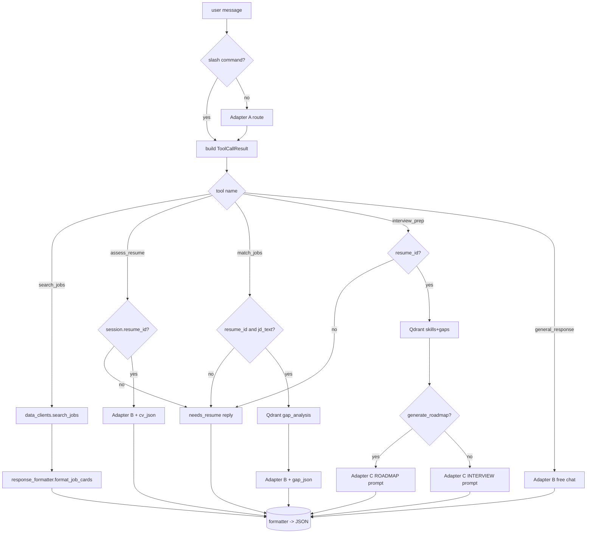
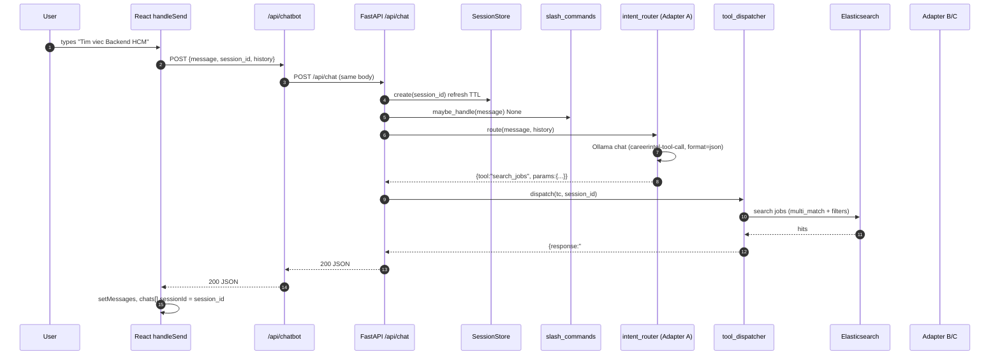
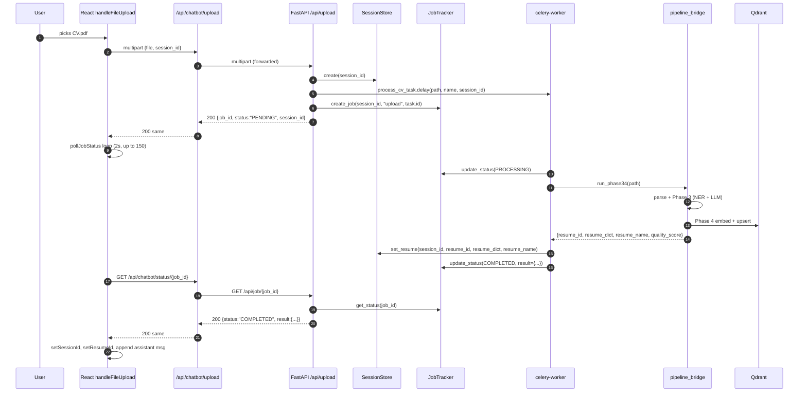

# SLM Orchestrator API Pipeline — Agent Guide

> **Audience**: Gemini code-pounder agents (backend FastAPI + Next.js BFF + React) and Claude reviewer agents working on the **SLM Qwen2.5-1.5B + 3 LoRA adapter** chatbot end-to-end.
> **Author role**: Claude research/plan caveman. Me NO write code. Me draw map of every wire.
> **Status**: DRAFT — needs big chief stamp before pounder starts.
> **Companion docs**: `chatbot_pipeline_agent_guide.md` (locked plan), `chatbot/adapter_inference_guide.md` (adapter contract), `backend/chatbot/pipeline.md` (one-liner).
> **Caveman law**: All other agent talk shall sound like cave talk.

---

## 0. Why This Guide Exist

Big chief say: implement SLM Qwen2.5-1.5B with 3 adapters into web app. SLM act as **orchestrator** for user query. KIE (key info extraction) lives in `chatbot/phase 3` + `chatbot/phase 4`.

The existing `chatbot_pipeline_agent_guide.md` already lock big decisions (Ollama on host, no SSE, no auth in FastAPI, drop root `adapter_model.safetensors`). **This guide does NOT change those decisions.** This guide drills down into one layer the locked plan only sketched: the **API endpoint contract** — request shape, response shape, headers, status codes, error shape — so frontend pounder and backend pounder do not collide.

Read order for any agent touching this stack:
1. `chatbot_pipeline_agent_guide.md` (locked plan, build order)
2. This file (API contract on every hop)
3. `chatbot/adapter_inference_guide.md` (training-side context, reference only)

---

## 1. Layer Map — Where Each Rock Lives

```
HOST machine
└── ollama serve  (port 11434, OLLAMA_HOST=0.0.0.0:11434)
        ▲
        │ http://host.docker.internal:11434
        │
docker network ─────────────────────────────────────────────────
│
│  ┌────────────┐    ┌──────────────────┐    ┌─────────────┐
│  │  Browser   │───▶│  next-app:3000   │───▶│chatbot-api  │
│  │ (frontend) │    │  (Next.js BFF)   │    │   :8000     │
│  └────────────┘    └──────────────────┘    │  (FastAPI)  │
│                                            └──────┬──────┘
│                                                   │
│                                      ┌────────────┼────────────┐
│                                      ▼            ▼            ▼
│                                  redis:6379   qdrant:6333   elasticsearch:9200
│                                      ▲
│                                      │ broker + result backend
│                                      ▼
│                              ┌──────────────────┐
│                              │  celery-worker   │ ── Phase 3 + 4 KIE
│                              │  queue "ml"      │ ── Adapter B/C heavy gen
│                              └──────────────────┘
└────────────────────────────────────────────────────────────────
```

Six containers total: `next-app`, `chatbot-api`, `celery-worker`, `redis`, `qdrant`, `elasticsearch`. Ollama stays on host (locked decision §8 of pipeline guide).

---

## 2. Endpoint Inventory — Three Hops

There are **three layers** the request travels:

| # | Layer | Where | Talks to |
|---|-------|-------|---------|
| FE | Frontend React | `frontend/ai assistant/page.tsx` rendered by `app/ai/page.tsx` | `/api/chatbot/*` |
| BFF | Next.js Route Handlers | `app/api/chatbot/*` (+ `app/api/kie/*`) | `${CHATBOT_BACKEND_URL}/api/*` |
| API | FastAPI server | `backend/chatbot/server.py` | Ollama + Redis + Qdrant + ES + Celery |

Three frontend endpoints exist today plus one to add. Three matching BFF endpoints. Four matching FastAPI endpoints.

### 2.1 Endpoint Table

| Purpose | FE call | BFF handler (Next) | API handler (FastAPI) | Sync? |
|---------|---------|--------------------|----------------------|-------|
| Send chat message | `POST /api/chatbot` | `app/api/chatbot/route.ts` | `POST /api/chat` | sync (~1-3s) |
| Upload CV file | `POST /api/chatbot/upload` | `app/api/chatbot/upload/route.ts` | `POST /api/upload` | async → job_id |
| Poll job status | `GET /api/chatbot/status/{jobId}` | `app/api/chatbot/status/[jobId]/route.ts` | `GET /api/job/{job_id}` | sync |
| Standalone KIE page | `POST /api/kie` | `app/api/kie/route.ts` | `POST /api/kie` (alias of `/api/upload`, returns only `job_id`) | async → job_id |
| Health | n/a | n/a | `GET /health` | sync |

### 2.2 Existing State Matrix

| File | Filled? | Notes |
|------|---------|-------|
| `app/api/chatbot/route.ts` | done | Proxies `POST /api/chat`, swallows errors to 200 with `task_type:"error"`. |
| `app/api/chatbot/upload/route.ts` | done | Multipart proxy + MIME allow-list. |
| `app/api/chatbot/status/[jobId]/route.ts` | NEEDS REWRITE (Option A) | Currently proxies upstream HTTP code (404/503). Must always return HTTP 200 with normalised body per §3.5. |
| `app/api/kie/route.ts` | done | Posts to FastAPI `/api/kie`, returns `{job_id, status:"PENDING"}`. |
| `app/kie/page.tsx` | done | Standalone PDF uploader, polls via `/api/chatbot/status/{jobId}`. |
| `app/ai/page.tsx` | done | Server component wrapper for `frontend/ai assistant/page.tsx`. |
| `frontend/ai assistant/page.tsx` | done | Chat UI with sessionId / resumeId / 60-attempt polling. |
| `backend/chatbot/server.py` | EMPTY | Pounder must implement. |
| `backend/chatbot/intent_router.py` | EMPTY | Pounder must implement. |
| `backend/chatbot/tool_dispatcher.py` | EMPTY | Pounder must implement. |
| `backend/chatbot/adapter_manager.py` | EMPTY | Pounder must implement. |
| `backend/chatbot/celery_app.py` | EMPTY | Pounder must implement. |
| `backend/chatbot/worker_tasks.py` | EMPTY | Pounder must implement. |
| `backend/chatbot/pipeline_bridge.py` | EMPTY | Pounder must implement. |
| `backend/chatbot/data_clients.py` (rename of `ts_search_client.py`) | EMPTY | Pounder must implement. |
| `backend/chatbot/response_formatter.py` | EMPTY | Pounder must implement. |
| `backend/chatbot/slash_commands.py` | EMPTY | Pounder must implement. |
| `backend/chatbot/adapter_config.py` | EMPTY | Pounder must implement. |
| `backend/chatbot/requirements.txt` | EMPTY | Pounder must implement. |

> Note: existing `.pyc` files in `__pycache__` are stale from earlier prototypes. Pounder should ignore — empty `.py` is the source of truth.

---

## 3. Contracts — Every Request / Response Shape

> All payloads JSON UTF-8 unless stated. Frontend renders markdown in `response`. Never send HTML — only markdown.

### 3.1 `POST /api/chatbot`  (FE → BFF)

**Request body** (sent by `frontend/ai assistant/page.tsx::handleSend`):
```json
{
  "message": "Tim viec Backend HCM luong 25 cu",
  "session_id": "ab12cd34",
  "history": [
    {"role": "user", "content": "..."},
    {"role": "assistant", "content": "..."}
  ]
}
```
- `session_id` is `null` on first turn.
- `history` is the last 10 messages.

**Response body** (200):
```json
{
  "response": "## Tim thay 5 viec...\n| ... |",
  "task_type": "search_jobs",
  "session_id": "ab12cd34",
  "metadata": {
    "tool": "search_jobs",
    "params": {"keyword": "Backend", "location": "Ho Chi Minh", "min_salary": 25},
    "hits": 5,
    "latency_ms": 1230
  }
}
```

**Error contract**: BFF MUST always return HTTP 200 with `task_type:"error"` so frontend `handleSend` does not blow up. Real upstream code goes in `metadata.error`. This matches existing `app/api/chatbot/route.ts`.

`task_type` enum (frontend uses for badge color):
- `search_jobs`
- `assess_resume`
- `match_jobs`
- `interview_prep`
- `general_response`
- `upload` (only from upload flow)
- `error`
- `needs_resume` (when tool requires CV but `session.resume_id` is null)

### 3.2 `POST /api/chat`  (BFF → FastAPI)

Same body shape as 3.1. Same response shape. FastAPI returns 200 for happy path; non-2xx for crashes (BFF will translate to `task_type:"error"`).

**Internal flow** in FastAPI handler:
1. `session_id = await session_store.create(req.session_id)` — refreshes TTL.
2. `tc = slash_commands.maybe_handle(req.message)` — if `/search`, `/coach`, etc., skip Adapter A.
3. If `tc is None`: `tc = await intent_router.route(req.message, req.history)` — Adapter A via Ollama `format:"json"`.
4. `result = await tool_dispatcher.dispatch(tc, session_id)`
5. Return `response_formatter.format_chat_response(...)`.

**Latency budget** (target):
- Adapter A call: <= 800 ms
- ES search: <= 200 ms
- Adapter B/C call: <= 2500 ms
- Total `/api/chat` p95: <= 4000 ms

If exceeded, dispatcher SHOULD enqueue Celery and return `{job_id, status:"PENDING"}` instead. Frontend already handles `data.job_id` branch.

### 3.3 `POST /api/chatbot/upload`  (FE → BFF)

Multipart form-data:
- `file` (required, <= 20 MB): PDF / DOCX / DOC / PNG / JPG / JPEG
- `session_id` (optional)

**Response body** (200):
```json
{
  "job_id": "f4a1c92e8c01",
  "status": "PENDING",
  "session_id": "ab12cd34"
}
```

The existing `frontend/ai assistant/page.tsx::handleFileUpload` branches on:
- `data.job_id` present — polling path (preferred; Phase 3 takes 60-180 s).
- `data.success === true` — synchronous path (kept for tiny files / dev mock).

Pounder MUST always return `job_id` path for production. Synchronous path is dev-only.

### 3.4 `POST /api/upload`  (BFF → FastAPI)

Same multipart shape. FastAPI handler:
1. Read `file.read()` into bytes, save to `tempfile.NamedTemporaryFile(suffix=ext)`.
2. `session_id = await session_store.create(form.session_id)`.
3. Enqueue Celery: `task = process_cv_task.delay(tmp_path, file.filename, session_id)`.
4. `job_id = await job_tracker.create_job(session_id, "upload", task.id)`.
5. Return `{job_id, status:"PENDING", session_id}`.

`process_cv_task` (in `worker_tasks.py`) MUST:
1. `job_tracker.update_status(job_id, "PROCESSING")`.
2. Call `pipeline_bridge.run_phase34(tmp_path)` (parse → Phase 3 → Phase 4 → Qdrant upsert).
3. `session_store.set_resume(session_id, resume_id, resume_dict, resume_name)`.
4. `job_tracker.update_status(job_id, "COMPLETED", result={...})`.
5. On exception: `update_status(job_id, "FAILED", error=str(e))`.

### 3.5 `GET /api/chatbot/status/{jobId}`  (FE → BFF)

**Response body** (200) — copied straight from FastAPI:
```json
{
  "job_id": "f4a1c92e8c01",
  "session_id": "ab12cd34",
  "job_type": "upload",
  "status": "PROCESSING",
  "result": {},
  "error": "",
  "created_at": "1717834821.4"
}
```

On `status == "COMPLETED"` the `result` object MUST match this shape so frontend can hydrate context:
```json
{
  "session_id": "ab12cd34",
  "resume_id": "qdr-uuid-1234",
  "resume_name": "Le_Hoang_Nam_CV.pdf",
  "response": "Da trich xuat xong CV. Ban muon minh danh gia ngay khong?",
  "task_type": "upload",
  "metadata": {
    "quality_score": 78,
    "num_experience": 3,
    "num_skills": 24,
    "phase3_time_s": 14.2,
    "phase4_time_s": 6.1
  }
}
```

Frontend `pollJobStatus` reads `result.session_id`, `result.resume_id`, `result.resume_name`, `result.response`, `result.task_type`, `result.metadata` — pounder MUST keep these keys exact.

Status enum: `PENDING` | `PROCESSING` | `COMPLETED` | `FAILED` | `ERROR`. (`ERROR` reserved for BFF/transport failure.)

**BFF firewall (Option A — locked).** `app/api/chatbot/status/[jobId]/route.ts` MUST ALWAYS return HTTP 200, even when the upstream FastAPI is down, returns 404, or any other non-2xx. Frontend `pollJobStatus` only branches on the JSON `status` field, never on HTTP code.

Normalised error body the BFF emits in every failure branch:
```json
{
  "job_id": "<requested id>",
  "session_id": "",
  "job_type": "",
  "status": "ERROR",
  "result": {},
  "error": "<short code>",
  "error_message": "<human readable VN>",
  "created_at": ""
}
```

Branch rules:
- Upstream 404 (job missing) -> 200 + `status:"ERROR"`, `error:"job_not_found"`.
- Upstream 5xx -> 200 + `status:"ERROR"`, `error:"upstream_error"`, `error_message` from FastAPI `detail`.
- `ECONNREFUSED` / network -> 200 + `status:"ERROR"`, `error:"backend_unreachable"`.
- BFF handler itself throws -> 200 + `status:"ERROR"`, `error:"bff_crash"`.

The shape is a superset of the happy-path shape so frontend code that reads `result.session_id`, `result.resume_id`, etc. simply finds empty values and falls through to the error branch.

### 3.6 `GET /api/job/{job_id}`  (BFF → FastAPI)

Same shape as 3.5. Implemented in `server.py` via `await job_tracker.get_status(job_id)`. Returns 404 when `None`.

### 3.7 `POST /api/kie`  (FE on `/kie` page → BFF → FastAPI)

Standalone PDF-only page (`app/kie/page.tsx`). Same as 3.3 but:
- BFF only forwards `file`, no `session_id`.
- FastAPI MAY share the same `process_cv_task` (just don't bind to a session); set `session_id=None` and skip `session_store.set_resume`. `result` still carries `resume_id`, `resume_dict`, `resume_name`, `metadata`.

Frontend renders `JSON.stringify(result, null, 2)` so any extra keys are fine.

### 3.8 `GET /health`

```json
{ "status": "ok", "ollama": "up", "redis": "up", "qdrant": "up", "elasticsearch": "up" }
```

Used by Docker healthcheck and smoke test.

---

## 4. State Stores — What Lives Where

| Store | Key | Owner | TTL | Holds |
|-------|-----|-------|-----|-------|
| Redis | `session:{id}` (hash) | `SessionStore` | 24 h | `resume_id`, `resume_dict` (JSON string), `resume_name` |
| Redis | `job:{id}` (hash) | `JobTracker` | 1 h | `status`, `celery_task_id`, `result` (JSON string), `error` |
| Redis | `session:{id}:jobs` (zset) | `JobTracker` | 1 h | recent job_ids per session |
| Qdrant | `resumes` collection | `phase 4 vector_store` | infinity | embeddings + payload (canonical resume) |
| Elasticsearch | `jobs` index | scraper (other team) | n/a | scraped job listings |

`session_id` flow: frontend stores it in React state, sends in every request. Backend creates one if missing and echoes it back in `response.session_id`. Frontend writes it into the chat object (`chat.sessionId`) so refresh-resume works.

`resume_id` flow: only set by upload pipeline (Celery worker). Read by `assess_resume`, `match_jobs`, `interview_prep`. If null when tool needs it, dispatcher returns `task_type:"needs_resume"` with markdown prompting user to upload.

---

## 5. The Three Adapters at Inference Time

Locked: **Ollama on host, 3 separate models**. The Modelfiles (root of repo):

| Adapter | Ollama model | Modelfile | Trained weights |
|---------|--------------|-----------|------------------|
| A - Tool Call | `careerintel-tool-call` | `Modelfile.careerintel-tool-call` (currently points at root `adapter_model.safetensors`; FIX per locked decision 2) | `chatbot/models/qlora-qwen25-1-5b-tool-call/final_adapter/` |
| B - HR Coach | `careerintel-hr-coach` | `Modelfile.careerintel-hr-coach` | `chatbot/models/qlora-qwen25-1-5b-dpo/final_adapter/` |
| C - Structured Gen | `careerintel-structured-gen` | `Modelfile.careerintel-structured-gen` | `chatbot/models/qlora-qwen25-1-5b-structured-gen/final_adapter/` |

`adapter_manager.AdapterManager.generate(adapter, system, user)` calls Ollama `POST /api/chat` with:
- `model = {tool_call|hr_coach|structured_gen} -> matching MODEL_* env var`
- `messages = [{role:system,content:system},{role:user,content:user}]`
- `options = GEN_PARAMS[adapter]` (Adapter A locks `format:"json"`)

Fallback when adapter not yet built: `.env` ships `MODEL_*=qwen2.5:1.5b` so dev box without trained weights still answers (poorly). DO NOT change this fallback for production — the docker `.env.docker` must override to `careerintel-*`.

System prompts already centralized at `backend/chatbot/adapter_prompts.py`. Pounder MUST import from there (do NOT inline new prompts).
Tool schemas centralized at `backend/chatbot/tool_schemas.py`. Pounder MUST validate Adapter A output against these.

---

## 6. Tool Dispatch Decision Tree



`needs_resume` short-circuit reply (Vietnamese, markdown):
```
Minh can xem CV cua ban truoc khi danh gia. Bam dau ghim o khung chat de tai CV (PDF/DOCX) len nhe.
```

---

## 7. Phase 3 / Phase 4 Bridge

Folders have **spaces** and both contain a file called `pipeline.py` — naive `import` fails. `pipeline_bridge.py` MUST use `importlib.util.spec_from_file_location` with explicit module names, as already outlined in `chatbot_pipeline_agent_guide.md` Step 12.

Bridge contract:

```python
def run_phase34(file_path: str) -> dict:
    """
    Returns:
        {
          "resume_id": "<qdrant_point_id>",
          "resume_dict": {...},
          "resume_name": "<file basename>",
          "quality_score": <int 0-100>,
          "num_experience": <int>,
          "num_skills": <int>,
          "phase3_time_s": <float>,
          "phase4_time_s": <float>
        }
    """
```

File parsing happens INSIDE the bridge before Phase 3:
- `.pdf` -> PyMuPDF text. If empty -> tesseract `vie+eng` OCR.
- `.docx` -> `python-docx`.
- `.png/.jpg/.jpeg` -> tesseract OCR.

Phase 3 entry: `SemanticExtractionPipeline(use_ner=True, use_llm=False).process(parsed_doc, layout_analysis)`.

> WARNING `SemanticExtractionPipeline.process()` expects Phase 2 outputs (`ParsedDocument` + `LayoutAnalysis`). Pounder MUST either (a) also load `chatbot/phase 2-*/` pipeline, or (b) shim the minimum `ParsedDocument`/`LayoutAnalysis` dataclasses from extracted text. Recommend option (a) for fidelity — add phase 2 to the importlib loader.

Phase 4 entry: `ValidationStoragePipeline(use_embeddings=True, use_storage=True, embedding_device="cpu", db_path="/qdrant/storage")`. `db_path` only used when Qdrant client is embedded; with remote Qdrant container, pounder must update `ResumeVectorStore` constructor to accept `QDRANT_URL` env var, OR mount the same volume. **Action item**: confirm with vector store implementation before pounder begins Step 12.

---

## 8. Frontend Contract Quirks

These come from reading `frontend/ai assistant/page.tsx` and `app/kie/page.tsx`. Backend MUST honour them or UI will glitch.

1. **`pollJobStatus` ceiling** is `attempts < 60` x 2 s = 120 s. Phase 3 (PhoBERT NER + LLM normalization) routinely exceeds this. **Action**: pounder bumps to 150 (~5 min) AND updates placeholder copy at attempt 30. (Same as pipeline guide Step 8 fix.)
2. Status `"FAILED"` OR `"ERROR"` both treated as failure — backend may use either. Per §3.5 BFF emits `"ERROR"` on transport/upstream failure with HTTP 200 (Option A).
3. Polling reads `statusData.result` flat — keys MUST be `response`, `session_id`, `resume_id`, `resume_name`, `task_type`, `metadata`. No nesting.
4. Frontend strips markdown via a custom `renderMarkdown` — escapes HTML first. Backend MUST send raw markdown, not HTML.
5. `metadata` is rendered to `console.log` only in MVP — but stays in `Message` object for future inspector panel. Send rich data.
6. On synchronous chat response, frontend reads `data.session_id` and stores. If backend forgets to echo it, history breaks across page refresh.
7. `app/kie/page.tsx` is a SEPARATE page (`/kie` route, not `/ai`). It polls `/api/chatbot/status/{job_id}` even though upload went to `/api/kie`. Backend MUST use the same `JobTracker` for both flows so polling finds the job.
8. `app/api/kie/route.ts` returns `{ job_id, status:"PENDING" }` only — no `session_id`. Backend `/api/kie` endpoint MAY accept anonymous (no session). Pounder should still create a throwaway session for tracking, but does not need to bind resume to it.

---

## 9. Error Shape and HTTP Codes

Strict rule (Option A — locked): **BFF returns 200 for all non-fatal errors**. Chat / upload / kie routes use `task_type:"error"`. Status-poll route uses `status:"ERROR"` (see §3.5 normalised body). No BFF route returns 4xx/5xx for upstream failure; only an in-process JS exception that escapes the route handler may surface as 500.

FastAPI side may return:
- `200` happy
- `400` bad request (validation error, missing file, file too large)
- `404` job not found in `GET /api/job/{job_id}`
- `422` Adapter A returned non-JSON after retry — bubble up as `{detail:"router_validation_failed"}`
- `500` unexpected
- `503` Ollama/Redis/Qdrant unreachable on startup (backed by health probe)

Frontend NEVER expects a non-2xx — the BFF is the firewall. Today's `app/api/chatbot/status/[jobId]/route.ts` violates this (propagates 404 + 503); pounder MUST rewrite per §3.5.

Standard FastAPI error body:
```json
{ "detail": "<short code>", "error_message": "<human readable VN>", "trace_id": "<uuid>" }
```

`trace_id` MUST be the FastAPI request ID set by middleware — written to logs and echoed in `metadata.trace_id` so frontend can paste it into support.

---

## 10. Build Order Quick-Sheet (Cross-Reference to Locked Plan)

| Step | File / Action | Reads contract from this guide section |
|------|---------------|----------------------------------|
| 1 | docker-compose additions (qdrant, chatbot-api, celery-worker) | Sec 1, Sec 11 of pipeline guide |
| 2 | `ollama create` for 3 adapters (fix Modelfile A first) | Sec 5 |
| 3 | `backend/chatbot/requirements.txt` | Sec 11 of pipeline guide |
| 4 | `adapter_config.py` | Sec 5 |
| 5 | `adapter_manager.py` — only `generate()`, no stream | Sec 5 |
| 6 | `slash_commands.py` | Sec 6 |
| 7 | `intent_router.py` — 1 retry, fallback `general_response` | Sec 3.2 |
| 8 | `data_clients.py` (ES + Qdrant) | Sec 3.2 search_jobs, Sec 6 |
| 9 | `response_formatter.py` | Sec 3.1 task_type enum |
| 10 | `celery_app.py` | Sec 4 broker URL |
| 11 | `pipeline_bridge.py` | Sec 7 |
| 12 | `worker_tasks.py` — `process_cv_task` | Sec 3.4, Sec 7 |
| 13 | `tool_dispatcher.py` | Sec 6 |
| 14 | `server.py` — 4 routes + startup/shutdown + middleware | Sec 3.2, 3.4, 3.6, 3.7, 3.8 |
| 15 | Frontend / BFF gap fixes (polling 60 -> 150, placeholder copy, rewrite `app/api/chatbot/status/[jobId]/route.ts` per §3.5) | Sec 3.5, Sec 8 |
| 16 | Smoke test `scripts/smoke_chatbot.ps1` | Sec 3 all |

---

## 11. Sequence Diagrams — Two Headline Flows

### 11.1 Chat (sync happy path)



### 11.2 Upload (async happy path)



---

## 12. Smoke / Acceptance — Reviewer Checklist

Reviewer (Gemini 3.5 Pro) MUST run these in order:

1. `docker compose up -d` -> 6 healthy containers (redis, elasticsearch, qdrant, chatbot-api, celery-worker, next-app). MongoDB optional for this feature.
2. `ollama list` on host -> shows `careerintel-tool-call`, `careerintel-hr-coach`, `careerintel-structured-gen`.
3. `curl http://localhost:3000/api/chatbot/status/nope` -> 200 with `status:"ERROR"` (BFF firewall test).
4. `curl -X POST http://localhost:3000/api/chatbot -H 'Content-Type: application/json' -d '{"message":"chao"}'` -> 200 with `task_type:"general_response"`.
5. `curl -X POST http://localhost:3000/api/chatbot -H 'Content-Type: application/json' -d '{"message":"Tim viec Backend o SG luong 25 cu"}'` -> `task_type:"search_jobs"`, `metadata.params.location == "Ho Chi Minh"`, `metadata.params.min_salary == 25`.
6. Upload sample PDF via `/api/chatbot/upload` -> poll until COMPLETED <= 300 s. Verify `result.resume_id` non-empty, `result.session_id` set.
7. Reuse `session_id` from step 6: `POST /api/chatbot {"message":"danh gia CV","session_id":"..."}` -> `task_type:"assess_resume"`, Vietnamese markdown, mentions at least one strength + one improvement.
8. `POST /api/chatbot {"message":"/roadmap Backend Developer","session_id":"..."}` -> `task_type:"interview_prep"`, response contains `##` and `|`.
9. With **no** session: `POST /api/chatbot {"message":"danh gia CV"}` -> `task_type:"needs_resume"`.
10. Kill Ollama on host, retry step 4 -> BFF returns 200 with `task_type:"error"` and human VN message, no 500.

If all 10 green -> ship.

---

## 13. Open Questions for Big Chief (Need Stamp Before Pounder Begins)

These are NEW questions not covered by locked plan Sec 8. Each blocks at least one step.

| # | Question | Blocks step | Default if no answer |
|---|----------|-------------|----------------------|
| 1 | Does Phase 4 `ResumeVectorStore` already support `QDRANT_URL` env, or must pounder refactor to remote client? | Sec 7, Step 11-12 | Refactor to remote client (qdrant-client `from_url`) and remove `db_path`. |
| 2 | Should `/api/kie` (standalone page) bind to anonymous session, or require Supabase user? Today BFF does NOT pass user. | Sec 3.7 | Anonymous, create throwaway session, no Qdrant payload PII tied to user. |
| 3 | Should chat history (`history` array from frontend) be passed into Adapter A prompt, or only used by Adapter B for context? Training data used single-turn. | Sec 3.1, Step 5 | Single-turn only for Adapter A; history flows to Adapter B as flattened context paragraph. |
| 4 | Frontend `SAMPLE_CHATS` are hardcoded sidebar entries with bytestring-corrupted titles. Replace with real Supabase-stored chats or keep dev placeholders? | Step 15 (frontend) | Keep placeholders for this PR; persistent chat list deferred to v2. |
| 5 | Hard size cap on uploaded file? Existing BFF has no limit; Phase 3 PhoBERT OOMs on >40 MB scans. | Sec 3.3 | Reject >20 MB at BFF with `task_type:"error"` + VN message. |
| 6 | When `general_response` returns long answer, do we stream via Server-Sent Events? Locked plan Sec 8.3 says NO for MVP. Confirm still NO? | Sec 3.2 | NO. JSON only. SSE = v2. |

---

## 14. Out-of-Scope (Do NOT Touch)

- Re-training any adapter
- Adding new tools beyond the 5 in `tool_schemas.py`
- Supabase JWT validation inside FastAPI (Next BFF still guards)
- ClickHouse migration
- Real-time streaming UI
- Chat persistence to Supabase

---

## 15. File Drop List for Gemini Pounder

**Must create / fill** (backend):
- `backend/chatbot/requirements.txt`
- `backend/chatbot/adapter_config.py`
- `backend/chatbot/adapter_manager.py`
- `backend/chatbot/slash_commands.py`
- `backend/chatbot/intent_router.py`
- `backend/chatbot/data_clients.py`  (renamed from `ts_search_client.py` — `git mv`)
- `backend/chatbot/response_formatter.py`
- `backend/chatbot/celery_app.py`
- `backend/chatbot/pipeline_bridge.py`
- `backend/chatbot/worker_tasks.py`
- `backend/chatbot/tool_dispatcher.py`
- `backend/chatbot/server.py`

**Must edit**:
- `docker-compose.yml` (add qdrant, chatbot-api, celery-worker)
- `.env.docker` (chatbot vars per pipeline guide Sec 8)
- `Modelfile.careerintel-tool-call` (point ADAPTER at correct dir)
- `frontend/ai assistant/page.tsx` (bump polling to 150, swap placeholder at attempt 30)
- `app/api/chatbot/status/[jobId]/route.ts` (always return HTTP 200 with normalised error body per §3.5; Option A)

**Must delete**:
- `adapter_model.safetensors` (root)
- `adapter_config.json` (root)

**Must write after pounding** (per AGENTS.md Gemini rules):
- `walkthrough.md` — narrate every change for reviewer.

---

*End of guide. Awaiting big chief stamp. No code yet.*


