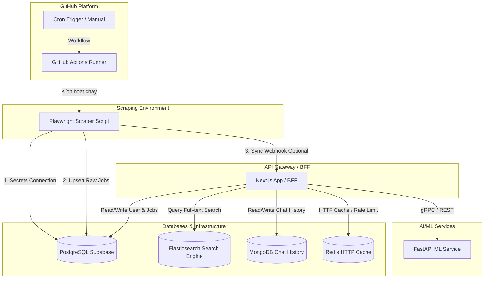

# Hướng Dẫn Chi Tiết Kiến Trúc Microservices (Walkthrough)

Tài liệu này cung cấp cái nhìn toàn cảnh về kiến trúc hệ thống **Microservices** của dự án **Job Market Analytics Platform** dựa trên sơ đồ thiết kế thực tế của bạn. Hệ thống cô lập các nghiệp vụ chuyên biệt thành các dịch vụ độc lập kết nối nhịp nhàng thông qua Docker Compose và GitHub Actions.

---

## 1. Bản Đồ Phân Định Ranh Giới Dịch Vụ (Service Boundaries)

Hệ thống được chia nhỏ thành các thành phần dịch vụ riêng biệt với ranh giới trách nhiệm rõ ràng:



1.  **Next.js App / BFF (API Gateway):**
    *   *Vai trò:* Cổng giao tiếp duy nhất đối với Client. Phục vụ giao diện người dùng (SSR/SSG), quản lý cookie session, thực thi Rate Limiting + Blacklist, định tuyến và tổng hợp dữ liệu từ các database trước khi phản hồi về cho Client.
2.  **Scraping Environment (GitHub Actions & Playwright):**
    *   *Vai trò:* Dịch vụ cào dữ liệu chạy độc lập trên Action Runner của GitHub để bảo toàn tài nguyên CPU/RAM cho Web Server chính. Tác vụ Playwright cào dữ liệu thô từ JobOKO và chèn thẳng vào PostgreSQL Supabase qua secrets.
3.  **Elasticsearch Search Engine:**
    *   *Vai trò:* Tìm kiếm việc làm toàn văn (Full-text search) tốc độ cao, cô lập tác vụ tìm kiếm nặng khỏi Postgres.
4.  **MongoDB Chat History:**
    *   *Vai trò:* Lưu trữ dữ liệu phi cấu trúc (lịch sử hội thoại của AI Chatbot) một cách linh hoạt.
5.  **Redis Cache:**
    *   *Vai trò:* Chỉ làm nhiệm vụ HTTP Cache tốc độ cao và Rate Limiter bảo mật (không chạy BullMQ nền).

---

## 2. Các Luồng Giao Tiếp (Communication Patterns)

### A. Giao Tiếp Đồng Bộ (Synchronous - Phản hồi lập tức)
*   **Client ↔ Next.js API Gateway (HTTPS / REST):** Lấy danh sách việc làm, thông tin profile, đăng nhập, đăng ký.
*   **Client ↔ Next.js API Gateway (SSE - Server-Sent Events):** Stream tin nhắn chatbot AI theo thời gian thực (typing effect).
*   **Next.js Gateway ↔ Databases (TCP Protocols):** Truy vấn nhanh lịch sử chat (MongoDB), cache API (Redis), search (Elasticsearch) thông qua TCP socket tiêu chuẩn.

### B. Giao Tiếp Bất Đồng Bộ (Asynchronous - Chạy nền)
*   **Playwright Scraper ↔ Supabase (Postgres TCP):** Cào dữ liệu chạy hoàn toàn độc lập, ghi dữ liệu thô vào Supabase mà không gây ảnh hưởng tới Server Web chính.
*   **Scraper ↔ Next.js Gateway (Webhook):** Playwright Scraper gửi một HTTP POST request báo hiệu cào xong để Next.js Gateway thực thi đồng bộ dữ liệu sang Elasticsearch ngầm (`npm run es:sync`).

---

## 3. Khả Năng Chịu Lỗi & Tự Phục Hồi (Resiliency)

Kiến trúc được thiết kế theo nguyên lý **Graceful Degradation** (Suy giảm tính năng mượt mà) để hệ thống không bao giờ bị tê liệt hoàn toàn khi có sự cố:

*   **Sập MongoDB (Chatbot):** Khóa tính năng chat AI, nhưng **tính năng Đăng nhập, Tìm kiếm việc làm và Dashboard vẫn hoạt động bình thường**.
*   **Sập Elasticsearch:** Next.js API Gateway tự động kích hoạt chế độ dự phòng (**Fallback**) truy vấn `LIKE` SQL trực tiếp trên PostgreSQL Supabase. Kết quả tìm kiếm sẽ chậm hơn đôi chút nhưng chức năng tìm kiếm không bị sập.
*   **Sập Redis:** Cấu hình **Fail-open** trong `redisSecurity.ts` tự động bỏ qua lỗi kết nối Redis, giúp ứng dụng Next.js vẫn chạy trơn tru mà không bị crash màn hình.
*   **Tự phục hồi Container:** Thuộc tính `restart: unless-stopped` trong `docker-compose.yml` đảm bảo Docker sẽ khởi động lại bất kỳ container nào bị crash đột ngột ngay lập tức.

---

## 4. Giám Sát Truy Vết Logs Liên Kết (Observability & Correlation ID)

Để giải quyết bài toán "mù tịt" logs trong môi trường microservices (một request đi qua nhiều dịch vụ), chúng ta triển khai cơ chế **Correlation ID**:

```
[Client Request] 
      │
      ▼
┌──────────────┐  (1) Sinh ID duy nhất: corr_1779901014393_fbd2iatdn
│ Next.js BFF  │  (2) Log: [corr_177...] Nhận request tìm kiếm...
└──────┬───────┘
       │  (3) Chuyển tiếp Header: X-Correlation-ID
       ▼
┌──────────────┐
│Elasticsearch │  (4) Log: [corr_177...] Đang thực thi Inverted Index...
└──────────────┘
```

Khi có lỗi xảy ra trên UI hoặc Gateway, bạn chỉ cần lấy Correlation ID từ HTTP Response Header `x-correlation-id` và lọc logs:
```powershell
# Chạy trên Windows PowerShell để lọc logs của đúng request đó
docker compose logs | findstr "corr_1779901014393_fbd2iatdn"
```

---

## 5. Hướng Dẫn Vận Hành Cục Bộ (Local Operations)

### Khởi chạy toàn bộ hạ tầng
```bash
docker compose up --build -d
```

### Theo dõi logs của riêng ứng dụng Web BFF
```bash
docker compose logs -f next-app
```

### Xóa dữ liệu cũ và khởi tạo lại sạch sẽ (khi đổi cấu hình db)
```bash
docker compose down -v
```
